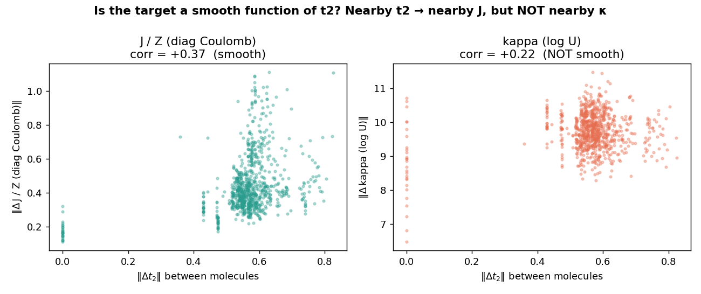
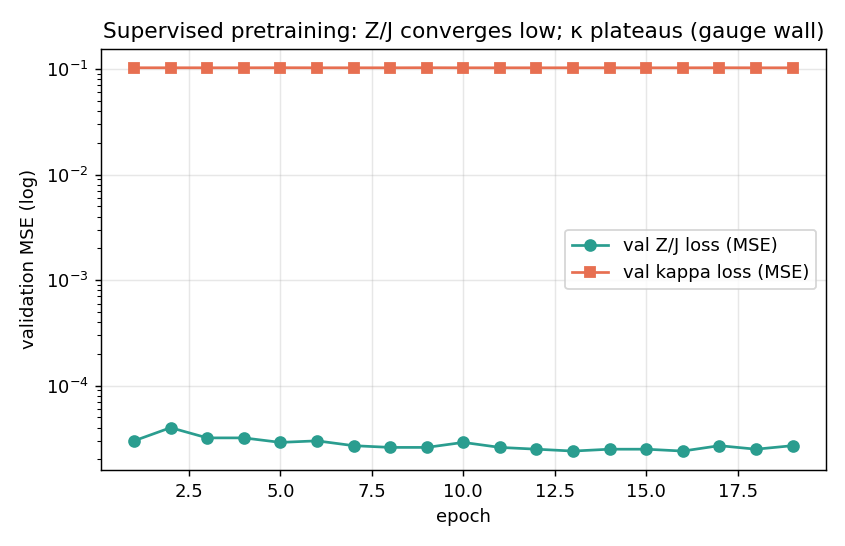

# LUCJ Surrogate: Observations, Diagnoses, and Design Choices

This document records the investigation that shaped the current model — what we
observed, the numbers behind each conclusion, and why the design ended up where
it is. It is meant to be read top-to-bottom as the "why" companion to the code
READMEs.

**TL;DR**

| Question | Answer | Evidence |
|:---------|:-------|:---------|
| Are the original Q-Chem amplitudes usable for `UCJOpSpinBalanced`? | **No** — they were UHF spin-orbital; ffsim wants RHF restricted spatial t2 | `norb` was 2× too big (44 vs 22); αβ vs αα blocks differ |
| Is the diagonal-Coulomb **J/Z** learnable from t2? | **Yes** | local-linear $R^2 = 0.80$; full-model $R^2 = 0.62$ and rising |
| Is the orbital rotation **U / κ = log U** learnable from t2? | **No (as raw entries)** | local-linear $R^2 = -0.16$; κ not smooth in t2 |
| Why is κ hard? | **Gauge freedom** (eigenvector sign/basis ambiguity) | smoothness corr 0.22 vs 0.37; deterministic but non-smooth |
| Does a gauge-invariant reconstruction loss fix it? | **In principle yes, but it has a Z=0 trap** on diverse data | reconstruction stalls at loss = 1.0 exactly |
| Final choice | Ship the **J/Z predictor** (`--loss-mode supervised`); keep a weak κ head; offer reconstruction as a flag | see [Results](#7-results) |

---

## 1. Pipeline as built

```
geometry (.xyz)
   │  pyscf RHF-CCSD / STO-3G, frozen core      (generate_rhf_dataset.py)
   ▼
restricted spatial t2  ──►  rhf_dataset/<mol>.npz   (30,205 molecules)
   │  ffsim compressed double factorization      (generate_df_targets.py)
   ▼
DF targets (U→κ, Z)    ──►  rhf_targets/<mol>.npz
   │  Edge Transformer + LUCJLoss                (pretrain/train.py)
   ▼
predicted (J/Z, U)     ──►  checkpoints_pretrain/
```

The Q-Chem CCSD stage (`extract_geometries.py` → `run_batch.sh`) is the original
raw-data pipeline and is **kept untouched**; the modeling now consumes RHF
amplitudes from pyscf (see [§2](#2-observation-the-spin-orbital--spatial-bug) for why).

---

## 2. Observation: the spin-orbital → spatial bug

The original LUCJ targets were produced by feeding **Q-Chem UHF spin-orbital**
amplitudes into `ffsim.UCJOpSpinBalanced.from_t_amplitudes`, which (confirmed
from the ffsim source) expects the **RHF restricted spatial** t2 of shape
`(nocc, nocc, nvirt, nvirt)` with `norb = nocc + nvirt`.

Consequences, measured on `C2H2N2O_rxn2091`:

| Quantity | Spin-orbital (wrong) | Spatial RHF (correct) |
|:---------|:---------------------|:----------------------|
| `norb` fed to ffsim | 44 | 22 |
| `n_params` | ~2× | ~1× |
| Physical meaning | none (mismatched basis) | valid LUCJ |

The restricted t2 equals the **opposite-spin (αβ) block**, not the same-spin (αα)
block. A first "fix" that took the αα block was therefore also wrong — and worse,
for symmetry-broken UHF solutions no block cleanly equals the RHF t2 (α/β orbital
energies differed by up to ~0.06 Ha on some transition states). 

**Decision:** regenerate amplitudes from a proper **RHF** reference. We used
**pyscf RHF-CCSD/STO-3G** (frozen core) directly — numerically equivalent to
Q-Chem RHF-CCSD for the same method/basis, but ~0.5–1 s/molecule (≈15 min for all
30k vs an hours-long Q-Chem re-run). The old UHF/spin-orbital LUCJ outputs and the
models trained on them were archived to `stale_2026-06-10_kappa_era/`.

---

## 3. Observation: J is learnable, κ is not

With **correct RHF data**, we asked a controlled question: from the t2 slice for
a pair, can a linear model predict the corresponding target entry? Same features,
same samples, same regularization for both targets.


| Target | local-linear test $R^2$ |
|:-------|:------------------------|
| **J / Z** (diagonal Coulomb) | **+0.80** |
| **κ = log U** (orbital rotation) | **−0.16** |

J is strongly learnable; κ is *worse than predicting the mean*. This held across
every variant we tried (local slices, full-t2 PCA, orbital-energy denominators,
small MLPs): J carries signal, κ does not.

---

## 4. Diagnosis: why κ is hard — the gauge problem

The double factorization writes each term as $Z = U\,\mathrm{diag}(z)\,U^\dagger$.
So **U is the eigenvector matrix and z are the eigenvalues**:

- **Eigenvalues are gauge-invariant** → J/Z is a smooth, well-defined function of
  t2 → learnable.
- **Eigenvectors carry sign + basis ambiguity** (and basis ambiguity within
  near-degenerate subspaces) → U / κ is **not a smooth function of t2**.

We confirmed this directly. Across all molecule pairs, we correlated the input
distance $\|\Delta t_2\|$ with the output distance for each target:



| | corr($\|\Delta t_2\|$, $\|\Delta\,\text{target}\|$) | among the closest-in-t2 pairs |
|:--|:--|:--|
| **J / Z** | **+0.37** (smooth) | $\|\Delta J\|$ shrinks to 0.60× of average |
| **κ** | +0.22 (not smooth) | $\|\Delta\kappa\|$ stays at **0.98×** of average |

The punchline: two molecules with **near-identical t2** have **κ as far apart as
random pairs** (ratio 0.98), while their J is correspondingly close (ratio 0.60).
κ is a *deterministic* function of t2 (the optimizer is reproducible: identical t2
→ identical U to `max|ΔU| = 0`), but it is **discontinuous / gauge-scrambled** —
nothing for a smooth network to latch onto. Naïve column sign/permutation
canonicalization did **not** help (it is the harder *basis* ambiguity in
degenerate subspaces). This matches the spectral-learning literature on
eigenvector sign/basis ambiguity (Laplacian canonicalization, SignNet).

---

## 5. The reconstruction loss — gauge-invariant, but a Z=0 trap

If κ's gauge is the problem, the natural fix is a **gauge-invariant** target:
don't regress κ; instead reconstruct t2 from the predicted (U, Z),

$$\hat t_2[i,j,a,b] = i \sum_{\mu,pq} Z^{(\mu)}_{pq} U^{(\mu)}_{ap} U^{(\mu)*}_{ip} U^{(\mu)}_{bq} U^{(\mu)*}_{jq},$$

and minimize $\|\hat t_2 - t_2\| / \|t_2\|$. Any U that reconstructs t2 is correct.
We verified the formula and the achievable error floor:

| Double-factorization config | reconstruction residual |
|:----------------------------|:------------------------|
| exact DF (full rank) | **0.000** (formula validated) |
| n_reps=2, unconstrained, optimized | 0.32 |
| n_reps=8, unconstrained, optimized | 0.20 |
| **n_reps=2 + LUCJ local sparsity (original setting)** | **0.94** ⚠️ |

(The last row shows the original LUCJ-2 ansatz captures only ~6% of t2 — itself a
major source of noise in the old κ targets.)

**Proof of concept that it can work:** a single molecule reconstructs to **0.15**;
16 similar molecules train down and the model produces molecule-distinct outputs
($\|\Delta\kappa\|$ across molecules jumps from 0.0001 → 6.4).

**But on the full diverse dataset it gets stuck.** From a random init the
reconstruction overshoots (loss > 1), so gradient descent drives **Z → 0**, where
reconstruction is exactly 0 and loss is **exactly 1.000** — a local minimum.
Mitigations that were necessary just to leave the origin: U must be **complex**
(a real orthogonal U makes $i\cdot\mathrm{einsum}(\text{real})$ purely imaginary →
real part 0 → zero reconstruction), and a **fixed complex base rotation** is
needed to break the $(U=I, Z=0)$ saddle. Even then, escape is glacial, larger
batches make it *worse* (SGD noise helps escape saddles), and warm-starting toward
ffsim's U fails for the same gauge reason as §4. So reconstruction is correct in
principle but not yet a robust training objective on heterogeneous molecules.

---

## 6. Design choices

1. **Data: pyscf RHF-CCSD** (correct restricted t2), not the UHF Q-Chem amplitudes
   — see §2. Equivalent physics, far faster to regenerate.
2. **Two loss modes behind a flag** (`pretrain/train.py::LUCJLoss`,
   `--loss-mode`):
   - `supervised` (**default**): direct regression of Z **and** κ to the ffsim DF
     targets. Robust, no saddle. J/Z learns; κ head is weak (gauge) — acceptable
     for a *pretraining* stage.
   - `reconstruction`: the gauge-invariant objective above + a Z anchor. Kept for
     experimentation (§5).
3. **Architecture fix that mattered:** the t2-slice encoder was a DeepSets
   *mean-pool* (a permutation-invariant bag of scalars) — far too lossy to
   reconstruct t2. Replaced with a **positional slice encoder** that tags each
   slice element with its within-slice indices. The t2 slice is also the only
   molecule-specific token component (orbital/pair-type/global features are
   identical across same-size molecules), so it is LayerNorm'd and gated up.

---

## 7. Results

Supervised pretraining on all 30,205 molecules (Edge Transformer, d=192, 6 layers):



| Metric | Value |
|:-------|:------|
| Z/J validation MSE | ~3e-5 (≈3 orders of magnitude below the κ term) |
| **Z/J $R^2$ (full val set, 3,020 mols)** | **0.62 at epoch 19, rising** (0.54 → 0.62; 0.75 on a uniform-size subset) |
| Z/J relative error $\|\hat Z - Z^*\|/\|Z^*\|$ | 0.58 |
| κ validation MSE | ~0.10, **flat from epoch 1** (gauge wall) |

The J/Z head is the deliverable; the κ head is present but weak, exactly as the
gauge analysis predicts.

---

## 8. Open problem / future work for U

Predicting U robustly needs the gauge handled, not avoided. Promising directions:
- **Gauge-canonicalize** U before learning (Laplacian-canonization / MAP for the
  *basis* ambiguity in degenerate subspaces), then regress canonicalized κ.
- A reconstruction objective with a **better-conditioned init** (e.g. warm-start
  from a per-molecule DF, or a curriculum from similar → diverse molecules) to
  avoid the Z=0 trap.
- Reconstruct a fully gauge-invariant downstream quantity (energy / RDMs) instead
  of t2 entries.

---

### Reproducing the figures / numbers
```bash
# figures (fig1/2/3 in docs/)
python -m pretrain.make_findings_figures
# J/Z R^2 of a trained checkpoint
python -m pretrain.eval_zpred checkpoints_pretrain/best.pt rhf_dataset
# learnability / smoothness / reconstruction diagnostics
python -m pretrain.analyze_rhf_cache
python -m pretrain.test_smoothness
python -m pretrain.debug_reconstruct
```
