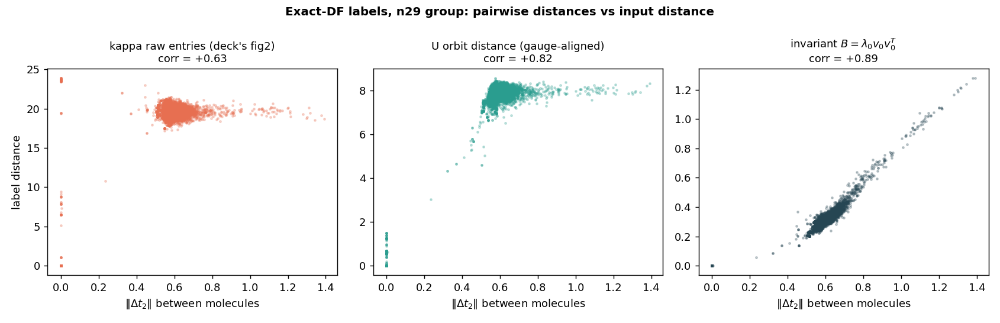
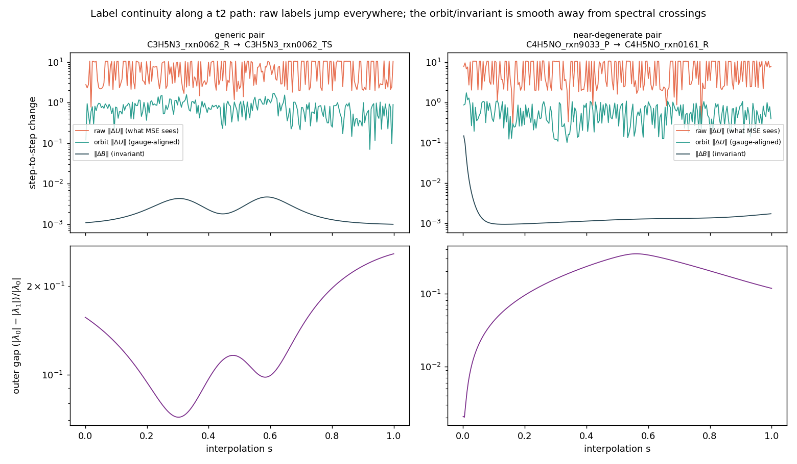

# Is U really unlearnable? A study of eigenvector-valued learning targets

*A response to the "J is learnable, κ is not" conclusion in `slides/deck_v2.md` /
`docs/FINDINGS.md`. All experiments in this document run on this repo's actual
data (`rhf_dataset_n29` + `rhf_targets`, and `rhf_cache`); code in
`gauge_study/`, reproduction commands in the appendix.*

---

## 0. Verdict up front

**The deck's empirical observations are correct, but the conclusion "U/κ is
unlearnable" is wrong as stated.** What is true:

1. **The κ labels, as currently generated, are unusable for entrywise
   regression.** They are dominated — not merely contaminated — by gauge
   freedom that `eigh`/L-BFGS resolves arbitrarily per molecule. Regenerating
   the *same molecule's* label with a different LAPACK build changes κ by a
   relative distance of **1.44** (≈ random matrices) while Z changes by 1e-9.
   Raw MSE on κ is a regression onto label noise; R² ≤ 0 is the expected
   outcome, not evidence about the task.
2. **The information that U carries is smooth and learnable.** The
   gauge-invariant content of the very same labels is as smooth a function of
   t2 as the Z/J target that already works (nearest-pair ratio **0.57 vs
   0.60** on the deck's own 42-molecule cache), and a plain ridge regression
   predicts its dominant part with **R² = 0.61** where raw κ gives ~0.
3. **There is one genuine, localized obstruction**: at spectral
   near-degeneracies (outer gap: ~8% of molecules within 5% of a λ₀/λ₁
   crossing; inner σ-clusters: ubiquitous), *no* method can pin down
   individual eigenvectors — but exactly there the ambiguous directions carry
   little or no physical weight, so subspace- or invariant-level targets
   remain well-posed.

| Claim "κ/U is unlearnable" interpreted as… | Verdict | Evidence |
|---|---|---|
| V1. No measurable map t2 → valid (U,Z) exists | **False** (trivially — ffsim computes one) | §2 |
| V2. No *continuous* selection of U exists globally | **True but benign**: obstruction only at degeneracies, which carry ~zero Z-weight; also unfixable by any canonicalization (Dym et al. 2024) | §3, §4.5 |
| V3. The labels as generated are not a smooth function of t2 | **True — this is what the deck measured.** A label-pipeline artifact, not a task property | §4.1–4.3 |
| V4. The *task* (predict any gauge representative with the right invariant content) is unlearnable | **False**: invariant content is smooth (ratio 0.57–0.78) and predictable (R² 0.61 with ridge; 0.88 for λ₀) | §4.2–4.6 |

The actionable consequence (§6): **stop regressing κ. Predict the invariant
generator of the label — for the current n_reps=2 exact-DF targets that is
literally one scalar + one (n_occ × n_virt) matrix — and rebuild U, Z at
inference with the same deterministic linear algebra ffsim uses.** This drops
into the existing Edge Transformer as a small head change, eliminates the
gauge problem exactly, and (as a bonus) removes the J=0 reconstruction trap.

---

## 1. What question are we actually asking?

The deck concludes from two observations —

* local-linear test R²: J **+0.80**, κ **−0.16**;
* nearest-pair ratio: ‖ΔJ‖ shrinks to 0.60× for t2-nearest pairs, ‖Δκ‖ stays
  at 0.98× (≈ random) —

that J is learnable and U/κ is not, attributing the failure to eigenvector
gauge. Both numbers reproduce (§4.1). But both are statements about **one
specific coordinatization of the label** (raw matrix entries) under **one
specific metric** (entrywise L2). "Learnability" of a target that is only
defined *up to a group action* can't be assessed in those terms: the target
is an **orbit**, not a point. The right questions are:

* **Q1** Is the orbit map t2 ↦ [U,Z] (labels modulo gauge) smooth enough to
  learn? (§4.2, §4.4)
* **Q2** Which reparameterization or loss makes a NN able to learn it?
  (§5, §6)
* **Q3** What metric should declare success? (§6.3)

---

## 2. Anatomy of the label generator (what U and Z actually are)

Everything below is verified numerically on this repo's data
(`gauge_study/exp1_structure.py`; all identities hold to float32 precision).

The 30,205 training targets (`rhf_targets/`, `generate_df_targets.py`) use
ffsim's **exact truncated DF** (`optimize=False`,
`ffsim.linalg._double_factorized_t2_explicit`):

1. Reshape: T[(i,a),(j,b)] = t2[i,j,a,b] — a real symmetric
   (n_occ·n_virt)² matrix.
2. Eigendecompose T = Σ_k λ_k v_k v_kᵀ, **sorted by |λ_k| descending**.
3. For each kept k, embed v_k as a one-body matrix M (virtual-row, occupied-
   column block) and form two Hermitian **quadratures**
   Q± = ½(1∓i)(M ± iMᵀ).
4. `eigh(Q±) = (w±, U±)` → the **orbital rotations are eigenvector matrices
   of Q±**; the diagonal-Coulomb matrices are **rank-1**: Z± = ±λ_k w wᵀ.
5. Keep the first `n_reps` terms: with n_reps=2, **both reps are the ±
   quadratures of the single dominant eigenvector v₀**.

Verified structural consequences (50 molecules, median / max):

| Identity | Deviation |
|---|---|
| Z₁ = −Z₀ (rep 1 determined by rep 0) | 0 / 0 |
| rank(Z₀) = 1 (σ₂/σ₁) | 8e-9 / 2e-8 |
| U₁ = conj(U₀) up to gauge | 3e-18 / 5e-18 |
| reconstruct_t2(Z,U) = λ₀v₀v₀ᵀ (best rank-1 approx of T) | 5e-8 / 7e-8 |

So the **entire (U,Z) label for both reps is a deterministic function of the
top eigenpair (λ₀, v₀) of T** — everything else is replayable linear algebra.
The spectrum of Q± is itself structured: eigenvalues come in ±σ/√2 pairs
(σ = singular values of the v₀ block) plus exactly **n_occ − n_virt exact
zeros** (3 for the (16,13) group; 5 for (17,12); observed exactly, every
molecule). Columns of U with w_p = 0 enter the ansatz with **zero Coulomb
weight — they are pure gauge and contain no information at all**, yet κ
regression is asked to predict them.

**The gauge group.** The LUCJ layer U exp(i Σ Z_pq n̂_p n̂_q) U† is invariant
under, per rep: per-column phases U → U·diag(e^{iθ}) (U(1)ⁿ — for these
complex-Hermitian eigenvectors LAPACK's phase choice is essentially
arbitrary); joint permutations U → UP, Z → PᵀZP (Sₙ, restricted to the
sparsity pattern's automorphisms when LUCJ interaction constraints are on);
continuous mixing within degenerate w-subspaces; and the v₀ **sign** (which
reverses U's column order and flips phases). On top of gauge, κ = log U adds
matrix-log branch discontinuities.

The 42-molecule `rhf_cache` labels (`optimize=True` + LUCJ sparsity) start
from the exact-DF init above and then run L-BFGS on a nonconvex objective
whose optimum captures only ~5% of t2 (measured residual 0.956) — adding
**optimizer multimodality** on top of gauge. The optimizer moves U far from
its init (aligned relative distance 0.62 median), and its output inherits the
init's arbitrary gauge.

**A practical hazard discovered along the way**: recomputing the exact-DF
label for the *same molecule* under a different numpy/LAPACK build reproduces
Z to 1e-9 but returns U with raw relative distance **1.44** (aligned: 0.24,
the remainder being degenerate-subspace mixing). Any future regeneration of
`rhf_targets` on different BLAS silently rewrites every κ label while J stays
bit-identical. If κ labels are kept at all, the generator must pin a gauge.

---

## 3. Theory: when are eigenvector-valued targets learnable?

Three classical facts frame everything:

* **Davis–Kahan / perturbation theory.** Eigen*spaces* are stable with
  sensitivity ∝ 1/gap: ‖sin Θ(V, Ṽ)‖ ≤ ‖ΔT‖/gap. Eigen*vectors* (with a
  fixed arbitrary gauge) are not stable in any sense at or near degeneracies.
  Individual-eigenvector prediction degrades exactly where gaps close;
  subspace/invariant prediction degrades only as fast as the physics does.
* **No continuous global selection.** Around a degeneracy, any selection of
  eigenvectors is discontinuous (for real symmetric families this is the
  Longuet-Higgins/Berry sign flip around a conical intersection — a
  *topological* obstruction, not a numerical one). Recent ML theory sharpens
  this: **continuous canonicalization does not exist** for the relevant group
  actions (Sₙ, O(d), U(1)ⁿ orbits of eigenframes) — Dym, Lawrence & Siegel,
  ICML 2024. This is why the deck's "naïve column sign/permutation
  canonicalization did not help" was predictable, and why *any*
  canonicalize-then-regress scheme keeps residual discontinuities near
  degeneracies.
* **Multi-valued targets break MSE.** If the label is an arbitrary orbit
  representative y = γ(x)·f(x) with effectively random γ, the Bayes-optimal
  deterministic predictor under MSE is E[y|x], which averages over the orbit
  and lands *off the manifold* (phases cancel toward 0). Test R² ≤ 0 is the
  *expected* outcome of a well-run experiment on such labels — it measures
  the label pipeline, not the task. The classical fixes are (i) orbit-
  invariant losses (min over the group), (ii) invariant reparameterization,
  (iii) conditional generative models when genuine multimodality remains.

Where this leaves the four readings of "unlearnable" from §0: only V3 (labels
as generated) and the degeneracy-localized part of V2 are true. Neither
implies V4 (the task is unlearnable) — that is an empirical question about
the smoothness of the *orbit map*, answered below.

---

## 4. Empirical results (this repo's data)

All code in `gauge_study/`. Data: the n29 uniform-size group
(**1410 molecules** with n_occ=16, n_virt=13 — larger than the 513-molecule
(17,12) group used in one auxiliary run) with the production exact-DF
targets; and the deck's own 42-molecule `rhf_cache` with compressed labels.

### 4.1 The deck's numbers reproduce

Raw κ nearest-decile ratio: **0.985** on n29 exact labels, **0.976** on the
cache (deck: 0.98). Z: **0.478** / **0.601** (deck: 0.60). Local-linear raw κ
R²: **+0.01** on n29 (deck: −0.16 on 42 compressed-label molecules — small
sample, harder labels, weaker features; sign aside, both ≈ 0). No dispute
about the measurements.

### 4.2 The same labels are smooth once you look at invariants


Nearest-decile / random-pair distance ratios, same pairs, different
coordinates (left: exact labels; right: compressed labels; dotted line =
input-side t2 contrast, the best any 1-Lipschitz-like target could do):

| Distance on | n29 exact (input 0.87) | cache compressed (input 0.56) |
|---|---|---|
| κ raw (deck's metric) | 0.985 | 0.976 |
| U raw | 0.982 | 0.968 |
| U phase-aligned | 0.967 | **0.876** |
| U orbit (phase+perm / true gauge) | 0.965 | 0.870 |
| **λ₀v₀ (invariant)** | **0.743** | — |
| **B = λ₀v₀v₀ᵀ (invariant)** | **0.780** | **t̂2: 0.568** |
| w sorted (eigenvalues) | 0.655 | — |
| Z raw (the "learnable" control) | 0.478 | 0.601 |

Two headline facts. **(a)** On the deck's own cache, the gauge-invariant
content of the "unlearnable" labels (t̂2 = what (U,Z) reconstruct) is
*smoother than the Z target that already works* (0.568 < 0.601), and
essentially tracks the input contrast (0.56) 1:1. **(b)** Phase alignment
alone — a closed-form postprocess — moves the compressed-label ratio from
0.976 to 0.876 and the correlation with ‖Δt2‖ from +0.35 to +0.78. The
"non-smoothness" was mostly bookkeeping.

On the exact labels the orbit distance improves less (0.985 → 0.965): there
the residual is *within-near-degenerate-subspace mixing*, which
phase+permutation alignment cannot fix but which the invariant distances see
through (0.74–0.78). That is the correct reading of "the harder basis
ambiguity" from FINDINGS §4 — it is real, but it lives almost entirely in
directions the physics doesn't use.



### 4.3 A continuation experiment: labels jump, the orbit doesn't

Linearly interpolate t2 between two molecules and regenerate labels at every
step (`exp5`, 240 steps):



* **raw ‖ΔU‖ per step: median 7.6** — the theoretical maximum for two
  unrelated gauges (√(2·29) ≈ 7.6). LAPACK redraws the gauge at *every*
  infinitesimal input change. This is the target supervised κ-MSE sees.
* orbit-aligned ‖ΔU‖: ~0.5–0.8 (residual = near-degenerate mixing);
* **invariant ‖ΔB‖: ~1.5e-3**, three orders of magnitude smaller — and its
  only spikes coincide exactly with pinches of the outer gap
  (right panel: gap 0.002 → ΔB spike ~0.15). Discontinuity is real but
  *localized and diagnosable*, exactly as Davis–Kahan predicts.

### 4.4 Degeneracy census (how often is the hard case actually hard?)

Across 1410 molecules: outer gap (|λ₀|−|λ₁|)/|λ₀| median 0.16; **8.4%**
within 0.05; **0.6%** within 0.01 → the rank-1 invariant target is unstable
for a small, *identifiable* subset (flag by predicted gap; fall back to
predicting the rank-2 subspace there). Inner spectrum: exact zero modes =
n_occ − n_virt always; min relative σ-gap < 0.01 for **96%** of molecules →
per-column eigenvector identities inside U are unstable essentially
*everywhere* — individual columns of U were never a predictable object, while
their span and Z-weighted combination are.

### 4.5 The learnability ladder: same features, same learner, only the target's coordinates change

Ridge on t2-PCA256, 1128 train / 282 test (`exp4`):


| Target (same information, different coordinates) | pooled test R² |
|---|---|
| κ raw (what the deck / current training regresses) | **+0.18** |
| κ template-aligned (all labels gauge-aligned to one train molecule) | +0.36 |
| B entries (sign-free invariant, 500 sampled) | +0.37 |
| **λ₀v₀, sign-canonicalized (the sufficient statistic)** | **+0.61** |
| Z upper-tri (the deck's learnable control) | +0.96 |
| inner eigenvalues w (invariant spectrum of the quadrature) | +0.98 |

Notes: raw κ shows *some* pooled signal here (unlike the deck's −0.16)
because exact labels + 1128 same-shape training molecules + global PCA
features are an easier setting than 33 compressed-label molecules with local
slices — but the deck-style *local* test still gives ≈0.01 raw, vs +0.13 for
local B slices. The ladder, not any single number, is the finding:
**eigenvalues ≫ invariant eigenvector content ≫ aligned coordinates ≫ raw
coordinates**, with a >3× R² spread for identical information.

### 4.6 End-to-end proof of concept for the retargeted pipeline (`exp6`)

Predict (λ₀, sign-canonical v₀) with ridge, rebuild (U, Z) via the exact
quadrature+eigh construction, score gauge-aware:

* λ₀: **R² = 0.88** (it's an eigenvalue — of course);
* v₀ direction: median |⟨v̂₀, v₀⟩| = **0.78** vs 0.38 for the train-mean
  baseline (quartiles 0.42–0.98: easy molecules nearly nailed, near-crossing
  molecules not — consistent with §4.4);
* invariant-content error ‖B̂−B‖/‖B‖: 0.93 vs 1.36/1.37 for baselines. A
  *linear* probe is not a good v₀ model — the point is that the signal is
  there and the pipeline is exact; the deck's Edge Transformer (which already
  gets R² 0.63 on the harder-to-pool Z entries with far weaker features than
  it could have) is the natural next learner.
* Instructive negative: scored by *unweighted* U orbit distance, even this
  genuinely informative prediction looks barely better than a random label
  (1.00 vs 1.05) — because that metric is dominated by the near-zero-weight
  degenerate columns (same-molecule relabeling floor: 0.24). **The metric,
  not the signal, produces "unlearnable" verdicts.**

---

## 5. How the literature handles exactly this problem

**Eigenvectors as *inputs* (the mature case).**
[SignNet/BasisNet](https://arxiv.org/abs/2202.13013) (Lim et al., ICLR 2023)
build invariance to sign flips (φ(v)+φ(−v)) and to basis rotations in
degenerate subspaces (operate on projectors VVᵀ) and prove universality —
the projector trick is the same move as our B/H targets.
[Laplacian Canonization / MAP](https://arxiv.org/abs/2310.18716) (NeurIPS
2023) fixes sign/basis by projecting onto canonical axes — works for >90% of
eigenvectors but is a preprocessing heuristic, and
[Dym–Lawrence–Siegel (ICML 2024)](https://arxiv.org/abs/2402.16077) prove
**no continuous canonicalization exists** for these group actions (weighted
frames are their continuity-preserving fix). Lesson: canonicalization is a
useful mitigation, provably not a complete one — which our template-aligned
κ result (+0.36, between raw and invariant) illustrates precisely.

**Eigenvectors as *outputs*.** The quantum-ML field converged on **never
regressing eigenvectors**: predict the *operator*, diagonalize at inference —
[PhiSNet](https://arxiv.org/abs/2106.02347) (NeurIPS 2021),
[DeepH](https://www.nature.com/articles/s43588-022-00265-6) (Nat. Comput.
Sci. 2022), [QHNet](https://arxiv.org/abs/2306.04922) (ICML 2023) all predict
Hamiltonian matrices precisely because "the DFT Hamiltonian … transforms
covariantly … in contrast to gauge-dependent eigenvectors". Our
λ₀v₀/B retarget is this pattern specialized to the DF tensor (predict the
one-body generator; eigh at inference).
[Self-consistency training](https://arxiv.org/abs/2403.09560) (ICML 2024) is
the label-free version — structurally identical to this repo's
reconstruction loss, validating that objective as a mainstream idea (their
SCF-residual = our t̂2 residual).
[Expressive sign-equivariant networks](https://arxiv.org/abs/2312.02339)
(NeurIPS 2023) give architectures whose *outputs* transform with the input's
sign gauge (v·MLP(|v|)-type forms) — relevant if one insists on emitting
frame-dependent objects.
Where the solution set is genuinely multi-modal, eigen-solvers are recast
with invariant objectives rather than regression:
[EigenGame](https://arxiv.org/abs/2010.00554) (ICLR 2021, best paper) —
eigenvectors as Nash equilibrium of utilities built from Rayleigh quotients
and orthogonality penalties; Spectral Inference Networks / NeuralEF do the
same for operator eigenfunctions. None of these regress raw eigenvector
coordinates against arbitrarily-gauged labels.

**Orbit losses for label ambiguity (solved problems in other fields).**
Speech separation's label-permutation problem —
[Permutation Invariant Training](https://arxiv.org/abs/1607.00325), made
polynomial with the [Hungarian loss](https://www.isca-archive.org/interspeech_2021/dovrat21_interspeech.pdf);
[DETR](https://arxiv.org/abs/2005.12872)'s bipartite-matching loss for set
prediction. Identical structure to our min-over-(phase×perm) alignment, with
large-scale evidence that networks train fine through a discrete matcher.
For continuous-group targets, vision learned the hard way that the
*representation* must be continuous:
[Zhou et al., CVPR 2019](https://arxiv.org/abs/1812.07035) (quaternions/Euler
are discontinuous → 6D Gram-Schmidt representation) — κ = log U with branch
cuts is exactly a "quaternion-like" discontinuous chart of a manifold-valued
output.

**Amortized quantum-circuit initialization (the project's own genre).**
Warm-start prediction for VQE is an active area — LSTM meta-initializers
([arXiv:2505.10842](https://arxiv.org/pdf/2505.10842)), GNN initializers
(Qracle, QCE 2025), and notably
[Flow-VQE](https://www.nature.com/articles/s41534-025-01159-x) (npj QI 2025):
a *conditional generative* model over good parameters, trained
preference-style with no parameter labels at all — the standard answer when
the teacher's solution set is multimodal (our optimize=True labels). The
predict-then-refine pattern (NN gives the basin, cheap per-molecule
optimizer polishes) is the field's default, matching the deck's own
"predict-then-refine" bullet.

---

## 6. What this means for ML-LUCJ

### 6.1 The recommended retarget (small change, exact fix)

For the current production targets (n_reps=2, exact DF), replace the κ/Z
heads' target with the label's invariant generator:

* **targets**: scalar λ₀ (signed) + matrix m = v₀ ∈ R^(n_occ×n_virt),
  sign-canonicalized (e.g. largest-|entry| positive) — *or* sign-free via the
  outer product B;
* **loss**: min(‖m̂−m‖², ‖m̂+m‖²) (two-term orbit loss — the entire residual
  gauge after this retarget is one global sign), plus MSE on λ₀;
* **inference**: rebuild M → quadratures Q± → eigh → (U, Z) with ~15 lines of
  the generator's own linear algebra (`gauge_study/common.py::exact_df_t2`
  already implements it);
* **architecture**: v₀ lives on occupied×virtual index pairs — the Edge
  Transformer *already has* occ-virt pair tokens; this is a scalar head over
  those tokens plus one pooled scalar for λ₀. The J/Z head can stay (or be
  derived: Z = ±λ₀wwᵀ).

Why this is exactly right and not merely convenient: (i) it is a *sufficient
statistic* — the reconstruction (U,Z) equals ffsim's output up to gauge,
verified to float32 precision (§2); (ii) it is smooth wherever the outer gap
is open, and the gap is *predictable* (flag the ~8% risky molecules, §4.4);
(iii) diagonalization happens only at inference, so the degenerate-eigh
backprop pathology never arises; (iv) it generalizes to n_reps = 2K: predict
the rank-K truncation Σ λ_k v_k v_kᵀ of the t2 matrix (a "denoised t2" — the
same object the J-head's success already proves is partially predictable),
splitting into eigenpairs at inference.

### 6.2 The reconstruction loss's J=0 trap disappears in these coordinates

FINDINGS §5 found pure reconstruction collapses to Z=0 (loss pinned at 1.0):
in (U, Z) coordinates the trap is structural — at Z=0 the output is
identically 0, *all* U-gradients vanish exactly, and the U-manifold is a huge
flat plateau. In m-coordinates the same objective is
‖Σ_k ±m_k m_kᵀ − T‖² — a symmetric low-rank factorization (Burer–Monteiro)
landscape: m=0 is a *strict saddle* whose escape directions are the top
eigenvectors of T with curvature ∝ −|λ_k|, and such landscapes have no
spurious local minima under standard conditions. Same physics, benign
geometry. If a self-supervised stage is kept (recommended as a fine-tune, cf.
self-consistency training), run it on m̂, not on (U, Z).

### 6.3 Evaluation metrics (what replaces κ-MSE/R²)

Report, in this order of authority:

1. **Downstream energy**: QSCI/variational energy gap vs the teacher init —
   the actual deliverable;
2. **Invariant-content error** ‖B̂−B‖_F/‖B‖_F (for exact targets this *is*
   the t̂2 error);
3. **Weighted subspace error**: principal angles between Z-weighted
   eigenspaces, or equivalently ‖Ĥ−H‖ with H = U diag(w) U† — never
   unweighted per-column distances (§4.6's cautionary result);
4. **Orbit distance** min over gauge ‖Û−Uγ‖ *only* with |w|-weighted columns,
   if a U-space number is wanted;
5. For any remaining supervised κ path: alignment (phase closed-form +
   Hungarian) inside the loss, PIT/DETR-style, and *never* raw R².

Also worth institutionalizing: a label-pipeline determinism test across
BLAS/LAPACK builds (§2's hazard), and reporting the outer-gap distribution of
any evaluation subset (accuracy stratified by gap, as in §4.4, distinguishes
model failure from task ill-posedness).

### 6.4 For the compressed / optimize=True targets (if revisited)

Those labels add optimizer multimodality that no canonicalization removes
(aligned ratio saturates at 0.87 while the invariant content sits at 0.57 —
the gap between those two numbers *is* the optimizer noise). Options, in
order of preference: (a) don't regress them — train on exact-DF invariants
(§6.1) and add per-molecule L-BFGS refinement at inference (predict-then-
refine; the NN only needs the basin — this is also exactly how ffsim itself
produces them: exact init → local optimization); (b) reconstruction/energy
fine-tuning in m-coordinates (§6.2); (c) if capturing the teacher's solution
*distribution* ever matters, a conditional generative head (Flow-VQE
precedent). The existing Stage-C RL plan with QSCI reward is compatible with
all three.

### 6.5 Equivariance bookkeeping (architecture notes, lower priority)

* The relevant input symmetry is *separate* index relabeling of occupied and
  virtual orbitals (S_occ × S_virt acting on t2 and correspondingly on v₀).
  The current tokenizer breaks it via `PosEmb(p)` — defensible because MO
  energy ordering is canonical, but near-degenerate orbital *energies* make
  even the input ordering unstable between conformers; if pursued, make the
  v₀-head equivariant (pair-token-local readout already is, minus the
  positional embeddings) rather than adding output-side machinery.
* Sign-equivariant output forms (v·MLP(|v|), Lim et al. 2023) are the
  architectural alternative to the two-term sign loss; not needed if §6.1's
  loss is used.
* SignNet-style symmetrization and MAP canonicalization remain relevant only
  if eigenvectors are ever used as *inputs* (e.g. feeding v₀ or MO
  coefficients into a larger model).

---

## 7. Threats to validity

* All smoothness/learnability numbers use fixed-shape molecule groups
  (n_occ, n_virt constant); cross-shape generalization is untested here (the
  deck's training already handles variable shapes via padding/masking).
* Ridge-on-PCA is a deliberately weak learner: §4.5/§4.6 numbers are
  lower bounds on signal, not model benchmarks; conversely they can't prove
  the Edge Transformer will reach any particular R² on v₀.
* The n29 closest-decile input contrast is mild (0.87) — Transition1x
  same-shape molecules are genuinely diverse; ratios should be read relative
  to that dotted line, not to 0. (Same-reaction R/TS/P pairs turn out *not*
  to be near-identical in t2 — mean ratio 0.98 — so "nearby molecules" must
  be found by search, as done here, not assumed from chemistry.)
* For n_reps > 2 or richer DF variants the sufficient statistic grows
  (top-K eigenpairs) and near-degenerate λ_k crossings between *kept* factors
  become more frequent; the subspace-level remedies in §6.1/§6.3 are the
  scalable path, but were only validated here for K=1.
* exp5's interpolation path is synthetic (convex combinations of t2 are not
  physical molecules); it isolates the label map's behavior, which is its
  only purpose.

---

## 8. Reproduction

```bash
cd ccsd_amplitudes
export OMP_NUM_THREADS=1            # small-matrix workloads; avoids BLAS thrashing
python3 -m gauge_study.exp1_structure        # label anatomy checks       (~1 min)
python3 -m gauge_study.exp2_smoothness       # gauge-aware smoothness     (~2 min)
python3 -m gauge_study.exp3_cache_compressed # deck-cache decomposition   (~7 min)
python3 -m gauge_study.exp4_learnability     # learnability ladder        (~1 min)
python3 -m gauge_study.exp5_interpolation    # continuation experiment    (~3 min)
python3 -m gauge_study.exp6_retarget_poc     # retargeted pipeline PoC    (~1 min)
python3 -m gauge_study.make_figs             # figures in gauge_study/figs
```

Logs from the runs behind this document: `gauge_study/exp*.log`.

**References** (linked inline in §5): SignNet/BasisNet — Lim et al., ICLR'23 ·
Sign-equivariant nets — Lim et al., NeurIPS'23 · Laplacian Canonization — Ma
et al., NeurIPS'23 · Impossibility of continuous canonicalization — Dym et
al., ICML'24 · PhiSNet — Unke et al., NeurIPS'21 · DeepH — Li et al., NCS'22 ·
QHNet — Yu et al., ICML'23 · Self-consistency training — Zhang et al.,
ICML'24 · EigenGame — Gemp et al., ICLR'21 · PIT — Yu et al., 2017 ·
Hungarian loss — Dovrat et al., Interspeech'21 · DETR — Carion et al.,
ECCV'20 · Rotation continuity — Zhou et al., CVPR'19 · Flow-VQE — npj QI'25 ·
Davis–Kahan 1970; Kato 1966; Longuet-Higgins 1975 / Berry 1984 for the
classical eigenvector-continuity facts.
