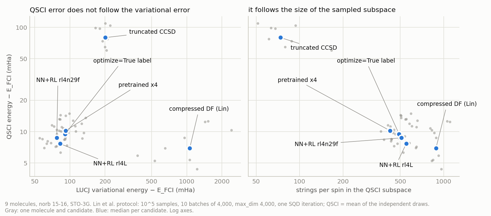

# Task 1: noiseless QSCI with Lin et al.'s protocol — does a better LUCJ energy give a better QSCI energy?

*5 Oct 2026, follow-up task 1. Lin et al. = Wan-Hsuan Lin et al., arXiv:2511.22476 (local checkout
`wan-hsuan-lucj/`).*

* **Code** (`pretrain/followups/`): `task1_sqd_lin.py` (candidates, GPU sampling, diagonalizations, FCI, self-test),
  `task1_sqd_report.py` (every table below), `task1_sqd_figure.py`, `task1_sqd_diag.slurm` and `task1_fci.slurm`
  (Expanse), `task1_sync.sh`.
* **Results** (`pretrain/opt_true/results/followups/task1_sqd_vs_lin/`): `lucj_states.jsonl` (exact LUCJ energy,
  sampling statistics and CI-string dimensions of every state and draw), `qsci_batches_{smallval,n17}.json` (every
  QSCI batch: energy, strings per spin, ⟨S²⟩, time), `summary_{smallval,n17,n17u}.json`, `fci_refs.json`,
  `spin_penalty_check.json`, `report_{smallval,n17,n17u}.md` (full report output; `n17u` = the 9 distinct norb-17
  molecules, `names_n17_c2hno_unique.txt`).
* **Logs**: `rl_runs/followups/task1_sqd_vs_lin/`. Bulky intermediates (samples, CI strings, raw diagonalization
  files) are in `runs_ot/energy_tasks/task1_sqd_vs_lin/` (gitignored).

## 0. Answer

QSCI here is SQD without configuration recovery: Lin et al.'s noiseless protocol, which has one SQD iteration.

1. **Not in general.** Across the six parameter sets, the order by variational energy and the order by QSCI energy
   are unrelated. Per molecule, the Spearman correlation has mean 0.13 and median 0.03; pooled it is −0.09. The
   clearest case is Lin et al.'s own compressed-DF initialization without regularization, the version she
   recommends for QSCI. Its LUCJ energy lies 1.1 Ha above FCI, above Hartree–Fock. Yet with her protocol it gives
   the second-best QSCI energy (8.0 mHa above FCI, better than the label on 7/9 molecules). With 10⁶ samples it gives
   the best (0.7 mHa).
2. **What sets the QSCI energy is how many distinct configurations the samples contain.** The label, the pretrained
   network and the two RL policies are all reasonable variational states (59–70 % of the CCSD correlation energy).
   Among them, the QSCI error follows the subspace size: Spearman −0.96 with strings per spin, against 0.24 with
   the LUCJ energy. The RL that improved the variational energy did not reliably improve QSCI:
   * **rl4L** (68.2 % vs 62.0 % for the label): QSCI error 8.6 vs 10.1 mHa, lower on 8/9 molecules (beyond 2 standard
     errors). Its states are a little more spread out.
   * **rl4n29f**, the best variational policy (70.3 %): 10.0 mHa, the same as the label (better on 4/9 molecules).
     The extra n29 RL made its states more concentrated (p_HF 0.860 vs 0.839).
3. **At a fixed subspace size the four are equal.** With the 300 (or 100) strings per spin that the library ranks
   first, label, pre4, rl4L and rl4n29f lie within 0.5 mHa (1.6 mHa) of each other (norb 17: 1.2 and 0.9 mHa).
   The variational gains of RL do not pick out better configurations; RL helps QSCI only to the extent that the
   state samples more of them.
4. **Against Lin et al.** Under her sampling protocol, our best policy (rl4L, 8.6 mHa) is close to her compressed
   initialization (8.0 mHa) at 10⁵ samples and clearly behind it at 10⁶ samples (2.08 vs 0.69 mHa). In error ratios:
   * relative to truncated CCSD, rl4L improves the QSCI error by a factor of 10.5, the label 8.6 and her compressed
     initialization 12.4. Her paper reports 1.3–10.8 for her compressed initialization and 3.0–29.5 for her
     TN-optimized parameters (one heavy-hex layer, other systems);
   * her per-molecule TN optimization of the QSCI energy gains 1.1–4.2× (median 2.4×) over her compressed start. Our
     energy-trained RL gains 1.2× over the labels and 0.9× over her compressed initialization.

   **So with QSCI as the target, a network trained on the variational energy is not more competitive than her
   method.** It is much better variationally (70 % against below HF). Competing on QSCI would need a QSCI-aware
   reward, such as the QSCI energy itself (her TN objective, task 2) or a coverage term.
5. **norb 17** (9 distinct C2HNO molecules, CCSD(T) reference; §4): the same picture. At 10⁵ samples the compressed
   DF is best (8.7 mHa above CCSD(T)) and rl4L second (9.2 mHa), lower than the label (10.7 mHa) on 9/9 molecules.
   rl4n29f is 18 mHa better than the label variationally but worse in QSCI on 9/9 (12.1 mHa). At 10⁶ samples the
   compressed DF goes 1.6 mHa *below* CCSD(T) (so CCSD(T) is above FCI there); rl4L 0.4, label 1.0, rl4n29f
   1.7 mHa above. At fixed subspace size the label and network states are within 1.2 mHa and the compressed DF is
   5 mHa worse than the label.
6. **Protocol detail.** At these sizes, 10⁵ samples hold only 1,400–3,900 distinct configurations, fewer than one batch
   of 4,000. So all 10 batches are identical for every state except the compressed-DF one, and her min/max error bars
   collapse to zero (she reports the same for N2/6-31G). The sampling noise was measured from 5 independent 10⁵-sample
   draws per state instead: standard deviation 0.27–0.48 mHa (median over molecules) for the label and network
   states, 0.25 for the compressed DF, 7 mHa for truncated CCSD (norb 17: 0.44–0.63, 0.37 and 7 mHa).

## 1. Question

Item 1 of Fang's list (5 Oct): does a better LUCJ variational energy translate into a better SQD energy, under
the protocol of Lin et al.? This is the missing link for "are we more competitive than her?". Everything is
noiseless: exact state vectors, sampled exactly.

## 2. Method (exact settings)

**Molecules.** STO-3G, frozen core, canonical RHF orbitals; active-space Hamiltonians from `rhf_hamiltonians/`
(`pretrain/rl/hamiltonian.py`).

* small val (`pretrain/rl/small_val.txt`, 9): C2H3N rxn2858 P/TS (norb 15, 8α+8β), C2H4O rxn0724 and rxn2507 P/TS
  (norb 16, 9+9), C3H4 rxn2391 R/P/TS (norb 16, 8+8).
* norb 17 (12 C2HNO of `pretrain/rl/large_val.txt`, 10+10; the four reactants R are the same molecule).
* norb 18–19 were not run (their states need > 12 GB of GPU memory).

**Candidates** (all: 2 layers, square interaction pairs, spin-balanced, final orbital rotation from the CCSD t1;
t1/t2 from `rhf_dataset/`, float32 → float64):

| tag | parameters |
|:--|:--|
| truncated | `ffsim.UCJOpSpinBalanced.from_t_amplitudes(t2, t1=t1, n_reps=2, interaction_pairs=square)`, no optimization (Lin et al.'s "truncated") |
| cdf_lin | the same call with `optimize=True`, L-BFGS-B `maxiter=100`, `multi_stage_start=20`, `multi_stage_step=2`, no regularization: Lin et al.'s "compressed" initialization in the form she recommends for QSCI (ffsim's implementation, which she contributed) |
| label | the project's optimize=True label (canonical exact-DF init, L-BFGS ≤ 500 it., regularization λ = 0.005; `rhf_targets_compressed_small/`, `rhf_targets_compressed_n17/`) |
| pre4 | pretrained slot model, 4 recycles (`policy_dump init4:runs_ot/slotall_T4/best.pt`) |
| rl4L | GRPO policy, norb 15–18 exact-reward RL, step 25 (`rl_runs/grpo_large_rl4/policy_best.pt`) |
| rl4n29f | rl4L + n29 TN-reward RL, step 30 (`rl_runs/grpo_n29_tn/policy_last.pt`) |

**States.** `pretrain.rl.gpu_energy.LUCJEnergyGPU` (complex64) on scai2 GPU 2 (TITAN Xp): exact LUCJ energy and
the CI matrix, flattened in ffsim order and renormalized. Checks: on N2/6-31G (10e,10o) the GPU state equals
`ffsim.apply_unitary` element by element (2.5e-14 in complex128, 1.5e-7 in complex64); every recomputed LUCJ
energy that the project had stored (label, pre4, rl4L, rl4n29f; 28 small-val and n17 pairs checked) agrees to
≤ 4.5e-8 Ha; the cdf_lin energy of C2H3N_rxn2858_P recomputed with ffsim directly from the ffsim operator agrees
to 3e-8 Ha.

**Sampling and QSCI, protocol "lin"** (her paper's protocol; code: `scripts/sqd/fe2s2_30e20o/lucj_*_t2.py`,
`scripts/sqd/n2_cc-pvdz_10e26o/random_sqd.py`, `src/lucj/sqd_energy_task/lucj_compressed_t2_task{,_sci}.py`):

1. `ffsim.sample_state_vector(psi, shots=1_000_000, seed=rng, bitstring_type=INT)`, `rng = default_rng(seed)`;
   seed 0 = her `entropy=0`.
2. A uniformly random subset of 100,000 of these samples (she uses the unseeded global `np.random.choice`; we seed
   it). This equals 10^5 independent draws.
3. `diagonalize_fermionic_hamiltonian(h1, h2, bit_array, samples_per_batch=4000, num_batches=10, max_dim=4000,
   max_iterations=1, symmetrize_spin=True, energy_tol=1e-5, occupancies_tol=1e-3, carryover_threshold=1e-3,
   seed=rng)`. One iteration means no configuration recovery (her simulation scripts use `max_iterations=1`).
4. Solver: PySCF selected CI, `solve_sci_batch(..., spin_sq=0.0)` — her `*_sci` variant. Her 10^5-sample runs used
   Dice (`qiskit_addon_dice_solver`), which is not installed here; both diagonalize H exactly in the same
   subspace, Dice without a spin penalty (effect of the penalty: §6).
5. QSCI value of one draw = mean of the 10 batch energies (her figures show mean, min, max).

The run is staged (GPU sampling, CPU diagonalization), but each stage calls the library's own code: the CI strings
come from `qiskit_addon_sqd.fermion._prepare_ci_strings`, the first iteration of
`diagonalize_fermionic_hamiltonian`, which is line-for-line identical in qiskit-addon-sqd 0.12.0 (her lock file)
and 0.13.1 (ours); `subsample`, `solve_sci`, `bit_array_to_arrays` are identical too. `selftest` reproduces her
one-call `diagonalize_fermionic_hamiltonian` bit for bit (|ΔE| ≤ 4e-15 Ha on all batches of a random-LUCJ N2
case in which subsampling and `max_dim` both act). PySCF 2.14 (she: 2.10), ffsim 0.0.84 (she: 0.0.60).

**Extra protocols on the same samples.**
* 5 independent draws (seeds 0–4) per state: the 10 batches turned out to be identical for every candidate except
  cdf_lin (§3.1), so the spread between draws is the only measure of the sampling noise.
* "n2631g": her script for N2/6-31G (10e,16o), the only system of her paper with our orbital count
  (`scripts/sqd/n2_6-31g_10e16o/lucj_*.py`): all 10^6 samples, one batch, `max_dim=None`. Seed 0 only.
* "top100", "top300": n2631g with `max_dim` = 100 / 300 strings per spin (the strings the library ranks first),
  i.e. QSCI at a fixed subspace size. Seed 0 only.

**References.** FCI for the 9 small-val molecules: PySCF `fci.direct_spin0`, conv_tol 1e-10, ⟨S²⟩ ≤ 1e-12,
41–166 M determinants. Timings: 4–5 min at norb 15 and 15–22 min at norb 16 (9,9), on 8 threads on scai2; 18 min at
  norb 16 (8,8) on scai2, and 9–13 min on 16 Expanse threads for the two other (8,8) molecules.
CCSD(T): `pretrain/opt_true/results/ccsd_t_refs.json`.

**Compute.** GPU: scai2 GPU 2 only. CPU: ≤ 16 cores on scai2 (FCI 8 threads; diagonalization workers 2–4 threads;
sampler post-processing 5 single-threaded processes). Expanse: shared partition, account cla361, 3 jobs of 32 cores
(`pretrain/followups/task1_sqd_diag.slurm`) for the cdf_lin batches, the n2631g protocol and the norb-17 set,
plus one 48-core FCI job: 378 core-hours in total (§7).

## 3. Results at norb 15–16 (9 molecules, FCI reference)

### 3.1 Sampled states

| candidate | LUCJ % CCSD corr | p_HF | entropy of \|ψ\|² | distinct configurations in 10⁵ (range) | distinct in 10⁶ | distinct batches of 10 | strings per spin, protocol lin / n2631g |
|:--|--:|--:|--:|--:|--:|--:|--:|
| truncated CCSD | 16.6 | 0.968 | 0.23 | 173 (86–330) | 494 | 1 | 83 / 173 |
| compressed DF (Lin) | −401 | 0.320 | 5.18 | 10,391 (4,358–18,401) | 47,870 | 10 | 922 / 3,269 |
| optimize=True label | 62.0 | 0.842 | 1.30 | 2,084 (1,564–3,079) | 7,934 | 1 | 513 / 1,183 |
| pretrained x4 | 59.4 | 0.854 | 1.17 | 1,814 (1,402–2,649) | 6,605 | 1 | 450 / 1,071 |
| NN+RL rl4L | 68.2 | 0.839 | 1.37 | 2,387 (1,888–3,863) | 9,187 | 1 | 604 / 1,398 |
| NN+RL rl4n29f | 70.3 | 0.860 | 1.21 | 2,131 (1,581–3,609) | 7,891 | 1 | 533 / 1,226 |

(Means over 9 molecules and 5 draws; p_HF = weight of the HF determinant; entropy in nats.)

* The compressed DF without regularization has large diagonal-Coulomb norms: ‖Z‖_F ≈ 2.0–2.6 per layer, against
  0.7 for the label and 0.14 for truncated CCSD, on C2H3N_rxn2858_P. With only two Trotter layers the state then
  moves far from the CCSD-like state; its LUCJ energy rises above HF. It also spreads over many determinants. This
  is the trade-off Lin et al. describe in her Figs. 3–4 (regularization helps the VQE energy and hurts QSCI), here in an
  extreme form. ffsim, applied directly to the ffsim operator, gives the same energy (−128.006 Ha against −130.179
  for HF, Δ = 3e-8 Ha against the GPU engine).

### 3.2 QSCI energies with Lin et al.'s protocol (10⁵ samples, 10 batches of 4,000)

Errors are E − E_FCI in mHa, averaged over the 9 molecules. "Seed 0" is the single run her protocol would report;
the next column averages the 5 independent draws per state. "% FCI corr" is the share of the FCI correlation energy
that the QSCI energy recovers.

| candidate | LUCJ % CCSD corr | LUCJ − FCI | QSCI − FCI, seed 0 | QSCI − FCI, 5 draws | sd between draws | % FCI corr | strings per spin | QSCI below label |
|:--|--:|--:|--:|--:|--:|--:|--:|--:|
| truncated CCSD | 16.6 | 197.3 | 82.37 | 85.02 | 7.96 | 63.6 | 83 | 0/9 |
| compressed DF (Lin) | −401.3 | 1127.5 | 8.00 | 8.00 | 0.25 | 96.6 | 929 | 7/9 |
| optimize=True label | 62.0 | 94.7 | 9.81 | 10.10 | 0.46 | 95.7 | 520 | — |
| pretrained x4 | 59.4 | 99.5 | 11.44 | 11.41 | 0.41 | 95.1 | 448 | 1/9 |
| NN+RL rl4L | 68.2 | 80.1 | 8.41 | **8.61** | 0.26 | 96.3 | 611 | **8/9** |
| NN+RL rl4n29f | 70.3 | 75.5 | 9.93 | 9.97 | 0.45 | 95.7 | 538 | 4/9 |
| *for scale:* CCSD / CCSD(T) | | | | 7.89 / 1.91 | | | | |

* With CCSD(T) as the reference, every error drops by the same per-molecule constant (CCSD(T) is 0.9–3.8 mHa above
  FCI, mean 1.9). The ordering and the differences are unchanged; that table is in `report_smallval.md`.
* With 10⁵ samples, every QSCI energy except truncated CCSD lands at roughly CCSD accuracy, 4–6 mHa short of CCSD(T).

**Each candidate against the label** (molecule by molecule; QSCI = mean of 5 draws; "beyond 2 s.e." = the difference
exceeds twice its standard error from the 5 draws):

| candidate | ΔE_LUCJ (mHa) | LUCJ lower | ΔE_QSCI (mHa) | QSCI lower | lower beyond 2 s.e. | higher beyond 2 s.e. |
|:--|--:|--:|--:|--:|--:|--:|
| truncated CCSD | +102.6 | 0/9 | +74.92 | 0/9 | 0/9 | 9/9 |
| compressed DF (Lin) | +1032.7 | 0/9 | −2.09 | 7/9 | 7/9 | 2/9 |
| pretrained x4 | +4.8 | 5/9 | +1.32 | 1/9 | 0/9 | 6/9 |
| NN+RL rl4L | −14.6 | 8/9 | **−1.48** | 8/9 | 8/9 | 1/9 |
| NN+RL rl4n29f | −19.2 | 9/9 | −0.12 | 4/9 | 4/9 | 3/9 |

### 3.3 Variational order against QSCI order

The six candidates were ranked per molecule by LUCJ energy and by QSCI energy (mean of 5 draws), and the two
rankings compared with Spearman's ρ. "Pooled" is ρ over all molecules after centring each molecule's values.

| candidates compared | ρ per molecule: mean (median; range) | ρ pooled | concordant pairs | ρ of QSCI with strings per spin (pooled) |
|:--|--:|--:|--:|--:|
| all 6 | 0.13 (0.03; −0.26 to 0.89) | −0.09 | 77/135 | −0.64 |
| without compressed DF | 0.66 (0.70; 0.30 to 0.90) | 0.48 | 69/90 | −0.68 |
| label + pre4 + rl4L + rl4n29f | 0.31 (0.40; −0.40 to 0.80) | 0.24 | 33/54 | **−0.96** |

* Leaving out the compressed DF raises the correlation only because truncated CCSD is last in both orders.
* Among the four reasonable variational states, the QSCI energy is nearly a function of the number of
  distinct strings sampled (ρ −0.96). The LUCJ energy adds little (ρ 0.24).

### 3.4 More samples, and the subspace size held fixed

Same states and solver, mean QSCI − FCI over the 9 molecules (mHa). Protocol "n2631g" is her N2/6-31G script:
10⁶ samples, one batch, no max_dim; it was run on 3 independent draws (seeds 0–2) per state, except the compressed
DF (seed 0 only, its 10⁶-sample subspaces take 3–17 min each). "Fixed k strings" means the k strings per spin that
the library ranks first, from the seed-0 10⁶ samples (one draw).

| candidate | LUCJ − FCI | 10⁵ samples (her paper; 5 draws) | 10⁶ samples (her 16-orbital script; 3 draws) | sd between 10⁶ draws | fixed 300 strings/spin | fixed 100 strings/spin |
|:--|--:|--:|--:|--:|--:|--:|
| truncated CCSD | 197 | 85.02 | 48.15 | 2.22 | 49.38 ¹ | 64.49 |
| compressed DF (Lin) | 1127 | 8.00 | **0.69** ² | – | 18.12 | 37.63 |
| optimize=True label | 95 | 10.10 | 2.55 | 0.10 | 13.89 | 29.57 |
| pretrained x4 | 100 | 11.41 | 3.12 | 0.12 | 13.43 | 28.96 |
| NN+RL rl4L | 80 | 8.61 | 2.08 | 0.06 | 13.43 | 29.80 |
| NN+RL rl4n29f | 76 | 9.97 | 2.58 | 0.08 | 13.83 | 30.57 |

¹ Truncated CCSD has only 167 strings per spin in 10⁶ samples (mean). ² Seed 0 only.

* **More samples.** With 10⁶ samples the errors fall about 4× for the label and network states. They fall 12× for
  the compressed DF, which keeps finding new configurations (3,277 strings per spin against 1,067–1,407). The three
  independent 10⁶-sample draws agree to 0.06–0.12 mHa (sd) for the label and network states. Against the label,
  rl4L is lower on 8/9 molecules (−0.47 mHa), rl4n29f is level (+0.03 mHa; 3/9 lower and 3/9 higher beyond
  2 s.e.), pre4 is higher on 9/9 (+0.57 mHa) and the compressed DF lower on 9/9 (−1.86 mHa).
* **Fixed subspace size.** At 300 strings per spin, label, pre4, rl4L and rl4n29f lie within 0.5 mHa of each other.
  rl4L and pre4 are 0.46 mHa better than the label, rl4n29f 0.06 mHa. At 100 strings per spin the spread is 1.6 mHa,
  and rl4n29f, the best variational state, is the worst of the four. The compressed DF is clearly worse at fixed size
  (+4.2 and +8.1 mHa vs the label): its advantage comes entirely from sampling more distinct configurations.

### 3.5 Per molecule

QSCI − FCI in mHa (protocol lin, mean of 5 draws); in parentheses, the LUCJ % of the CCSD correlation energy.

| molecule | truncated CCSD | compressed DF (Lin) | optimize=True label | pretrained x4 | NN+RL rl4L | NN+RL rl4n29f | best QSCI | best LUCJ |
|:--|--:|--:|--:|--:|--:|--:|:--|:--|
| C2H3N_rxn2858_P | 65.0 (13) | 10.4 (-976) | 8.4 (62) | 8.4 (63) | 6.3 (66) | 7.3 (68) | NN+RL rl4L | NN+RL rl4n29f |
| C2H3N_rxn2858_TS | 77.4 (25) | 5.3 (-96) | 8.6 (57) | 10.1 (62) | 7.4 (69) | 8.7 (70) | compressed DF (Lin) | NN+RL rl4n29f |
| C2H4O_rxn0724_P | 73.5 (14) | 5.4 (-396) | 9.5 (67) | 9.7 (42) | 8.0 (66) | 10.4 (67) | compressed DF (Lin) | NN+RL rl4n29f |
| C2H4O_rxn0724_TS | 79.7 (12) | 8.8 (-326) | 11.3 (53) | 13.6 (42) | 13.1 (66) | 14.5 (66) | compressed DF (Lin) | NN+RL rl4L |
| C2H4O_rxn2507_P | 98.7 (18) | 4.4 (-517) | 8.1 (69) | 10.1 (59) | 7.7 (70) | 8.5 (73) | compressed DF (Lin) | NN+RL rl4n29f |
| C2H4O_rxn2507_TS | 60.3 (15) | 12.6 (-564) | 11.9 (49) | 14.2 (65) | 11.1 (68) | 13.2 (69) | NN+RL rl4L | NN+RL rl4n29f |
| C3H4_rxn2391_R | 97.6 (24) | 5.9 (-61) | 11.2 (70) | 11.5 (71) | 7.0 (75) | 8.7 (78) | compressed DF (Lin) | NN+RL rl4n29f |
| C3H4_rxn2391_P | 109.0 (16) | 6.9 (-177) | 9.0 (69) | 10.2 (67) | 7.2 (69) | 7.8 (72) | compressed DF (Lin) | NN+RL rl4n29f |
| C3H4_rxn2391_TS | 103.9 (13) | 12.4 (-497) | 12.7 (61) | 14.9 (64) | 9.8 (65) | 10.8 (69) | NN+RL rl4L | NN+RL rl4n29f |

The full table (seed-0 batch mean / min / max, number of distinct batches, mean ± sd over the draws) is in
`report_smallval.md`.

## 4. Results at norb 17 (C2HNO, CCSD(T) reference)

**Set.** The 12 C2HNO entries of `large_val.txt` (10+10 electrons) contain the same reactant four times
(rxn4439/4440/4441/4442_R: identical Hamiltonian, LUCJ states, samples and QSCI energies), so there are **9 distinct
molecules**. The tables below use those 9 (set `n17u`, `report_n17u.md`). The 12-entry tables (`report_n17.md`)
count the reactant four times; their means differ by at most 0.5 mHa (0.7 for truncated CCSD) and lead to the
same conclusions.

**Reference.** No FCI was run at norb 17. A QSCI energy is variational, so it bounds FCI from above. On all 9
molecules, the best QSCI energy lies 0.2–2.6 mHa (mean 1.6) *below* CCSD(T). CCSD(T) is therefore above FCI by at
least that much here (at norb 15–16 it is 0.9–3.8 mHa above FCI). The errors below understate the error against FCI
by a molecule-dependent constant of a few mHa. Differences between candidates are unaffected. Error ratios
(§5) are inflated, because the smaller of the two errors is understated more in relative terms.

### 4.1 QSCI energies with Lin et al.'s protocol (10⁵ samples, 10 batches of 4,000)

Mean over the 9 molecules, mHa against CCSD(T); 5 independent draws per state.

| candidate | LUCJ % CCSD corr | LUCJ − CCSD(T) | QSCI − CCSD(T), seed 0 | QSCI − CCSD(T), 5 draws | sd between draws | strings per spin | p_HF | distinct configurations in 10⁵ | QSCI below label |
|:--|--:|--:|--:|--:|--:|--:|--:|--:|--:|
| truncated CCSD | 15.0 | 251.1 | 81.40 | 84.33 | 5.89 | 90 | 0.969 | 189 | 0/9 |
| compressed DF (Lin) | −152.7 | 724.9 | 8.77 | **8.72** | 0.33 | 1,003 | 0.404 | 8,673 | **9/9** |
| optimize=True label | 60.9 | 120.3 | 10.80 | 10.71 | 0.53 | 607 | 0.827 | 2,234 | — |
| pretrained x4 | 50.5 | 150.1 | 10.85 | 10.77 | 0.49 | 581 | 0.817 | 2,134 | 4/9 |
| NN+RL rl4L | 68.7 | 98.3 | 9.41 | **9.23** | 0.41 | 670 | 0.838 | 2,333 | **9/9** |
| NN+RL rl4n29f | 67.4 | 101.9 | 12.08 | 12.14 | 0.68 | 538 | 0.861 | 1,930 | 0/9 |

**Each candidate against the label** (per molecule; QSCI = mean of 5 draws):

| candidate | ΔE_LUCJ (mHa) | LUCJ lower | ΔE_QSCI (mHa) | QSCI lower | lower beyond 2 s.e. | higher beyond 2 s.e. |
|:--|--:|--:|--:|--:|--:|--:|
| truncated CCSD | +130.8 | 0/9 | +73.61 | 0/9 | 0/9 | 9/9 |
| compressed DF (Lin) | +604.6 | 0/9 | −1.99 | 9/9 | 8/9 | 0/9 |
| pretrained x4 | +29.8 | 1/9 | +0.06 | 4/9 | 2/9 | 2/9 |
| NN+RL rl4L | −22.0 | 7/9 | **−1.49** | 9/9 | 7/9 | 0/9 |
| NN+RL rl4n29f | −18.4 | 6/9 | **+1.43** | 0/9 | 0/9 | 8/9 |

* **The norb-15–16 picture holds.** The compressed DF is best, rl4L second. rl4L beats the label on every molecule
  (−1.5 mHa). rl4n29f is 18 mHa better than the label variationally, yet worse in QSCI on every molecule (+1.4 mHa,
  8/9 beyond 2 s.e.). Its states are the most concentrated of the four (p_HF 0.861, 538 strings per spin).
* **Rankings** (Spearman ρ of LUCJ vs QSCI order, as in §3.3): all 6, mean 0.00 per molecule (pooled 0.09); without
  the compressed DF, 0.63 (pooled 0.47); label + network family, 0.27 (pooled 0.08). Among the four, QSCI follows
  strings per spin (pooled ρ −0.91) and not the LUCJ energy (0.08).

### 4.2 More samples, and the subspace size held fixed

Mean over the 9 molecules, QSCI − CCSD(T) in mHa. The 10⁶-sample and fixed-size columns use seed 0 only (one draw).

| candidate | LUCJ − CCSD(T) | 10⁵ samples (5 draws) | 10⁶ samples | strings/spin at 10⁶ | fixed 300 strings/spin | fixed 100 strings/spin |
|:--|--:|--:|--:|--:|--:|--:|
| truncated CCSD | 251 | 84.33 | 51.61 | 196 | 51.61 ¹ | 70.26 |
| compressed DF (Lin) | 725 | 8.72 | **−1.61** | 3,774 | 23.17 | 47.42 |
| optimize=True label | 120 | 10.71 | 0.98 | 1,510 | 17.97 | 41.74 |
| pretrained x4 | 150 | 10.77 | 1.14 | 1,443 | 16.73 | 41.20 |
| NN+RL rl4L | 98 | 9.23 | 0.41 | 1,698 | 16.93 | 40.82 |
| NN+RL rl4n29f | 102 | 12.14 | 1.65 | 1,357 | 17.38 | 41.35 |

¹ Truncated CCSD has fewer than 300 strings per spin, so "fixed 300" is its 10⁶-sample subspace.

* **10⁶ samples.** The compressed DF goes 1.6 mHa below CCSD(T) and is lower than the label on 9/9 molecules
  (−2.6 mHa). rl4L is lower than the label on 8/9 (−0.57 mHa). rl4n29f is higher on 8/9 (+0.67 mHa).
* **Fixed subspace size.** The four label and network states lie within 1.2 mHa at 300 strings per spin and within
  0.9 mHa at 100. At 300, pre4, rl4L and rl4n29f are 0.6–1.2 mHa below the label (7–8/9 molecules; one draw
  each, so no noise estimate); at 100, 0.4–0.9 mHa (5–7/9). The compressed DF is 5–6 mHa above the label. As at norb 15–16, its advantage comes from the number of distinct
  configurations it samples, not from better ones.

### 4.3 Per molecule (norb 17)

QSCI − CCSD(T) in mHa (protocol lin, mean of 5 draws); in parentheses, the LUCJ % of the CCSD correlation energy.

| molecule | truncated CCSD | compressed DF (Lin) | optimize=True label | pretrained x4 | NN+RL rl4L | NN+RL rl4n29f | best QSCI | best LUCJ |
|:--|--:|--:|--:|--:|--:|--:|:--|:--|
| C2HNO_rxn4439_P | 89.9 (20) | 9.8 (-261) | 10.6 (55) | 12.0 (50) | 10.0 (70) | 13.3 (69) | compressed DF (Lin) | NN+RL rl4L |
| C2HNO_rxn4439_TS | 80.7 (9) | 12.9 (-178) | 13.3 (57) | 12.1 (57) | 9.8 (69) | 13.4 (68) | NN+RL rl4L | NN+RL rl4L |
| C2HNO_rxn4440_P | 84.5 (18) | 4.1 (-316) | 5.8 (72) | 6.9 (53) | 5.3 (69) | 6.6 (66) | compressed DF (Lin) | optimize=True label |
| C2HNO_rxn4440_TS | 83.3 (15) | 6.5 (-88) | 9.4 (67) | 8.2 (46) | 7.2 (69) | 10.8 (68) | compressed DF (Lin) | NN+RL rl4L |
| C2HNO_rxn4441_P | 89.8 (13) | 10.7 (-158) | 11.7 (66) | 12.2 (51) | 10.3 (66) | 13.1 (64) | NN+RL rl4L | optimize=True label |
| C2HNO_rxn4441_TS | 78.3 (10) | 10.2 (-80) | 12.6 (46) | 12.9 (47) | 11.3 (67) | 15.0 (68) | compressed DF (Lin) | NN+RL rl4n29f |
| C2HNO_rxn4442_P | 95.6 (20) | 8.6 (-129) | 11.3 (70) | 11.6 (50) | 9.9 (71) | 12.8 (68) | compressed DF (Lin) | NN+RL rl4L |
| C2HNO_rxn4442_TS | 75.5 (13) | 8.7 (-43) | 12.1 (54) | 11.7 (43) | 11.3 (64) | 14.1 (64) | compressed DF (Lin) | NN+RL rl4n29f |
| C2HNO_rxn4439_R | 81.4 (17) | 6.9 (-122) | 9.5 (62) | 9.4 (56) | 7.9 (73) | 10.3 (71) | compressed DF (Lin) | NN+RL rl4L |

The full tables (seed-0 batch mean / min / max, distinct batches, mean ± sd over the draws) are in
`report_n17u.md` (9 molecules) and `report_n17.md` (12 entries).

## 5. Comparison with Lin et al.

Her overall comparison is in `wan-hsuan-lucj/csv/improvement_quimb.xlsx` (sheet 3) and in the paper's TN-results
figure (`fig/tn_results_maxdim-4000_shot-100000.pdf`). Setup: LUCJ heavy-hex, **one layer**, exact state vectors,
10⁵ samples, 10 batches of 4,000. Her QSCI errors (mHa) and error ratios:

| system (orbitals) | truncated | compressed | TN-optimized | truncated / compressed | truncated / TN | compressed / TN |
|:--|--:|--:|--:|--:|--:|--:|
| N2/6-31G 1.2 Å (16) | 154.3 | 14.2 | 5.2 | 10.8 | 29.5 | 2.7 |
| N2/6-31G 2.4 Å (16) | 165.2 | 77.5 | 18.7 | 2.1 | 8.8 | 4.2 |
| N2/cc-pVDZ 1.2 Å (26) | 197.5 | 32.3 | 28.9 | 6.1 | 6.8 | 1.1 |
| N2/cc-pVDZ 2.4 Å (26) | 187.6 | 144.0 | 62.0 | 1.3 | 3.0 | 2.3 |
| [2Fe-2S] (20) | 1842.2 | 607.5 | 248.9 | 3.0 | 7.4 | 2.4 |

The same ratios here: 2 layers, square, norb 15–16, 9 molecules, FCI reference. Each ratio is computed per
molecule, then averaged (range in parentheses); QSCI = mean of 5 draws at 10⁵ samples, of 3 draws at 10⁶
(compressed DF: seed 0 at 10⁶):

| ratio of QSCI errors | 10⁵ samples | 10⁶ samples |
|:--|--:|--:|
| truncated / compressed DF (her recipe) | 12.4 (4.8–22.6) | 89.6 (40.7–228.7) |
| truncated / label | 8.6 (5.1–12.2) | 20.1 (7.5–40.0) |
| truncated / rl4L | 10.5 (5.5–15.2) | 26.0 (8.8–53.4) |
| truncated / rl4n29f | 9.1 (4.6–14.0) | 21.0 (6.9–49.4) |
| label / rl4L: what the energy RL adds to the labels | 1.21 (0.86–1.61) | 1.28 (0.84–1.68) |
| compressed DF / rl4L | 0.94 (0.57–1.64) | 0.36 (0.12–0.81) |

At norb 17 (9 molecules, CCSD(T) reference, ratios inflated as explained in §4), at 10⁵ samples: truncated /
compressed DF 10.7, truncated / label 8.3, truncated / rl4L 9.7, truncated / rl4n29f 7.4, label / rl4L 1.17
(1.05–1.36), compressed DF / rl4L 0.94 (0.77–1.32). At 10⁶ samples several errors against CCSD(T) are ≤ 0, so no
ratios are given there.

* At our orbital count, her compressed recipe improves on truncated CCSD by about the factor she found for
  N2/6-31G at 1.2 Å (12.4 here, 10.8 there).
* **The step that would make us competitive is the one she gets from TN optimization.** Optimizing the QSCI energy
  per molecule improves her compressed start by 1.1–4.2× (median 2.4×). A network trained on the variational energy
  improves the labels by 1.2× and does not beat her compressed start (0.94× at 10⁵ samples, 0.36× at 10⁶;
  norb 17: 1.17× and 0.94× at 10⁵).
* These are loose comparisons: one heavy-hex layer against two square layers; N2 at stretched bonds and [2Fe-2S]
  against closed-shell organic molecules near equilibrium and at transition states. Her TN numbers also involve
  500 NOMAD evaluations per system on MPS samples (χ 50); here everything is one exact evaluation per state.

## 6. Caveats

* **Identical batches.** With ≤ 3,863 distinct configurations in 10⁵ samples (norb 17: ≤ 3,080), `subsample`
  returns all of them in every batch, so the 10 batches are one subspace. Only the compressed-DF states
  (4,400–18,400 distinct configurations; norb 17: 6,700–14,600) give 10 different batches; their batch spread is a
  median 1.0 mHa, at most 8 mHa (norb 17: 1.7 and 3.7 mHa). The noise figures here come from 5 independent draws
  per state.
* **Draws per protocol.** 10⁵ samples: 5 draws for every state. 10⁶ samples: 3 draws at norb 15–16 except the
  compressed DF; one draw (seed 0) for the compressed DF and at norb 17. Fixed size (top 100 / 300): one draw.
  For one-draw protocols the "beyond 2 s.e." columns of `report_*.md` reduce to sign counts.
* **Solver.** PySCF selected CI with a spin penalty (`spin_sq=0.0`, her `*_sci` code path). Her 10⁵-sample runs
  used Dice without a penalty, and Dice is not installed here. Dropping the penalty lowers the QSCI energy by
  0.05–0.08 mHa for label and RL subspaces (⟨S²⟩ 0.004 → 0.006) and by 0.3–0.55 mHa for the tiny truncated-CCSD
  subspaces (`spin_penalty_check.json`, 8 subspaces). No ordering changes.
* **Ansatz.** Ours is the project's 2-layer square LUCJ, hers in the headline comparison is 1-layer heavy-hex. The
  improvement factors are only loosely comparable.
* **Her compressed recipe** uses ffsim's implementation (which she contributed) with the settings of her paper.
  Her own JAX code (`src/lucj/operator_task/`) may converge differently.
* **Labels** are the project's regularized ones (λ = 0.005, L-BFGS ≤ 500 iterations, mostly unconverged): the
  VQE-oriented variant. The QSCI-oriented unregularized variant is the compressed-DF column.
* **Sample size matters.** The ranking at a given sample budget mixes two things: the quality of the important
  configurations and how many distinct ones are sampled. With far more samples all spread-out states approach FCI.
* **Small sets.** 9 + 9 distinct molecules (the norb-17 list contains the same C2HNO reactant 4 times). At norb 17
  the only reference is CCSD(T); there it lies at least 0.2–2.6 mHa above FCI (bounded by the best QSCI energy),
  and at norb 15–16 it is 0.9–3.8 mHa above FCI.
* **Numerics.** The states are complex64 (amplitude error ~1e-7, irrelevant for sampling). Every LUCJ energy that
  the project had stored was reproduced to ≤ 4.5e-8 Ha. Each RL policy comes from a single run (one seed).

## 7. Cost (measured)

All times measured (medians, wall seconds). Per state and draw: LUCJ state + energy 2.2 s at norb 15–16 and 7.0 s
at norb 17 (GPU, TITAN Xp); 10⁶ samples 3.5 / 8.9 s (GPU); CI-string preparation for all protocols 19.0 / 20.3 s
(1 CPU thread). Per QSCI subspace:

| diagonalization | norb 15 | norb 16 | norb 17 |
|:--|--:|--:|--:|
| QSCI 10⁵ (lin), label / network / truncated, 4 threads | 19.4 | 33.1 | 46.9 |
| QSCI 10⁵ (lin), compressed DF, per batch, 4 threads | 30.0 | 55.9 | 137.0 |
| QSCI 10⁶ (n2631g), label / network / truncated, 4 threads | 54.4 | 100.2 | 219.2 |
| QSCI 10⁶ (n2631g), compressed DF, 4 threads | 197 | 414 | 1,063 (max 2,326) |
| QSCI top 300, 2 threads | 14.7 | 22.0 | 48.6 |
| QSCI top 100, 2 threads | 2.4 | 3.0 | 7.5 |

(At norb 15 a few lin subspaces ran on 2 threads.) One 10⁵-sample QSCI value of a label or network state
therefore costs ~10 s of GPU plus 20–50 s on 4 CPU threads, because its 10 batches coincide; a compressed-DF state
needs 10 distinct diagonalizations (5–23 min).

**Totals.** 2,043 distinct diagonalizations (6,768 batch results with the repeated batches) in 1,098 units, all
complete. Expanse (shared partition, account cla361): three 32-core diagonalization jobs of 3.7–4.0 h and one 48-core FCI job
of 13 min, **378 core-hours charged** (sacct CPUTime). The diagonalizations they ran account for 170 thread-hours of
solver time; the rest is workers waiting for norb-17 sample files and the 15-min idle exit. scai2: GPU 2 for
states and sampling (2.0 h of GPU time for 630 state-draws), 3.5 single-thread hours of CI-string preparation,
20 thread-hours of diagonalizations, 7 FCI runs of 4–23 min on 8 threads.

## 8. What to run next

1. **A QSCI-aware RL reward.** Use the QSCI energy at 10⁵ samples (one subspace per state, because the batches
   coincide) as the GRPO reward at norb 15–17, or add a configuration-coverage term to the energy reward. One reward
   costs ~5–10 s of GPU (state and sampling) plus 20–60 s on 4 CPU threads (diagonalization). That is affordable for
   the small-set RL, and a GPU SQD solver (SBD) would make it cheap.
2. **Task 2** (per-molecule NOMAD on the QSCI energy) gives the direct upper bound for these molecules and this
   protocol. Compare its QSCI errors with §3.2.
3. **norb 18–19** need ≥ 24–60 GB GPUs for the state; the diagonalizations stay cheap (~1–4 min per 10⁵-sample
   subspace at norb 17, up to 40 min for a compressed-DF 10⁶-sample one).
4. If exact protocol fidelity matters, run Dice on a subset: the expected difference is the 0.05–0.08 mHa spin
   penalty effect.
