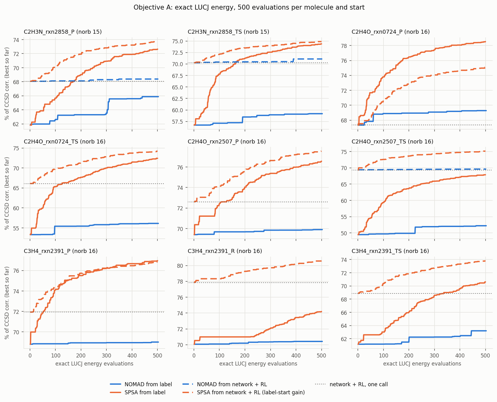
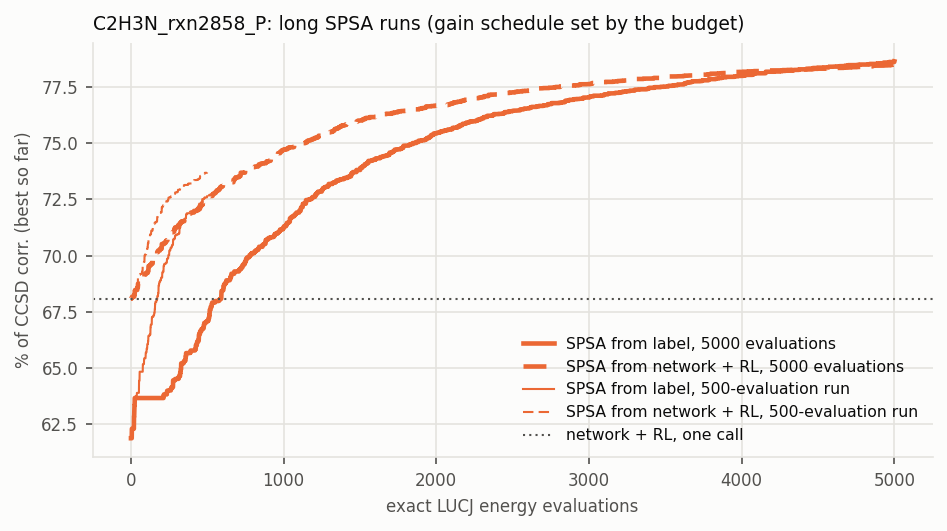
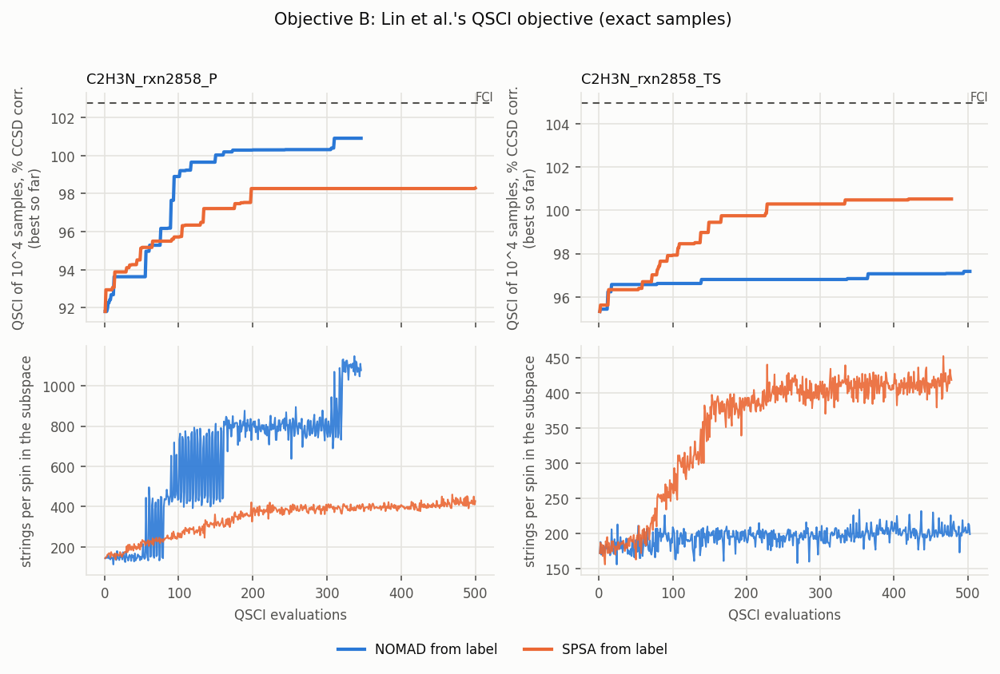

# Task 2: per-molecule direct optimization of the LUCJ parameters (NOMAD and SPSA, 500 evaluations)

*5 Oct 2026, follow-up task 2. A workflow agent started it at 00:20. The account's session limit cut that agent off
at ~03:30 while its jobs kept running. A second agent finished the task between 09:45 and 13:20. Lin et
al. = Wan-Hsuan Lin et al., arXiv:2511.22476 (local checkout `wan-hsuan-lucj/`).*

* **Code** (`pretrain/followups/`):
  * `task2_common.py`: parameter vector, starts, exact sampler, QSCI, settings.
  * `task2_opt.py`: one run, NOMAD or SPSA on objective `lucj` or `qsci`. `--finalize` writes the result of a killed
    run from its checkpoint.
  * `task2_worker.py` and `task2_sci_worker.py`: the GPU-energy process and the torch-free SCI process.
  * `task2_score.py` (Task-1 protocol) and `task2_dimscan.py` (fixed-size subspaces).
  * `task2_report.py` (every table below) and `task2_plots.py` (the figures).
  * `task2_infer_time.py`, `task2_selftest.py`, and the queue scripts `task2_queue*.sh`.
* **Results** (`pretrain/opt_true/results/followups/task2_direct_opt/`):
  * `lucj/` and `qsci/`: one JSON and one best-point NPZ per run.
  * `score_task1_protocol.jsonl`, `dimscan.jsonl`, `infer_time_{gpu,cpu}.json`, `selftest*.json` and `summary.json`.
* **Logs** (`rl_runs/followups/task2_direct_opt/`):
  * per-evaluation histories in `lucj/*.jsonl` and `qsci/*.jsonl`;
  * job lists `jobs_*.txt`, queue logs `queue_*.log` and the resume scripts (`chain_resume.sh`, `chain_nomad2.sh`,
    `score2.sh`, `dimscan*.sh`).
* **Figures**: `docs/followups/fig_task2_lucj.png`, `fig_task2_long.png` and `fig_task2_qsci.png`.

Terms:

* **one call**: the network + RL policy rl4n29f, one forward pass per molecule.
* **label**: the optimize=True start, our counterpart of Lin et al.'s compressed-t2 initialization.
* **%**: percent of the CCSD correlation energy.
* **mHa**: error against FCI (Task 1's `fci_refs.json`).
* **QSCI** and **SQD**: SQD without configuration recovery, Lin et al.'s noiseless protocol.

## 0. Answer

1. **On the LUCJ energy, per-molecule optimization beats one network call, but NOMAD with Lin et al.'s settings does
   not.** This is objective A, the quantity RL is trained on.
   * **NOMAD from the label** adds +1.9 points on average (9 molecules; range +0.2 to
     +4.0): 62.0 → 63.9 %, against 70.3 % for one call on the same
     molecules. It reaches the one-call value on 1/9 molecules (C2H4O_rxn0724_P, where the label and one call start equal: 67.35 vs 67.37 %).
   * **NOMAD from the one-call start** adds +0.3 to +0.8 points (3 molecules).
   * **SPSA from the label** goes from 62.0 to 73.8 % (mean of 9). Its hyperparameters were tuned on one
     training-set molecule. It passes the one-call value (mean 70.3 %) on 7 of 9 molecules after a median of 129
     evaluations, about 4 min on a TITAN Xp. From the one-call start, SPSA goes from 70.3 to 75.8 %.
   * **With 5,000 evaluations** on one molecule (C2H3N_rxn2858_P), SPSA reaches 78.7 % from the label and 78.6 %
     from one call. At 10× the budget the start no longer matters. One call (68.1 %) is 10.6 points below what
     this molecule allows.
   * **So the policy is not at the optimum of its own objective.** It sits at least 5.5 points below it on average
     at 500 evaluations, and 10.6 points on the one molecule run longer. That is headroom for RL. One call is still
     worth a median of 129 SPSA evaluations from the label (5 to more than 500), and more than 500 NOMAD evaluations on 8 of 9 molecules.
2. **A better LUCJ energy does not give a better QSCI energy.** This repeats Task 1.
   * Under the Task-1 protocol (10⁵ samples), the SPSA optima are on average 1.1 mHa (label start) and 0.8 mHa
     (one-call start) worse than their starts: 9.8 → 10.9 mHa and 10.0 → 10.8 mHa.
   * They sample fewer distinct configurations: 520 → 497 and 535 → 490 strings per spin.
   * With a fixed number of configurations, all objective-A parameter sets lie within about 2 mHa of each other
     (4 molecules, 150–800 strings per spin), in an order unrelated to their LUCJ energies.
3. **The QSCI objective (objective B) wins at QSCI only by spreading the samples.** This is Lin et al.'s
   tensor-network baseline, here with exact samples, on C2H3N_rxn2858 P and TS from the label.
   * **10⁴-sample QSCI**, the objective itself, improves from 24.4 to 4.1 mHa (NOMAD, stopped at 346 evaluations)
     and to 9.9 mHa (SPSA) for P. For TS it improves from 25.4 to 20.5 and 11.7 mHa.
   * **Her final evaluation (10⁵ samples)** gives:
     * P: 8.0 → 6.0 mHa (NOMAD) and 3.2 mHa (SPSA);
     * TS: 9.0 → 7.9 mHa (NOMAD) and 4.1 mHa (SPSA);
     * one network call: 7.2 mHa (P) and 8.5 mHa (TS).

     So on QSCI her procedure beats one call by 4.0–4.4 mHa with SPSA and by 0.6–1.2 mHa with NOMAD. As error
     ratios over the start, NOMAD gains 1.1–1.3× and SPSA 2.2–2.5×. She reports 1.1–4.2× for her TN optimization
     (Task 1).
   * **The QSCI-optimized states are not better states.**
     * Their LUCJ energies collapse. P after NOMAD sits at −1037 %, 2.3 Ha above Hartree–Fock.
     * Three of the four hold about twice as many distinct strings at 10⁵ samples: 943–1123 per spin, against
       449–509 for the label and one call. The fourth (TS, NOMAD: 559) also gained the least.
     * At a fixed number of configurations they are the worst of all parameter sets. At k = 300 strings per spin:
       * P: 10.8 and 20.9 mHa, against 8.2–10.4 mHa for the seven objective-A sets;
       * TS: 13.1 and 13.5 mHa, against 10.4–11.9 mHa.
4. **Cost.** One network call takes 0.19 s on one CPU core (0.53 s on the TITAN Xp, including input building).
   * Objective A takes 6–28 min of a TITAN Xp per molecule and start: NOMAD 11 min at norb 15 and 20–27 min at norb 16
     when it has the GPU to itself; SPSA 6–28 min.
   * Objective B takes 1.4–8.7 h of the GPU and 2–3 cores per molecule.
   * That is 2×10³ to 2×10⁵ times one call, before any tuning of the optimizer, and the result does not transfer to
     another molecule.

## 1. Question

Two per-molecule baselines for the network + RL policy, both at Lin et al.'s budget of 500 objective evaluations
per molecule, on the nine norb 15–16 molecules of `pretrain/rl/small_val.txt`:

* **Objective A, the exact LUCJ energy.** RL optimizes this with one policy for all molecules. Optimizing it
  separately for each molecule shows how far the one-call policy is from what each molecule allows, an empirical
  upper bound for RL. It also prices the alternative to the network: an optimizer run per molecule.
* **Objective B, the QSCI energy of 10⁴ samples.** This is Lin et al.'s tensor-network optimization: NOMAD tunes the
  LUCJ parameters so that QSCI on 10⁴ samples drawn from the ansatz gives the lowest energy. Here the samples come
  from the exact state, not from her χ = 50 MPS. The optimized parameters are then scored as in her paper and in
  Task 1, with 10⁵ samples.

Starts: the optimize=True **label** (our counterpart of her compressed-t2 initialization) and the policy
**rl4n29f**, which is one network call (`rl_runs/grpo_n29_tn/policy_last.pt`). Optimizers: **NOMAD** with her
settings, and **SPSA** as a gradient-free, first-order alternative.

## 2. Settings (Lin et al. vs here)

| item | Lin et al. (paper §Computational details; `wan-hsuan-lucj/src/lucj/quimb_task/lucj_sqd_quimb_task_sci_nomad.py`, launcher `scripts/quimb/*/lucj_compressed_t2_nomad_r24.py`) | here |
|:--|:--|:--|
| optimizer | NOMAD PSD-MADS: `MAX_BB_EVAL 500`, `PSD_MADS_NB_VAR_IN_SUBPROBLEM 20`, `PSD_MADS_SUBPROBLEM_MAX_BB_EVAL 20`, `PSD_MADS_NB_SUBPROBLEM 4`, no bounds, default mesh; "four threads … for solving the subproblems in parallel" | **same parameter lines** (PyNomadBBO 4.5.1, the version her `pyproject.toml` asks for). **Deviation:** OpenMP threads = 1, so the subproblems take turns and the evaluations are serialized through one GPU worker. PyNomad 4.5.1 crashed with more threads on a toy problem. The budget is the same; the order of the evaluations, and what the subproblems learn from each other, differ. NOMAD counted 503 evaluations against the 500 budget |
| parameters x | `UCJOpSpinBalanced.from_parameters`, with the final orbital rotation in x | the same parameterization (2 layers, square connectivity, spin-balanced); **deviation:** the final orbital rotation is the fixed t1 rotation, not in x (the network does not predict it either). norb 15 → 508 parameters, norb 16 → 574 |
| ansatz in her runs | heavy-hex, 1 layer, χ = 50 (every NOMAD launcher: N₂/6-31G 10e16o, N₂/cc-pVDZ 10e26o, [2Fe-2S] 30e20o) | square, 2 layers (the ansatz of the whole project) |
| start | compressed double factorization of the CCSD t2 (multi-stage, L-BFGS-B, 100 iterations per stage) | the optimize=True label (compressed DF, regularization 0.005, L-BFGS capped at 500 iterations), or rl4n29f |
| objective B | QSCI on 10⁴ samples from a quimb `CircuitMPS` (χ = 50, cutoff 1e-10), `sample(seed=0)`; `diagonalize_fermionic_hamiltonian`: 10 batches × 4000, `max_dim` 4000, 1 iteration, `symmetrize_spin`, `energy_tol` 1e-5, `occupancies_tol` 1e-3, `carryover_threshold` 1e-3, `solve_sci_batch`; f = the energy of the result, the lowest batch | **same SQD call and settings**, f defined the same way. **Deviation:** the 10⁴ samples come exactly from the state vector (GPU CI matrix, sampler checked against `ffsim.sample_state_vector`), not from an MPS; sampling seed fixed across evaluations as in her code. The SCI runs in a torch-free subprocess, and every SCI energy is checked against the full-space Rayleigh quotient of its eigenvector (all \|Δ\| ≤ 7e-8 Ha) |
| objective A | not an optimization target in her work | exact LUCJ energy, GPU complex64 (`pretrain.rl.gpu_energy`; ≈1e-7 Ha) |
| final evaluation | exact state vector, 10⁵ samples, 10 batches × 4000, the same SQD settings; mean / min / max over batches | the **Task-1 protocol** (`task2_score.py`, a copy of `task1_sqd_lin.py`'s "lin" protocol): `ffsim.sample_state_vector` 10⁶ shots → a uniformly random 10⁵ subset → 10 batches × 4000, `solve_sci` with spin_sq = 0 (her `_sci` variant) |
| SPSA (not in her work) | – | Spall gains (α 0.602, γ 0.101, A = 10 % of the iterations). The gain is calibrated from 10 gradient samples at x0, and these count toward the budget. The best evaluated point is returned. Objective A: c = 0.005, first step 0.008 per coordinate. Tuned on one training-set molecule (C2H3N_rxn2857_TS, 5 settings, table in §3.1); the rl4n29f-start runs reuse the gain calibrated at the label start ("label-start gain"). Objective B: c = 0.02 (4× larger: with a fixed sampling seed the objective changes in steps), first step 0.008, 3 h cap |
| hardware | – | scai2 TITAN Xp 12 GB (GPU 3), usually shared by 2–3 of these jobs. Objective A: 1 CPU thread per run; objective B: 2–3 SCI threads |

## 3. Results

Every table below is printed by `python -m pretrain.followups.task2_report`, which reads the result files and needs
no GPU. Numbers are measured unless marked otherwise.

### 3.1 Objective A: the exact LUCJ energy



Each panel shows one molecule. Color marks the optimizer (NOMAD blue, SPSA orange) and line style marks the start
(solid: label, dashed: one call). The dotted line is the one-call value.

| molecule | norb | start | start % | NOMAD | Δ | SPSA (cal.) | Δ | SPSA (label gain) | Δ |
|:--|--:|:--|--:|--:|--:|--:|--:|--:|--:|
| C2H3N_rxn2858_P | 15 | label | 61.84 | 65.88 | +4.04 | 72.64 | +10.80 | 72.64 | +10.80 |
| C2H3N_rxn2858_P | 15 | rl4n29f | 68.07 | 68.39 | +0.32 | 68.43 | +0.36 | 73.71 | +5.64 |
| C2H3N_rxn2858_TS | 15 | label | 56.71 | 59.19 | +2.48 | 74.37 | +17.65 | 74.37 | +17.65 |
| C2H3N_rxn2858_TS | 15 | rl4n29f | 70.27 | 71.09 | +0.82 | 70.59 | +0.32 | 74.87 | +4.60 |
| C2H4O_rxn0724_P | 16 | label | 67.35 | 69.28 | +1.94 | 78.53 | +11.18 | 78.53 | +11.18 |
| C2H4O_rxn0724_P | 16 | rl4n29f | 67.37 | – | – | – | – | 75.09 | +7.72 |
| C2H4O_rxn0724_TS | 16 | label | 53.31 | 56.12 | +2.81 | 72.42 | +19.11 | 72.42 | +19.11 |
| C2H4O_rxn0724_TS | 16 | rl4n29f | 66.03 | – | – | – | – | 74.22 | +8.18 |
| C2H4O_rxn2507_P | 16 | label | 69.41 | 69.90 | +0.49 | 76.57 | +7.16 | 76.57 | +7.16 |
| C2H4O_rxn2507_P | 16 | rl4n29f | 72.61 | – | – | – | – | 77.55 | +4.94 |
| C2H4O_rxn2507_TS | 16 | label | 49.48 | 52.21 | +2.73 | 67.86 | +18.38 | 67.86 | +18.38 |
| C2H4O_rxn2507_TS | 16 | rl4n29f | 69.33 | 69.60 | +0.27 | 72.78 | +3.45 | 75.11 | +5.78 |
| C3H4_rxn2391_P | 16 | label | 68.80 | 69.00 | +0.21 | 76.96 | +8.17 | 76.96 | +8.17 |
| C3H4_rxn2391_P | 16 | rl4n29f | 71.94 | – | – | – | – | 76.84 | +4.91 |
| C3H4_rxn2391_R | 16 | label | 70.07 | 70.42 | +0.35 | 74.19 | +4.12 | 74.19 | +4.12 |
| C3H4_rxn2391_R | 16 | rl4n29f | 77.84 | – | – | – | – | 80.61 | +2.76 |
| C3H4_rxn2391_TS | 16 | label | 61.17 | 63.20 | +2.03 | 70.61 | +9.45 | 70.61 | +9.45 |
| C3H4_rxn2391_TS | 16 | rl4n29f | 68.87 | – | – | – | – | 73.83 | +4.96 |

Means over the 3 molecules with NOMAD and SPSA from both starts:

| start | one call / start | NOMAD | SPSA (cal.) | SPSA (label gain) | best of the runs |
|:--|--:|--:|--:|--:|--:|
| label | 56.01 | 59.09 (+3.08) | 71.62 (+15.61) | 71.62 (+15.61) | 71.62 (+15.61) |
| rl4n29f | 69.22 | 69.69 (+0.47) | 70.60 (+1.38) | 74.57 (+5.34) | 74.57 (+5.34) |

Best-so-far (mean % corr over molecules) after k evaluations:

| start / optimizer | k=1 | k=50 | k=100 | k=200 | k=300 | k=500 |
|:--|--:|--:|--:|--:|--:|--:|
| label / nomad (9 mol.) | 62.01 | 62.12 | 62.62 | 62.93 | 63.41 | 63.91 |
| label / spsa (9 mol.) | 62.01 | 65.24 | 68.05 | 70.51 | 72.11 | 73.80 |
| rl4n29f / nomad (3 mol.) | 69.22 | 69.27 | 69.33 | 69.36 | 69.44 | 69.69 |
| rl4n29f / spsa (3 mol.) | 69.22 | 69.71 | 69.71 | 69.71 | 70.09 | 70.60 |
| rl4n29f / spsa (aLabel) (9 mol.) | 70.26 | 71.33 | 72.51 | 73.95 | 74.80 | 75.76 |

Long SPSA runs (best-so-far % corr after k evaluations):

| run | k=1 | k=500 | k=1000 | k=2000 | k=3000 | k=5000 |
|:--|--:|--:|--:|--:|--:|--:|
| C2H3N_rxn2858_P label long5000 (5000 evals, 0.8 h) | 61.84 | 67.06 | 71.22 | 75.46 | 77.05 | 78.67 |
| C2H3N_rxn2858_P rl4n29f long5000aLabel (5000 evals, 0.9 h) | 68.07 | 72.52 | 74.71 | 76.69 | 77.65 | 78.55 |

Reading the table:

* **SPSA (cal.)** calibrates its gain at the start point. At the one-call start the gradients are 2–3× smaller
  than at the label, so the calibrated gain is 2–3× larger. The first step has a fixed size and helps.
  * On the two C2H3N molecules every later step overshoots. The best point stays at evaluation 24–26: +0.3 points.
  * On C2H4O_rxn2507_TS the gain is only 2× larger, and SPSA still adds 3.4 points, against 5.8 with the
    label-start gain.
* **SPSA (label gain)** reuses the gain calibrated at the label start of the same molecule. That fixes the problem,
  so the one-call comparisons use that variant.
* **NOMAD** spends its evaluations on 20-variable subproblems in a space of 508–574 variables. Its best point comes
  late (median evaluation 465 of 503 over its 12 runs, 12 of them after evaluation 400), so the budget limits it, not convergence.



The 5,000-evaluation runs scale SPSA's gain schedule to their own budget (the constant A is 10 % of the iterations),
so their first 500 evaluations move more slowly than the 500-evaluation runs. Both starts end at the same value: 78.7 % (label) and 78.6 % (one call).

**How many evaluations one call is worth.** The table below gives the first evaluation at which a run from the label
reaches the one-call value, and the wall time to that point on the TITAN Xp.

| molecule | label % | one call % | NOMAD best % | NOMAD: evals to match | SPSA best % | SPSA: evals to match (min) |
|:--|--:|--:|--:|--:|--:|--:|
| C2H3N_rxn2858_P | 61.84 | 68.07 | 65.88 | not in 503 | 72.64 | 173 (3.9) |
| C2H3N_rxn2858_TS | 56.71 | 70.27 | 59.19 | not in 503 | 74.37 | 164 (2.8) |
| C2H4O_rxn0724_P | 67.35 | 67.37 | 69.28 | 26 | 78.53 | 5 (0.2) |
| C2H4O_rxn0724_TS | 53.31 | 66.03 | 56.12 | not in 503 | 72.42 | 126 (5.2) |
| C2H4O_rxn2507_P | 69.41 | 72.61 | 69.90 | not in 503 | 76.57 | 129 (5.1) |
| C2H4O_rxn2507_TS | 49.48 | 69.33 | 52.21 | not in 503 | 67.86 | not in 500 |
| C3H4_rxn2391_P | 68.80 | 71.94 | 69.00 | not in 503 | 76.96 | 52 (2.8) |
| C3H4_rxn2391_R | 70.07 | 77.84 | 70.42 | not in 503 | 74.19 | not in 500 |
| C3H4_rxn2391_TS | 61.17 | 68.87 | 63.20 | not in 503 | 70.61 | 337 (18.4) |

* NOMAD from the label reached the one-call value on 1/9 molecules; median 26 evaluations (1.1 min).

* SPSA from the label reached the one-call value on 7/9 molecules; median 129 evaluations (3.9 min).

**SPSA tuning** (one training-set molecule, not in the evaluation set; label start; 500 evaluations). The setting
used everywhere is c = 0.005 with a first step of 0.008.

| molecule | c | first-step target | start | best | Δ |
|:--|--:|--:|--:|--:|--:|
| C2H3N_rxn2857_TS | 0.005 | 0.0005 | 68.85 | 72.89 | +4.04 |
| C2H3N_rxn2857_TS | 0.005 | 0.002 | 68.85 | 76.25 | +7.40 |
| C2H3N_rxn2857_TS | 0.005 | 0.008 | 68.85 | 76.96 | +8.11 |
| C2H3N_rxn2857_TS | 0.005 | 0.03 | 68.85 | 71.25 | +2.40 |
| C2H3N_rxn2857_TS | 0.02 | 0.002 | 68.85 | 76.25 | +7.40 |

### 3.2 Objective B: the QSCI energy of 10⁴ exact samples



| molecule | start | optimizer | evals | wall (h) | s / eval | QSCI start → best (% corr) | QSCI − FCI start → best (mHa) | best at | variational % start → at best | strings per spin start → at best (max) |
|:--|:--|:--|--:|--:|--:|--:|--:|--:|--:|--:|
| C2H3N_rxn2858_P | label | nomad | 346 (stopped) | 8.69 | 90.4 | 91.81 → 100.91 | 24.36 → 4.11 | 310 | 61.84 → -1036.73 | 143 → 1070 (1148) |
| C2H3N_rxn2858_P | label | spsa | 500 | 2.47 | 17.8 | 91.81 → 98.29 | 24.36 → 9.94 | 500 | 61.84 → -91.85 | 143 → 427 (460) |
| C2H3N_rxn2858_TS | label | nomad | 503 | 1.38 | 9.8 | 95.33 → 97.18 | 25.37 → 20.49 | 495 | 56.71 → 21.66 | 172 → 203 (234) |
| C2H3N_rxn2858_TS | label | spsa | 478 (stopped) | 3.00 | 22.6 | 95.33 → 100.52 | 25.37 → 11.68 | 420 | 56.71 → -44.62 | 172 → 429 (452) |

* **NOMAD on P was stopped after 346 of 500 evaluations.** Once the 10⁴ samples contained more than 4,000 distinct
  bitstrings, the 10 batches differed and each evaluation needed 10 SCI solves of about 1,100 strings per spin. An
  evaluation then took 650–720 s, and the remaining 154 would have needed more than 30 h (extrapolated). The best
  point came at evaluation 310, and the result was written from the checkpoint (`--finalize`).
* **SPSA on TS hit its 3 h cap** at 478 evaluations.
* **Every run enlarges the subspace and degrades the LUCJ energy.** In three of the four runs the LUCJ energy ends
  above Hartree–Fock. "variational % at best" is the exact LUCJ energy of the best QSCI point; negative values lie
  above Hartree–Fock.

### 3.3 Final scores with Lin et al.'s protocol (10⁵ samples)

This is the Task-1 protocol, which is her final evaluation step:

* `ffsim.sample_state_vector` with 10⁶ shots;
* a uniformly random subset of 10⁵;
* 10 batches of 4,000, one SQD iteration, `solve_sci` with spin_sq = 0.

It is applied to the start points and to the best point of every run. "strings" is the number of α (= β) strings in
the subspace. When the 10⁵ samples hold fewer than 4,000 distinct bitstrings, all 10 batches are identical and the
range collapses to one value.

| molecule | parameters | variational % | SQD mean % [range over batches] | SQD mean − FCI (mHa) | SQD mean − CCSD(T) (mHa) | unique / 10^5 | strings |
|:--|:--|--:|--:|--:|--:|--:|--:|
| C2H3N_rxn2858_P | start:label | 61.84 | 99.17 [99.17, 99.17] | 7.98 | 6.7 | 1745 | 449–449 |
| C2H3N_rxn2858_P | lucj:label:nomad | 65.88 | 98.29 [98.29, 98.29] | 9.93 | 8.6 | 1635 | 400–400 |
| C2H3N_rxn2858_P | lucj:label:spsa | 72.64 | 98.55 [98.55, 98.55] | 9.35 | 8.1 | 1717 | 422–422 |
| C2H3N_rxn2858_P | qsci:label:nomad | -1036.73 | 100.05 [99.55, 100.36] | 6.00 | 4.7 | 36404 | 1078–1123 |
| C2H3N_rxn2858_P | qsci:label:spsa | -91.85 | 101.29 [101.19, 101.46] | 3.24 | 2.0 | 5458 | 970–987 |
| C2H3N_rxn2858_P | start:rl4n29f | 68.07 | 99.51 [99.51, 99.51] | 7.22 | 5.9 | 1816 | 465–465 |
| C2H3N_rxn2858_P | lucj:rl4n29f:nomad | 68.39 | 99.59 [99.59, 99.59] | 7.04 | 5.8 | 1857 | 462–462 |
| C2H3N_rxn2858_P | lucj:rl4n29f:spsa | 68.43 | 99.41 [99.41, 99.41] | 7.44 | 6.1 | 1826 | 467–467 |
| C2H3N_rxn2858_P | lucj:label:spsa:long5000 | 78.67 | 98.92 [98.92, 98.92] | 8.54 | 7.2 | 1800 | 434–434 |
| C2H3N_rxn2858_P | lucj:rl4n29f:spsa:aLabel | 73.71 | 99.07 [99.07, 99.07] | 8.20 | 6.9 | 1660 | 405–405 |
| C2H3N_rxn2858_P | lucj:rl4n29f:spsa:long5000aLabel | 78.55 | 99.03 [99.03, 99.03] | 8.28 | 7.0 | 1702 | 418–418 |
| C2H3N_rxn2858_TS | start:label | 56.71 | 101.54 [101.54, 101.54] | 9.00 | 5.4 | 2005 | 488–488 |
| C2H3N_rxn2858_TS | lucj:label:nomad | 59.19 | 101.77 [101.77, 101.77] | 8.38 | 4.8 | 1997 | 493–493 |
| C2H3N_rxn2858_TS | lucj:label:spsa | 74.37 | 100.85 [100.85, 100.85] | 10.81 | 7.2 | 1839 | 454–454 |
| C2H3N_rxn2858_TS | qsci:label:nomad | 21.66 | 101.97 [101.97, 101.97] | 7.85 | 4.3 | 2724 | 559–559 |
| C2H3N_rxn2858_TS | qsci:label:spsa | -44.62 | 103.41 [103.36, 103.53] | 4.06 | 0.5 | 5066 | 943–968 |
| C2H3N_rxn2858_TS | start:rl4n29f | 70.27 | 101.74 [101.74, 101.74] | 8.47 | 4.9 | 2051 | 509–509 |
| C2H3N_rxn2858_TS | lucj:rl4n29f:nomad | 71.09 | 101.51 [101.51, 101.51] | 9.06 | 5.5 | 1992 | 514–514 |
| C2H3N_rxn2858_TS | lucj:rl4n29f:spsa | 70.59 | 101.97 [101.97, 101.97] | 7.86 | 4.3 | 2047 | 513–513 |
| C2H3N_rxn2858_TS | lucj:rl4n29f:spsa:aLabel | 74.87 | 101.36 [101.36, 101.36] | 9.45 | 5.9 | 1857 | 456–456 |
| C2H4O_rxn0724_P | start:label | 67.35 | 99.68 [99.68, 99.68] | 8.79 | 7.6 | 1704 | 466–466 |
| C2H4O_rxn0724_P | lucj:label:nomad | 69.28 | 99.44 [99.44, 99.44] | 9.29 | 8.1 | 1806 | 480–480 |
| C2H4O_rxn0724_P | lucj:label:spsa | 78.53 | 99.53 [99.53, 99.53] | 9.10 | 7.9 | 1835 | 505–505 |
| C2H4O_rxn0724_P | start:rl4n29f | 67.37 | 98.63 [98.63, 98.63] | 11.02 | 9.8 | 1579 | 451–451 |
| C2H4O_rxn0724_P | lucj:rl4n29f:spsa:aLabel | 75.09 | 98.94 [98.94, 98.94] | 10.36 | 9.1 | 1646 | 462–462 |
| C2H4O_rxn0724_TS | start:label | 53.31 | 98.21 [98.21, 98.21] | 11.73 | 10.0 | 2594 | 590–590 |
| C2H4O_rxn0724_TS | lucj:label:nomad | 56.12 | 98.66 [98.66, 98.66] | 10.72 | 9.0 | 2643 | 642–642 |
| C2H4O_rxn0724_TS | lucj:label:spsa | 72.42 | 97.04 [97.04, 97.04] | 14.30 | 12.6 | 2335 | 547–547 |
| C2H4O_rxn0724_TS | start:rl4n29f | 66.03 | 97.18 [97.18, 97.18] | 14.00 | 12.3 | 2138 | 504–504 |
| C2H4O_rxn0724_TS | lucj:rl4n29f:spsa:aLabel | 74.22 | 96.44 [96.44, 96.44] | 15.63 | 13.9 | 2080 | 487–487 |
| C2H4O_rxn2507_P | start:label | 69.41 | 98.05 [98.05, 98.05] | 7.71 | 6.8 | 1793 | 419–419 |
| C2H4O_rxn2507_P | lucj:label:nomad | 69.90 | 97.77 [97.77, 97.77] | 8.28 | 7.4 | 1788 | 427–427 |
| C2H4O_rxn2507_P | lucj:label:spsa | 76.57 | 97.65 [97.65, 97.65] | 8.51 | 7.6 | 1783 | 396–396 |
| C2H4O_rxn2507_P | start:rl4n29f | 72.61 | 97.39 [97.39, 97.39] | 9.03 | 8.1 | 1738 | 413–413 |
| C2H4O_rxn2507_P | lucj:rl4n29f:spsa:aLabel | 77.55 | 97.48 [97.48, 97.48] | 8.84 | 7.9 | 1715 | 406–406 |
| C2H4O_rxn2507_TS | start:label | 49.48 | 100.02 [100.02, 100.02] | 11.30 | 9.6 | 2500 | 604–604 |
| C2H4O_rxn2507_TS | lucj:label:nomad | 52.21 | 99.14 [99.14, 99.14] | 13.29 | 11.5 | 2387 | 545–545 |
| C2H4O_rxn2507_TS | lucj:label:spsa | 67.86 | 99.11 [99.11, 99.11] | 13.35 | 11.6 | 2345 | 529–529 |
| C2H4O_rxn2507_TS | start:rl4n29f | 69.33 | 99.12 [99.12, 99.12] | 13.34 | 11.6 | 2359 | 551–551 |
| C2H4O_rxn2507_TS | lucj:rl4n29f:nomad | 69.60 | 99.17 [99.17, 99.17] | 13.22 | 11.5 | 2387 | 539–539 |
| C2H4O_rxn2507_TS | lucj:rl4n29f:spsa | 72.78 | 99.09 [99.09, 99.09] | 13.41 | 11.7 | 2410 | 524–524 |
| C2H4O_rxn2507_TS | lucj:rl4n29f:spsa:aLabel | 75.11 | 99.45 [99.45, 99.45] | 12.59 | 10.8 | 2357 | 538–538 |
| C3H4_rxn2391_P | start:label | 68.80 | 97.68 [97.68, 97.68] | 8.60 | 7.7 | 1866 | 550–550 |
| C3H4_rxn2391_P | lucj:label:nomad | 69.00 | 97.25 [97.25, 97.25] | 9.61 | 8.7 | 1878 | 531–531 |
| C3H4_rxn2391_P | lucj:label:spsa | 76.96 | 97.08 [97.08, 97.08] | 10.01 | 9.1 | 1770 | 490–490 |
| C3H4_rxn2391_P | start:rl4n29f | 71.94 | 97.99 [97.99, 97.99] | 7.86 | 7.0 | 2093 | 574–574 |
| C3H4_rxn2391_P | lucj:rl4n29f:spsa:aLabel | 76.84 | 97.17 [97.17, 97.17] | 9.79 | 8.9 | 1818 | 471–471 |
| C3H4_rxn2391_R | start:label | 70.07 | 96.78 [96.78, 96.78] | 10.82 | 8.8 | 1596 | 431–431 |
| C3H4_rxn2391_R | lucj:label:nomad | 70.42 | 96.36 [96.36, 96.36] | 11.80 | 9.8 | 1603 | 443–443 |
| C3H4_rxn2391_R | lucj:label:spsa | 74.19 | 97.28 [97.28, 97.28] | 9.65 | 7.6 | 1911 | 500–500 |
| C3H4_rxn2391_R | start:rl4n29f | 77.84 | 97.88 [97.88, 97.88] | 8.26 | 6.2 | 1848 | 531–531 |
| C3H4_rxn2391_R | lucj:rl4n29f:spsa:aLabel | 80.61 | 97.39 [97.39, 97.39] | 9.40 | 7.4 | 1811 | 523–523 |
| C3H4_rxn2391_TS | start:label | 61.17 | 100.87 [100.87, 100.87] | 12.18 | 8.4 | 3072 | 681–681 |
| C3H4_rxn2391_TS | lucj:label:nomad | 63.20 | 100.59 [100.59, 100.59] | 12.86 | 9.0 | 2984 | 645–645 |
| C3H4_rxn2391_TS | lucj:label:spsa | 70.61 | 100.44 [100.44, 100.44] | 13.21 | 9.4 | 2900 | 633–633 |
| C3H4_rxn2391_TS | start:rl4n29f | 68.87 | 101.57 [101.57, 101.57] | 10.55 | 6.7 | 3608 | 816–816 |
| C3H4_rxn2391_TS | lucj:rl4n29f:spsa:aLabel | 73.83 | 100.71 [100.71, 100.71] | 12.56 | 8.7 | 3058 | 660–660 |

Means over the 9 molecules scored for all four of start:label, lucj:label:spsa, start:rl4n29f, lucj:rl4n29f:spsa:aLabel:

| parameters | variational % | SQD mean − FCI (mHa) | strings per spin |
|:--|--:|--:|--:|
| start:label (9 mol.) | 62.01 | 9.79 | 520 |
| lucj:label:spsa (9 mol.) | 73.80 | 10.92 | 497 |
| start:rl4n29f (9 mol.) | 70.26 | 9.97 | 535 |
| lucj:rl4n29f:spsa:aLabel (9 mol.) | 75.76 | 10.76 | 490 |
| lucj:label:nomad (9 mol.) | 63.91 | 10.46 | 512 |
| lucj:rl4n29f:nomad (3 mol.) | 69.69 | 9.78 | 505 |

* **Objective A runs.** Raising the variational energy by 3–19 points changes the 10⁵-sample QSCI energy by
  −1.2 to +2.6 mHa. It gets worse on 14 of 18 (molecule, start) pairs, and the strings per spin drop
  slightly. The one-call start is not better than the label at QSCI either: 10.0 vs 9.8 mHa on average.
* **Objective B runs.** These are the only parameter sets that beat both starts clearly: 3.2 and 4.1 mHa for SPSA,
  against 7.2–9.0 mHa. Their subspaces are about twice as large.

### 3.4 Fixed-size subspaces: better configurations or more configurations?

Take the k most probable α strings of the exact state (exact marginals on the GPU), diagonalize in the k × k
subspace (spin-symmetric, as QSCI does), and compare the energies at equal k. This removes the sample-count effect
that dominates §3.3.

C2H3N_rxn2858_P (error vs FCI (mHa); variational % in the second column):

| parameters | variational % | k=150 | k=300 | k=450 | k=600 | k=800 |
|:--|--:|--:|--:|--:|--:|--:|
| start:label | 61.84 | 15.80 | 9.59 | 5.71 | 3.43 | 1.84 |
| start:rl4n29f | 68.07 | 15.63 | 8.30 | 5.07 | 3.28 | 1.86 |
| lucj:label:nomad | 65.88 | 16.66 | 10.43 | 6.60 | 3.85 | 2.05 |
| lucj:label:spsa | 72.64 | 16.94 | 9.48 | 5.75 | 3.70 | 2.03 |
| lucj:rl4n29f:nomad | 68.39 | 15.57 | 8.24 | 5.02 | 3.26 | 1.86 |
| lucj:rl4n29f:spsa | 68.43 | 15.35 | 8.33 | 4.97 | 3.29 | 1.89 |
| lucj:rl4n29f:spsa:aLabel | 73.71 | 15.66 | 8.75 | 5.19 | 3.17 | 1.86 |
| qsci:label:nomad | -1036.73 | 33.60 | 20.86 | 12.34 | 6.90 | 4.66 |
| qsci:label:spsa | -91.85 | 17.23 | 10.77 | 6.67 | 3.89 | 2.13 |

C2H3N_rxn2858_TS (error vs FCI (mHa); variational % in the second column):

| parameters | variational % | k=150 | k=300 | k=450 | k=600 | k=800 |
|:--|--:|--:|--:|--:|--:|--:|
| start:label | 56.71 | 20.14 | 10.97 | 6.92 | 4.49 | 2.65 |
| start:rl4n29f | 70.27 | 21.09 | 10.82 | 6.71 | 4.57 | 2.69 |
| lucj:label:nomad | 59.19 | 20.67 | 10.87 | 7.26 | 4.75 | 2.73 |
| lucj:label:spsa | 74.37 | 20.70 | 11.92 | 7.78 | 4.99 | 2.85 |
| lucj:rl4n29f:nomad | 71.09 | 21.12 | 10.73 | 6.66 | 4.55 | 2.67 |
| lucj:rl4n29f:spsa | 70.59 | 21.06 | 10.54 | 6.58 | 4.46 | 2.69 |
| lucj:rl4n29f:spsa:aLabel | 74.87 | 20.50 | 10.44 | 6.51 | 4.30 | 2.65 |
| qsci:label:nomad | 21.66 | 21.28 | 13.09 | 8.26 | 5.03 | 3.01 |
| qsci:label:spsa | -44.62 | 22.52 | 13.46 | 8.21 | 5.04 | 3.09 |

C2H4O_rxn0724_TS (error vs FCI (mHa); variational % in the second column):

| parameters | variational % | k=150 | k=300 | k=450 | k=600 | k=800 |
|:--|--:|--:|--:|--:|--:|--:|
| start:label | 53.31 | 25.32 | 16.57 | 11.73 | 7.86 | 4.63 |
| start:rl4n29f | 66.03 | 26.91 | 17.90 | 12.46 | 8.42 | 4.85 |
| lucj:label:spsa | 72.42 | 25.82 | 17.66 | 12.52 | 8.12 | 4.83 |
| lucj:rl4n29f:spsa:aLabel | 74.22 | 25.40 | 17.28 | 11.86 | 7.85 | 4.71 |

C3H4_rxn2391_TS (error vs FCI (mHa); variational % in the second column):

| parameters | variational % | k=150 | k=300 | k=450 | k=600 | k=800 |
|:--|--:|--:|--:|--:|--:|--:|
| start:label | 61.17 | 31.94 | 19.29 | 13.90 | 10.49 | 6.63 |
| start:rl4n29f | 68.87 | 32.56 | 20.86 | 14.93 | 11.03 | 7.04 |
| lucj:label:spsa | 70.61 | 32.43 | 20.00 | 14.28 | 10.62 | 7.06 |
| lucj:rl4n29f:spsa:aLabel | 73.83 | 32.11 | 19.95 | 14.43 | 10.74 | 6.93 |

* **Objective A.** At equal size, the label, one call and their optimized versions lie within 2.2 mHa of each other
  (largest spread: C2H3N_rxn2858_P, k = 300), in an order unrelated to their variational energies. On the two
  norb-16 transition states, the label has the worst LUCJ energy, yet it ranks first at almost every k. Optimizing
  the LUCJ energy does not rank better configurations first.
* **Objective B.** The QSCI-optimized states are worse than every objective-A set at every k on both molecules.
  The gap is up to 18 mHa (P, NOMAD, k = 150) and as small as 0.05 mHa (P, SPSA, k = 450). The
  marginal mass covered by the top 600 strings drops from 0.9997 to 0.945 for P/NOMAD. Their QSCI advantage at a
  fixed sample count therefore comes entirely from sampling more distinct configurations, not from a better
  ranking. This matches Task 1's reading of Lin et al.'s unregularized compressed initialization: high LUCJ energy,
  good QSCI.

### 3.5 Cost: one network call vs per-molecule optimization

* rl4n29f inference (NVIDIA TITAN Xp): median 528 ms per molecule (input build incl. 3 frozen recycles + final recycle + realize); model load 1.7 s.
* rl4n29f inference (cpu x1 threads): median 192 ms per molecule (input build incl. 3 frozen recycles + final recycle + realize); model load 0.1 s.
* objective A (LUCJ), nomad, start label, norb 15 (2 runs): 11.3 min per run (1.34 s per evaluation)
* objective A (LUCJ), nomad, start label, norb 16 (7 runs): 26.3 min per run (3.12 s per evaluation)
* objective A (LUCJ), nomad, start rl4n29f, norb 15 (2 runs): 11.1 min per run (1.31 s per evaluation)
* objective A (LUCJ), nomad, start rl4n29f, norb 16 (1 run): 20.2 min per run (2.39 s per evaluation)
* objective A (LUCJ), spsa, start label, norb 15 (2 runs): 10.0 min per run (1.18 s per evaluation)
* objective A (LUCJ), spsa, start label, norb 16 (7 runs): 23.2 min per run (2.77 s per evaluation)
* objective A (LUCJ), spsa, start rl4n29f, norb 15 (4 runs): 7.0 min per run (0.83 s per evaluation)
* objective A (LUCJ), spsa, start rl4n29f, norb 16 (8 runs): 23.1 min per run (2.76 s per evaluation)
* objective B (QSCI), nomad, start label, norb 15 (2 runs): 302.0 min per run (50.13 s per evaluation)
* objective B (QSCI), spsa, start label, norb 15 (2 runs): 164.2 min per run (20.19 s per evaluation)

* **One network call** has a median cost of 0.19 s (one CPU core) or 0.53 s (TITAN Xp), plus a one-time model load
  (0.1–1.7 s). This includes building the input (3 frozen recycles and the final recycle) and turning the output into
  LUCJ parameters.
* **Objective A per molecule** costs 500 exact LUCJ energies. Each takes 0.7–1.4 s at norb 15 and 2.4–3.3 s at
  norb 16 on a TITAN Xp (4.8 s when shared), so a run takes 6–28 min, about 2×10³–9×10³ network calls.
* **Objective B** costs 1.4–8.7 h per molecule, CPU-bound in the SCI. Each evaluation grows with the subspace the
  optimizer creates, as P/NOMAD shows.
* **Not counted:** the network's one-time training cost, which is amortized over every molecule it is applied to.

## 4. Caveats

* **Small sets, one seed.**
  * Objective A covers 9 molecules (four reactions; norb 15–16). NOMAD covers 9 molecules from the label and
    3 from one call.
  * Objective B covers 2 molecules from the label only, her start.
  * Each setting ran once (NOMAD with its default seed, SPSA with seed 0), so run-to-run variance is unmeasured.
* **Tuning is uneven.**
  * SPSA got light tuning: 5 settings on one training molecule.
  * NOMAD ran untuned at her settings, which were made for 1-layer heavy-hex ansätze. Our 2-layer square ansatz has
    508–574 parameters, so NOMAD may be further from its best here than in her work.
  * NOMAD's subproblems ran one at a time (OpenMP threads = 1) where hers had 4 threads. The budget is the same; the
    scheduling differs.
* **Exact samples, not χ = 50 MPS samples.** Objective B is the noiseless limit of her TN optimization: there is no
  MPS truncation, which could act either as noise or as a regularizer. Our ansatz (square, 2 layers, fixed final
  orbital rotation) differs from hers (heavy-hex, 1 layer, optimized final rotation). The label start is a
  regularized compressed-DF solution, not her unregularized one.
* **Two runs stopped early.**
  * NOMAD/QSCI on C2H3N_rxn2858_P stopped at 346 of 500 evaluations. The process predated the stop-file check, so
    it was killed between evaluations and its result was written from the checkpoint.
  * SPSA/QSCI on C2H3N_rxn2858_TS stopped at 478 evaluations (3 h cap).
  * Their best-so-far objective values could only have improved with the missing evaluations. That is not true of
    their 10⁵-sample scores.
* **The first QSCI numbers were wrong and were discarded.**
  * The first implementation solved the SCI in the same process as torch. It returned energies above the true
    subspace energy: −130.2919 vs −130.3834 Ha for the same 143 × 143 subspace of C2H3N_rxn2858_P's label.
    `selftest*.json` still holds the wrong value under `qsci_opt`; the first NOMAD/QSCI attempt is in
    `rl_runs/followups/task2_direct_opt/old_invalid/`.
  * The SCI now runs in a torch-free subprocess. Every reported SCI energy carries its full-space Rayleigh-quotient
    check: |Δ| ≤ 6.7e-8 Ha over all objective-B evaluations, all scores and all subspace scans.
* **Wall times come from a shared TITAN Xp.** Usually 2–3 of these jobs ran on it, next to other users' jobs on
  other GPUs of the host. The same norb can take 2× longer under sharing: NOMAD on C2H4O_rxn2507_TS took 40.7 min
  from the label (shared) and 20.2 min from one call (alone).
* **% of the CCSD correlation energy is a convenience.** QSCI/SQD values above 100 % are normal because FCI lies
  below CCSD for these molecules; the mHa-vs-FCI columns are the clean measure.

## 5. Reproduce

```bash
cd ccsd_amplitudes; export CUDA_VISIBLE_DEVICES=3   # scai2 GPU 3 (never 0/1)
PY=pretrain/.train_venv/bin/python3
# one run (objective lucj|qsci, optimizer nomad|spsa, start label|rl4n29f); job lists in rl_runs/followups/task2_direct_opt/jobs_*.txt
$PY -m pretrain.followups.task2_opt --name C2H3N_rxn2858_P --start label --objective lucj --optimizer nomad --worker-threads 1
$PY -m pretrain.followups.task2_opt --name C2H3N_rxn2858_P --start label --objective lucj --optimizer spsa --spsa-target 0.008 --worker-threads 1
$PY -m pretrain.followups.task2_opt --name C2H3N_rxn2858_P --start label --objective qsci --optimizer spsa --spsa-c 0.02 --spsa-target 0.008 --worker-threads 2 --max-wall-h 3
# killed run -> result JSON from the checkpoint; or stop a running one (code from 02:00 on) with touch <logs>/<objective>/<stem>.stop
$PY -m pretrain.followups.task2_opt --name C2H3N_rxn2858_P --start label --objective qsci --optimizer nomad --finalize
# scores (Task-1 protocol), fixed-size subspaces, tables, figures
$PY -m pretrain.followups.task2_score --only lucj qsci --threads 3 --names C2H3N_rxn2858_P
$PY -m pretrain.followups.task2_dimscan --names C2H3N_rxn2858_P --threads 3
$PY -m pretrain.followups.task2_report; $PY -m pretrain.followups.task2_plots
```
