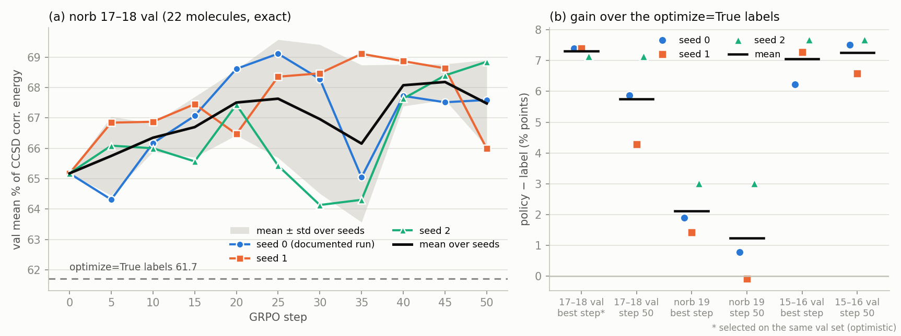

# Task 7: seed variation of the norb 15–18 exact-reward RL

5 Oct 2026. Seeds 1 and 2 were launched at 00:24 by the first task-7 agent and finished at 08:32 and 07:19. The
resuming agent evaluated them on the held-out sets (09:47–10:22) and wrote this report. Every number is a measured
exact energy (GPU, complex64). Seed 0 is the documented run (`rl_runs/grpo_large_rl4`; tags `rl4L` = step 25,
`rl4Lf` = step 50).

## Answer

Gains are in points of % CCSD correlation energy, policy minus the optimize=True label (500 iterations, stored), over
3 seeds (mean ± sample SD):

| claim (seed 0) | seed 0 | seed 1 | seed 2 | mean ± SD | SD relative to the gain |
|:--|--:|--:|--:|--:|--:|
| norb 17–18 val, val-selected step: +7.4 | +7.40 (step 25) | +7.39 (step 35) | +7.13 (step 50) | **+7.31 ± 0.15** | 2% |
| norb 17–18 val, step 50: +5.9 | +5.88 | +4.27 | +7.13 | **+5.76 ± 1.43** | 25% |
| norb 19 (untouched), val-selected step: +1.9 | +1.89 | +1.43 | +3.02 | **+2.11 ± 0.82** | 39% |
| norb 19, step 50 (documented `rl4Lf`): +0.8 | +0.78 | −0.07 | +3.02 | **+1.24 ± 1.60** | 130% |
| norb 15–16 small val, val-selected step | +6.23 | +7.28 | +7.68 | +7.06 ± 0.75 | 11% |
| norb 15–16 small val, step 50 | +7.51 | +6.58 | +7.68 | +7.26 ± 0.59 | 8% |

* **The +7.4 figure reproduces, but it is optimistic.** All three seeds reach a best val of 68.85–69.11, at different
  steps (25, 35, 50). This is the maximum of 11 noisy evaluations on the same 22 molecules it is reported on. The val
  curve is a plateau after step ~20 whose eval-to-eval SD within one run is 1.2–2.0 points, and its maximum is
  reproducible across seeds even though the curves are not. Each seed's best val exceeds its own mean over steps
  20–50 by 1.4, 1.1 and 2.3 points. A less biased estimate is that late-training mean: **+5.7 ± 0.7** (67.70, 67.98,
  66.60).
* **The step-50 gain (+5.9) is the median seed.** The seeds give +4.3, +5.9 and +7.1, an SD of 1.4 points (a quarter of
  the gain). The seed spread at a fixed step is 0.5–2.6 points (largest at steps 25–35). The gain is positive and
  large in every seed; its size for any single run is uncertain by about ±1.5 points.
* **norb 19: positive in every val-selected policy, small, and not robust at step 50.** The val-selected checkpoints
  beat the labels by +1.4 to +3.0 (wins 9, 9 and 10 of 12). The step-50 checkpoints give −0.1 to +3.0; seed 1's final
  policy is level with the labels. Counting the repeated reactant only once (9 distinct molecules), the gains are
  +1.7 ± 0.7 (selected) and +1.0 ± 1.4 (step 50). The seed SD (0.8–1.6) is as large as the margin. It also matches the
  label noise of task 3: the converged label variants of the same 12 molecules differ by 1.8 points in set mean
  (`docs/followups/task3_converged_labels.md`). The +1.9 at norb 19 is real in sign for selected checkpoints, but its
  size is not established.
* **What the RL step itself adds is robust.** All seeds start from the same policy (`rl4s`, step 0, val 65.17). On
  norb 19 that start sits 0.96 points *below* the labels. Every seed improves on it: +2.4 to +4.0 at the selected
  step and +0.9 to +4.0 at step 50 (all 5 distinct checkpoints positive). On the small val set the start already
  beats the labels by +5.4 points, and the seeds add +0.9 to +2.3.

## Setup

* **Recipe.** `pretrain/followups/task7_launch_seed.sh <seed>` reruns the seed-0 command
  (`rl_runs/grpo_large_rl4/args.json`) and changes only `--seed`. GRPO from `rl_runs/grpo_slot_T4p/policy_best.pt`
  (`--prefix-T 3`, the first 3 recycles frozen), train `large_train.txt` (51 molecules, norb 15–18), val `large_val.txt` (22,
  norb 17–18), group 8, 4 molecules per step, σ_K 0.01, σ_Z 0.005 (antithetic), lr 2e-5, 50 steps, val every 5 steps,
  exact rewards. Operational differences that do not change the algorithm: the shared queue `rl_queue/exact_shared`
  instead of `rl_queue/main`, a 6-h queue timeout instead of 1 h, and 4 driver threads.
* **Runs.** Both seeds completed 50 steps with 0 failed rewards. Wall time 8.1 h (seed 1) and 6.9 h (seed 2), sharing
  the exact queue with other agents; the step times sum to 5.6 h and 5.2 h, the rest is val evaluation.
* **Checkpoints.** `policy_best.pt` is the driver's choice: the step with the highest val mean (the earliest one on
  ties). Seed 1: best = step 35, last = step 50. Seed 2: best = last = step 50 (evaluated once, stored under both
  tags).
* **Held-out evaluation.** `python3 -m pretrain.followups.task7_rl_seeds eval --seed k --kind n19|small`: policy
  parameters dumped on CPU (`pretrain.rl.policy_dump`), energies through `rl_queue/exact_shared` (norb 19 on the scai7
  GPU 1 worker). That is 36 norb-19 energies (3 checkpoints × 12) and 27 small-val energies, 0 errors. Seed 0's numbers
  are the existing ones (`energy_n19_all.json` `rl4L` / `rl4Lf`, `energy_smallval_rl4L.json`, `energy_smallval_seed0.json`).
* **Sets.** The label references are the stored 500-iteration labels, as in the claims. norb 19
  (`gauge_study/names_norb19.txt`, 12 entries, 9 distinct molecules) is untouched by every run. The small val set
  (`pretrain/rl/small_val.txt`, 9) is disjoint from the training set, but it was the selection set of the start policy
  `rl4s`.

## Val curves (norb 17–18, 22 molecules; label mean 61.71)

| seed | 0 | 5 | 10 | 15 | 20 | 25 | 30 | 35 | 40 | 45 | 50 | best step |
|:--|--:|--:|--:|--:|--:|--:|--:|--:|--:|--:|--:|--:|
| 0 | 65.17 | 64.31 | 66.17 | 67.07 | 68.61 | **69.11** | 68.28 | 65.05 | 67.72 | 67.51 | 67.59 | 25 |
| 1 | 65.17 | 66.84 | 66.87 | 67.45 | 66.47 | 68.35 | 68.47 | **69.11** | 68.87 | 68.63 | 65.99 | 35 |
| 2 | 65.17 | 66.08 | 66.00 | 65.57 | 67.43 | 65.43 | 64.13 | 64.30 | 67.63 | 68.40 | **68.85** | 50 |
| mean | 65.17 | 65.75 | 66.35 | 66.69 | 67.50 | 67.63 | 66.96 | 66.15 | 68.07 | 68.18 | 67.47 | |
| SD over seeds | 0 | 1.30 | 0.46 | 1.00 | 1.08 | 1.95 | 2.45 | 2.59 | 0.69 | 0.59 | 1.43 | |
| mean − label | +3.46 | +4.04 | +4.64 | +4.98 | +5.79 | +5.92 | +5.25 | +4.44 | +6.36 | +6.47 | +5.76 | |

* Step 0 is the shared start policy, already +3.46 above the labels. The RL adds +2 to +3 points on average, reached by
  step ~20, followed by a plateau. The mean curve peaks at step 45 (68.18), a step that no seed selected.
* The seed spread at a fixed step (mean SD 1.4 over steps 5–50) is about the same as the eval-to-eval wander within a
  run (SD 1.31, 1.23 and 1.95 over steps 20–50). Step-to-step and seed-to-seed variation are most likely the same noise:
  the per-step changes of a 4-molecule, 8-sample GRPO update at lr 2e-5.
* The train-set evaluation (51 molecules) rises 66.4 → 69.0, 68.3 and 69.8 by step 50.

## Per seed: best and final checkpoints

| seed | best step | val@best | gain (wins) | val@50 | gain (wins) | norb 19 best | gain (wins) | norb 19 @50 | gain (wins) | small best | small @50 |
|:--|--:|--:|--:|--:|--:|--:|--:|--:|--:|--:|--:|
| 0 | 25 | 69.11 | +7.40 (18/22) | 67.59 | +5.88 (15/22) | 68.56 | +1.89 (9/12) | 67.45 | +0.78 (9/12) | 68.24 | 69.52 |
| 1 | 35 | 69.11 | +7.39 (16/22) | 65.99 | +4.27 (15/22) | 68.09 | +1.43 (9/12) | 66.59 | −0.07 (8/12) | 69.29 | 68.60 |
| 2 | 50 | 68.85 | +7.13 (16/22) | 68.85 | +7.13 (16/22) | 69.68 | +3.02 (10/12) | 69.68 | +3.02 (10/12) | 69.70 | 69.70 |
| label | | 61.71 | | | | 66.66 | | | | 62.01 | |
| start `rl4s` | 0 | 65.17 | +3.46 | | | 65.71 | −0.96 | | | 67.39 | |

Across seeds, with t 95% CIs of the mean (2 degrees of freedom, so wide):

| quantity | mean ± SD | 95% CI | per-molecule SE of one seed's gain |
|:--|--:|--:|--:|
| val@best gain (selected on this set) | +7.31 ± 0.15 | +6.93 … +7.69 | 1.56 |
| val@50 gain | +5.76 ± 1.43 | +2.20 … +9.32 | 1.54 |
| val mean over steps 20–50, gain | +5.72 ± 0.73 | | |
| norb 19 best gain | +2.11 ± 0.82 | +0.08 … +4.14 | 1.06 |
| norb 19 @50 gain | +1.24 ± 1.60 | −2.72 … +5.21 | 1.04 |
| norb 19 best gain, 9 distinct molecules | +1.69 ± 0.72 | −0.10 … +3.49 | 1.39 |
| norb 19 @50 gain, 9 distinct molecules | +1.02 ± 1.38 | −2.40 … +4.44 | 1.38 |
| small val best gain | +7.06 ± 0.75 | +5.19 … +8.93 | 2.22 |
| small val @50 gain | +7.26 ± 0.59 | +5.79 … +8.73 | 2.22 |

The last column is the uncertainty from *which molecules* are in the set: the SD of the per-molecule gains divided by
√n, averaged over seeds. For a single run it is as large as the seed SD at a fixed step. Both sources together put a
single-run, single-step gain on 22 molecules at about ±2 points (1 SD).

### Per molecule

* On the val set the seeds agree on *which* molecules beat the label. At the best step, all three seeds beat the label
  on the same 15/22 molecules and all three lose on 3/22. At step 50 the split is 15 won by all, 6 lost by all and 1
  mixed. The per-molecule SD over seeds is 0.68 points at the best step (max 1.68) and 1.66 at step 50 (max 3.01).
  The molecules the labels win are systematic, not seed noise.
* Is the val-selected checkpoint better than the final one on held-out molecules? On norb 19 it is better by +1.1 and
  +1.5 (seeds 0, 1), and the same checkpoint for seed 2. On the small val set it is −1.3 and +0.7, and again the same
  checkpoint for seed 2. With two informative pairs per set this cannot be resolved.

## Conclusions

1. The norb 17–18 claims hold in sign and roughly in size. +7.4 is a reproducible but selection-inflated number; about
   +5.7 ± 0.7 (late-training mean) or +5.8 ± 1.4 (step 50) is the honest size of the gain over the labels.
2. The norb-19 transfer claim (+1.9) holds for the val-selected checkpoints of all three seeds (+1.4 to +3.0). At step
   50 it ranges from −0.1 to +3.0. With a seed SD of 0.8–1.6 points, and converged label variants that span 1.8 points
   in set mean at norb 19 (task 3), it should be quoted as "about +2 ± 1, positive for val-selected checkpoints", not as a firm margin.
3. For future RL claims: run ≥ 3 seeds, select checkpoints on a set other than the one reported, or report a fixed step
   or the late-training mean. Quote mean ± SD over seeds together with the per-molecule SE.

## Files

* Runs: `rl_runs/followups/task7_rl_seeds/seed{1,2}/` (`args.json`, `log.jsonl`, `policy_best.pt`, `policy_last.pt`);
  driver logs `seed{1,2}.log`; evaluation logs `eval_{n19,small}_seed{1,2}.log`, `eval_smallval_seed0.log`.
* Energies: `pretrain/opt_true/results/followups/task7_rl_seeds/energy_{n19,smallval}_seed{1,2}.json` (tags
  `s<k>best`, `s<k>last`; `policy_steps` records the checkpoint steps), `energy_smallval_seed0.json` (`s0last`).
  `summary.json` holds every table above.
* Code: `pretrain/followups/task7_launch_seed.sh`, `pretrain/followups/task7_rl_seeds.py` (`eval`, `report`). On
  resume, an `extras()` section was added to the report: start policy, late-training mean and per-molecule agreement.
* Figure: `docs/followups/task7_rl_seeds.png`, written by `report`.
* Reproduce the tables: `pretrain/.train_venv/bin/python3 -m pretrain.followups.task7_rl_seeds report --seeds 0 1 2`
  (seconds, CPU).

## Resources used

* CPU: two GRPO drivers on scai2 (4 threads each) for 6.9–8.1 h; policy dumps with 2 threads each.
* GPU: none of its own. Rewards and held-out energies ran through the coordinator's shared exact queue (scai2 GPUs 6/7,
  scai7 GPU 1); the norb-19 evaluation took 34 min on the scai7 GPU 1 worker.
* All task-7 processes have exited (both drivers finished with `done`; the evaluation processes exited after writing
  their results). Nothing is left running, and no GPU was held by this task.
