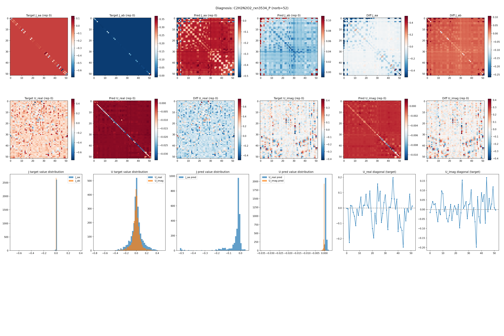
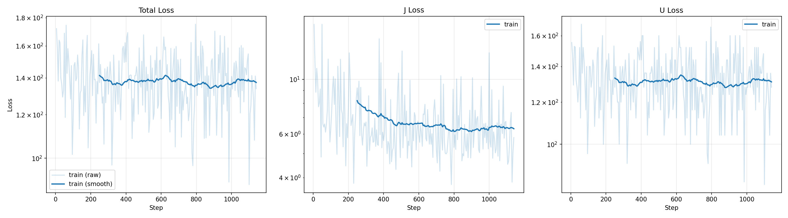
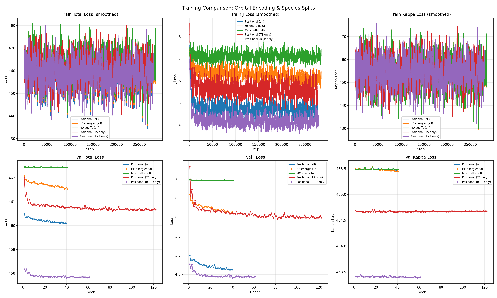
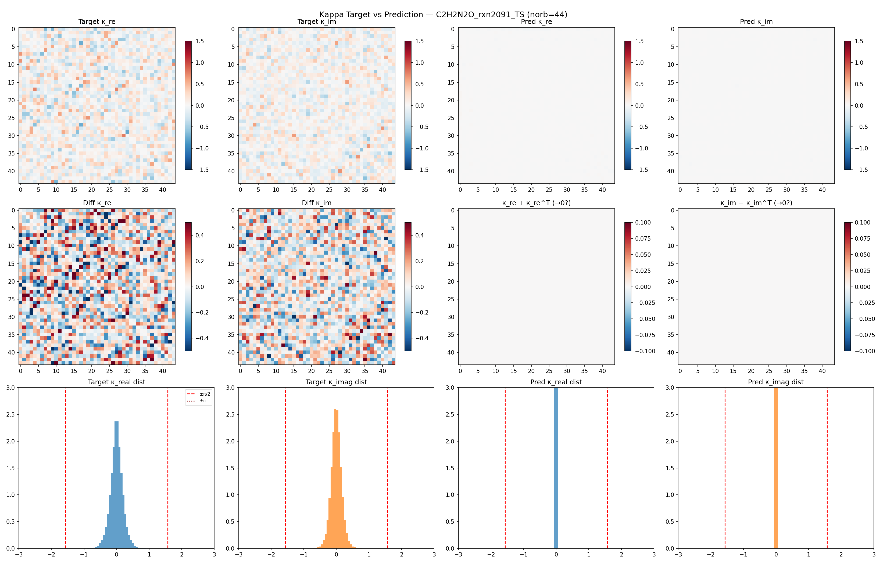

# Edge Transformer for LUCJ Parameter Prediction
### Pretraining a Neural Surrogate for Quantum Circuit Initialization

---

## Problem: Predict LUCJ Circuit Parameters from CCSD Amplitudes

**Goal**: Given HF/CCSD outputs for a molecule, predict the U and J matrices that define the LUCJ quantum circuit ansatz — bypassing the expensive compressed double factorization (ffsim).

**Input (per molecule)**

| Tensor | Shape |
|:-------|:------|
| $\mathbf{t}_1$ (singles) | $(n_\text{occ}, n_\text{virt})$ |
| $\mathbf{t}_2$ (doubles) | $(n_\text{occ}^2, n_\text{virt}^2)$ |
| Orbital metadata | per-orbital features |

**Output (per molecule, $L=2$ layers)**

| Tensor | Shape |
|:-------|:------|
| $\mathbf{J}_\mu^{(\sigma)}$ | $(n_\text{orb}, n_\text{orb})$ symmetric, sparse |
| $\boldsymbol{\kappa}_\mu$ | $(n_\text{orb}, n_\text{orb})$ anti-Hermitian |

$\mathbf{U}_\mu = \exp(\boldsymbol{\kappa}_\mu)$ reconstructs the unitary orbital rotation.

---

## Dataset: Transition1x (30,205 molecules)

**10,073 reactions** $\times$ 3 species (Reactant, TS, Product) from the Transition1x dataset.

Each molecule processed through: **HF** $\to$ **CCSD/STO-3G** (Q-Chem) $\to$ **Compressed DF** (ffsim)

| Property | Range |
|:---------|:------|
| $n_\text{orb}$ | 30 – 88 (median 66) |
| $n_\text{occ}$ | 16 – 44 |
| $n_\text{virt}$ | 14 – 44 |
| T2 elements | 50k – 3.7M per molecule |
| LUCJ params | 4.6k – 38.9k per molecule |

**Train/Val split**: 90/10 random (seed=42), stratified by species.

---

## Model Architecture

<b>Tokenizer</b> 
z(p,q) = OrbProj([ep || eq]) + PairTypeEmb + SliceEnc + g

▼

<b>Edge Transformer × L</b> 
Pre-norm · EdgeAttention + t2 bias · FFN 
Shape: (B, norb, norb, d)

▼

<b>J Head</b> 
J[p,q] = g(zpq) + g(zqp) 
<em>symmetric</em>

<b>κ Head</b> 
κ_re[p,q] = f(zpq) − f(zqp) 
κ_im[p,q] = h(zpq) + h(zqp) 
<em>anti-Hermitian</em>

**Config** (current runs):

| Parameter | Value | Parameter | Value |
|:----------|:------|:----------|:------|
| Embed dim $d$ | 128 | FFN dim | $4d = 512$ |
| Layers | 4 | Parameters | ~969K |
| Heads | 8 | Batch size | 4 |
| Dropout | 0.0 | Optimizer | AdamW + cosine |

**Pair tokens**: $n_\text{orb}^2$ per molecule
(up to $88^2 = 7{,}744$).

**Output per LUCJ layer $\mu$**:
- $\mathbf{J}_\mu$: sparse symmetric
- $\boldsymbol{\kappa}_\mu$: anti-Hermitian
- $\mathbf{U}_\mu = \exp(\boldsymbol{\kappa}_\mu)$: unitary

---

## Tokenizer: Pair Token Initialization

Each orbital pair $(p, q)$ receives an embedding $\mathbf{z}_{pq}^{(0)} \in \mathbb{R}^d$ composed of four additive components:

**1. Orbital features**: $\text{MLP}([\mathbf{e}_p \| \mathbf{e}_q])$ where $\mathbf{e}_p = \text{TypeEmb}(\text{occ/virt}) + \text{OrbEnc}(p)$

**2. Pair-type embedding**: 4 types $\in$ {occ-occ, occ-virt, virt-occ, virt-virt}

**3. $t_2$-slice encoding** (DeepSets): extract the slice of $t_2$ relevant to pair $(p,q)$:

| Pair type | $t_2$ slice | Shape |
|:----------|:------------|:------|
| occ-occ $(i,j)$ | $t_2[i, j, :, :]$ | $n_\text{virt} \times n_\text{virt}$ |
| occ-virt $(i,a)$ | $t_2[i, :, a, :]$ | $n_\text{occ} \times n_\text{virt}$ |
| virt-occ $(a,j)$ | $t_2[:, j, a, :]$ | $n_\text{occ} \times n_\text{virt}$ |
| virt-virt $(a,b)$ | $t_2[:, :, a, b]$ | $n_\text{occ} \times n_\text{occ}$ |

Encoded via: $\text{SliceEnc}(\mathbf{s}) = \rho\bigl(\text{mean}(\phi(\mathbf{s}))\bigr)$

**4. Global broadcast**: $[n_\text{occ}, n_\text{virt}, L]$ projected to $\mathbb{R}^d$

---

## Edge Attention with $t_2$ Structural Bias

Factorized attention over pair tokens (from the (2,1)-GT / Edge Transformer):

$$A_{(x,a) \to (a,y)} = \frac{\langle \mathbf{z}_{xa} W_Q,\; \mathbf{z}_{ay} W_K \rangle}{\sqrt{d_k}} + \lambda \cdot B_{xay}$$

- Triangular pattern: pair $(x,a)$ attends to pair $(a,y)$ via shared index $a$
- $\lambda$: learnable scalar (init 1.0)
- $B_{xay}$: for $x, a \in \text{occ},\; y \in \text{virt}$: $B_{xay} = \text{mean}_b\, t_2[x, a, y', b]$

$$\text{attn} = \text{softmax}\bigl(\text{einsum}(\texttt{"bxahd,bayhd}\to\texttt{bxayh"}, Q, K) / \sqrt{d_k} + \lambda B\bigr)$$

$$\text{out} = \text{einsum}(\texttt{"bxayh,bxayhd}\to\texttt{bxyhd"}, \text{attn}, V_L \otimes V_R)$$

Complexity: $O(n_\text{orb}^3 \cdot H \cdot d_k)$ per layer.

---

## Orbital Encoding Schemes

Three encoding modes for the per-orbital feature $\mathbf{e}_p \in \mathbb{R}^{d/2}$:

| Mode | $\mathbf{e}_p$ definition | Physical content |
|:-----|:--------------------------|:----------------|
| **Positional** | $\text{TypeEmb}(\text{occ/virt}) + \text{PosEmb}(p)$ | None (learned index) |
| **HF energies** | $\text{TypeEmb} + \text{MLP}(\epsilon_p)$ | Fock eigenvalue |
| **MO coefficients** | $\text{TypeEmb} + \text{AtomPooling}(\mathbf{C}_p)$ | Full orbital shape |

**MO coefficient pooling** (atom-aware DeepSets):

$$\mathbf{h}_p = \frac{1}{|\mathcal{B}|} \sum_{\mu \in \mathcal{B}} \phi\bigl(c_{p\mu},\; \text{ZEmb}(Z_\mu),\; \text{lEmb}(l_\mu)\bigr)$$

Each AO $\mu$ carries: coefficient $c_{p\mu}$, nuclear charge $Z_\mu$, angular momentum $l_\mu$.

**Hypothesis**: Richer physical features $\Rightarrow$ better generalization.

---

## Why Predict $\kappa$ Instead of $U$?

**Problem with predicting $U$ directly**:

The U targets are **dense** complex unitary matrices.
The model collapsed to predicting **near-zero** — worse than the trivial baseline.

| Metric | Value |
|:-------|:------|
| $\text{MSE}(\mathbf{0}, U)$ baseline | **101.9** |
| Trained model U loss | **~131** (worse!) |
| Model prediction range | $[-0.035, 0.003]$ |
| Target U range | $[-0.80, 0.80]$ |

**Fix**: Predict $\kappa = \log(U)$ instead.

$\kappa$ is **anti-Hermitian**:
- $\kappa_\text{re}$: anti-symmetric ($\kappa = -\kappa^T$)
- $\kappa_\text{im}$: symmetric ($\kappa = \kappa^T$)

Built-in constraints in the decode head **halve** the free parameters and **regularize** the output.

$U = \exp(\kappa)$ is reconstructed at inference.

---

## Diagnosis: U Target vs Prediction Distribution

**Left**: J targets are sparse/tridiagonal — model learns them well.
**Middle/Right**: U targets are dense with wide spread — model outputs near-zero (dark red = flat prediction).
**Histograms**: Target U spreads $[-0.8, 0.8]$; predictions cluster near 0.

---

## Training with U Loss: Stuck at Baseline

Early U-loss training (positional encoding, predicting U directly):
- J loss decreases from ~10 to ~5 ✓
- **U loss stuck at ~131** (worse than predicting all zeros = 102) ✗
- Model cannot learn the dense unitary structure

---

## Results: 5 Experimental Runs (Kappa Parameterization)

**Orbital encoding ablation** (all species):

| Encoding | Val J | Val $\kappa$ | Val Total |
|:---------|------:|---------:|------:|
| Positional | **4.62** | 455.5 | 460.1 |
| HF energies | 6.09 | 455.4 | 461.5 |
| MO coefficients | 6.96 | 455.5 | 462.4 |

**Species split** (positional encoding):

| Split | Val J | Val $\kappa$ | Val Total |
|:------|------:|---------:|------:|
| All (30k) | 4.62 | 455.5 | 460.1 |
| TS only (10k) | 5.98 | 454.7 | 460.7 |
| R+P only (20k) | **4.44** | **453.4** | **457.8** |

**Naive baselines** (predict all zeros):

| Target | $\text{MSE}(\mathbf{0}, \cdot)$ |
|:-------|------:|
| J | 8.5 |
| $\kappa$ | 352.8 |
| U | 101.9 |

**Kappa improvement over zero**:

$\frac{455 - 353}{353} \approx +29\%$ above zero-baseline

$\Rightarrow$ Model is **still above** the trivial baseline for $\kappa$!

---

## Training Curves: All 5 Runs

**Key observations**: J loss differentiates across encodings (positional best). Kappa loss plateaus at ~453–455 for all runs by epoch ~10.

---

## Analysis: Orbital Encoding

### J Loss: Positional Wins

| Encoding | Val J |
|:---------|------:|
| Positional | **4.62** |
| HF energies | 6.09 (+32%) |
| MO coefficients | 6.96 (+51%) |

The **simple learned embedding** outperforms physically-motivated features for J prediction. Why?

- STO-3G orbital energies don't vary much across the dataset
- The positional embedding is **learned end-to-end** — it encodes whatever the decoder needs
- Fixed physical features impose a rigid representation

### $\kappa$ Loss: No Differentiation

All three encodings plateau at $\kappa \approx 455$.

This suggests the **bottleneck is not in the orbital encoding** but in the model's ability to predict dense matrix structure from pair embeddings.

The J head works because J is **sparse** (tridiagonal + diagonal, ~$3n$ nonzeros).
$\kappa$ is **dense** ($n^2$ entries) — fundamentally harder.

---

## Analysis: Species Difficulty

| Split | Val J | Val $\kappa$ | $n_\text{train}$ | Epochs |
|:------|------:|---------:|------:|-------:|
| R+P only | **4.44** | **453.4** | 18k | 61 |
| All | 4.62 | 455.5 | 27k | 40 |
| TS only | 5.98 | 454.7 | 9k | 122 |

**Transition states are harder** to learn:
- TS has stronger multi-reference character, larger $T_1$ diagnostics
- Coupled-cluster amplitudes for TS are more "irregular"
- R+P (equilibrium geometries) have more systematic amplitude patterns

**R+P achieves the best loss** despite having less data than "All" — the TS samples add noise that hurts the model.

---

## Diagnosis: $\kappa$ Target vs Prediction

**Top row**: Target $\kappa$ has rich structure (anti-symmetric real, symmetric imag); predictions are near-zero.
**Middle row**: Difference ≈ target (model contributes nothing); symmetry constraints are correctly enforced.
**Bottom row**: Target values bounded within $\pm\pi/2$; predictions collapse to a spike at 0.

---

## The $\kappa$ Plateau Problem

### Current situation

The kappa loss **plateaus at ~455** across all runs, which is **above** the zero-prediction baseline of 353.

The model is effectively predicting **small perturbations** around zero that are **not accurate enough** to reduce MSE below the trivial solution.

### Structural properties of $\kappa$ that we're not exploiting

1. **Anti-Hermitian constraint**: enforced in decode head ✓, but the MLP predicts all $O(n^2)$ entries independently

2. **Rep symmetry**: $\kappa^{(1)} = -\kappa^{(0)*}$ (conjugate pair) — we predict both reps independently

3. **Spectral structure**: eigenvalues of $\kappa$ are purely imaginary; the model has no spectral inductive bias

4. **Low-rank structure**: $\kappa$ from compressed DF may be approximately low-rank — could predict via $\kappa \approx \sum_k \sigma_k \mathbf{u}_k \mathbf{v}_k^\top$

---

<!-- _class: compact -->

## Open Questions for Discussion

1. **Should we predict $\kappa$ in a different basis?**
   Eigendecomposition (predict eigenvalues + eigenvectors separately); low-rank factorization ($\kappa \approx \sum_k \sigma_k \mathbf{u}_k \mathbf{v}_k^\top$)
2. **Should the loss be different?**
   Spectral loss (penalize eigenvalue errors); reconstruction loss ($\|U_\text{pred} - U_\text{target}\|_F^2$ where $U = \exp(\hat\kappa)$); relative loss (normalize by per-sample Frobenius norm)
3. **Do we need more model capacity?**
   Current: 4 layers, 128 dim, 969K params. The pair-token grid is $O(n^2)$ — memory-bound for larger models.
4. **Can we exploit the conjugate-pair symmetry?**
   Only predict Rep 0; Rep 1 $= -\kappa^{(0)*}$ — halves the output parameters.
5. **MoLe-style architecture**: Use SE(3)-equivariant GNN on localized MOs (pending, arXiv:2602.20232)
