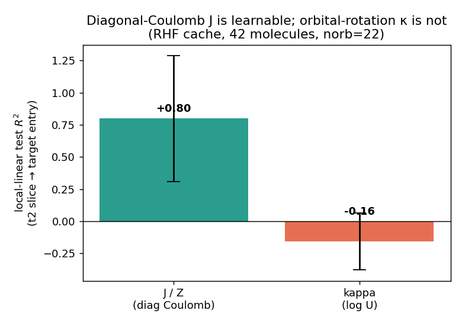
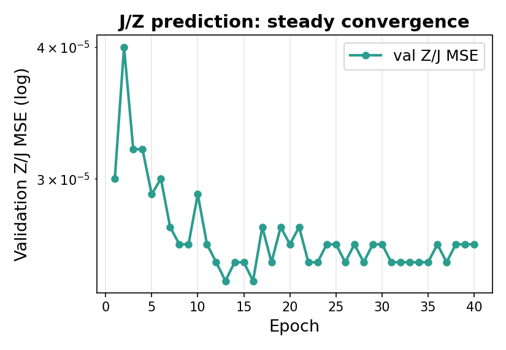

# ML-LUCJ: Amortized Quantum Circuit Initialization
## Edge Transformer for LUCJ Parameter Prediction
### Pretraining a Neural Surrogate for Quantum Circuit Initialization
#### *Updated results — verified RHF pipeline (June 2026)*

---

# The Quantum Chemistry Problem

<div class="columns">
<div class="col">

**Goal**: Compute molecular electronic energies on quantum hardware using variational quantum circuits.

The pipeline:
1. Classical CCSD → obtain amplitudes $(t_1, t_2)$
2. **Initialize** quantum circuit parameters (LUCJ ansatz)
3. Quantum sampling → bitstrings
4. Classical post-processing (QSCI) → energy

**The bottleneck**: Step 2 requires expensive per-instance optimization (minutes–hours per molecule).

</div>
<div class="col">

```
CCSD ──→ (t₁, t₂)
              │
    ┌─────────▼─────────┐
    │  Parameter Init    │ ← We replace this
    │  (per-instance     │    with a single
    │   optimization)    │    NN forward pass
    └─────────┬─────────┘
              ▼
    LUCJ Circuit ──→ Sample
              │
              ▼
    QSCI Diagonalize ──→ Energy
```

</div>
</div>

---

# ML-LUCJ: Our Approach

<div class="columns">
<div class="col">

### Core Idea: Amortized Optimization

Train a neural network $g_\phi$ to predict LUCJ circuit parameters from CC amplitudes:

$$\text{CCSD} \xrightarrow{t_1, t_2} \text{NN} \xrightarrow{U, J} \text{LUCJ}$$

**After training**: one forward pass (milliseconds) replaces the entire per-instance optimization loop.

### Architecture: (2,1)-GT Transformer

- Operates on **orbital-pair tokens** instead of single nodes
- Achieves expressivity beyond standard GNNs (>1-WL)
- Naturally handles the 4-index $t_2$ tensor structure via attention bias

</div>
<div class="col">

### Training Pipeline

| Stage | Method |
|:---|:---|
| A | Teacher params via compressed DF + TN-QSCI |
| B | Supervised: NN → teacher params |
| C | RL fine-tune with QSCI energy reward |

### Key Advantage

| Method | Per-molecule cost |
|:---|:---|
| Compressed DF | Minutes |
| TN-QSCI (500 evals) | Hours |
| **ML-LUCJ (ours)** | **Milliseconds** |

</div>
</div>

---


## Problem: Predict LUCJ Circuit Parameters from CCSD Amplitudes

**Goal**: Given HF/CCSD outputs for a molecule, predict the **U** and **J** matrices that define the LUCJ quantum circuit ansatz — bypassing the expensive compressed double factorization (ffsim).

<div class="columns">
<div class="col">

**Input (per molecule)**

| Tensor | Shape |
|:-------|:------|
| $\mathbf{t}_1$ (singles) | $(n_\text{occ}, n_\text{virt})$ |
| $\mathbf{t}_2$ (doubles) | $(n_\text{occ}^2, n_\text{virt}^2)$ |
| Orbital metadata | per-orbital features |

</div>
<div class="col">

**Output (per molecule, $L=2$ layers)**

| Tensor | Shape |
|:-------|:------|
| $\mathbf{J}_\mu^{(\sigma)}$ | $(n_\text{orb}, n_\text{orb})$ symmetric |
| $\boldsymbol{\kappa}_\mu$ | $(n_\text{orb}, n_\text{orb})$ anti-Hermitian |

$\mathbf{U}_\mu = \exp(\boldsymbol{\kappa}_\mu)$ reconstructs the unitary orbital rotation.

</div>
</div>

---

## Dataset: Transition1x (30,205 molecules) — Corrected Pipeline

**10,073 reactions** $\times$ 3 species (Reactant, TS, Product) from the Transition1x dataset.

```
geometry (.xyz)
   │  pyscf RHF-CCSD / STO-3G, frozen core      (generate_rhf_dataset.py)
   ▼
restricted spatial t2  ──►  rhf_dataset/<mol>.npz
   │  ffsim compressed double factorization      (generate_df_targets.py)
   ▼
DF targets (U→κ, J)   ──►  rhf_targets/<mol>.npz
```

| Property | Range |
|:---------|:------|
| $n_\text{orb}$ | 7 – 47 (median 29) |
| $n_\text{occ}$ | 4 – 23 |
| $n_\text{virt}$ | 3 – 24 |
| T2 elements/mol | ~1k – 300k |
| LUCJ params/mol | 0.2k – 8.8k |

**Train/Val split**: 90/10 random (seed=42), stratified by species.

---

## Bug in the Original Pipeline (now fixed)

The v1 slides reported results trained on **incorrect** data.

The original Q-Chem CCSD outputs were **UHF spin-orbital** amplitudes.
`ffsim.UCJOpSpinBalanced` expects **RHF restricted spatial** amplitudes.

| Quantity | Spin-orbital (v1, wrong) | Spatial RHF (v2, correct) |
|:---------|:-------------------------|:--------------------------|
| `norb` fed to ffsim | 44 (example) | **22** |
| Physical meaning of LUCJ output | none (basis mismatch) | valid LUCJ |

**Fix**: regenerated amplitudes from **pyscf RHF-CCSD/STO-3G** (frozen core). Numerically equivalent to Q-Chem RHF-CCSD for the same method/basis, but ~0.5 s/molecule vs hours of Q-Chem re-run.

All v1 data archived to `stale_2026-06-10_kappa_era/`.

All numbers from this point forward use the **verified RHF pipeline**.

---

## Model Architecture

<div class="columns">
<div class="col">

<div class="arch-box">
<b>Tokenizer</b><br>
z(p,q) = OrbProj([e_p ‖ e_q]) + PairTypeEmb + PosSliceEnc(t2) + g
</div>
<div class="arch-arrow">▼</div>
<div class="arch-box">
<b>Edge Transformer × L</b><br>
Pre-norm · EdgeAttention + t2 bias · FFN<br>
Shape: (B, norb, norb, d)
</div>
<div class="arch-arrow">▼</div>
<div class="columns">
<div class="head-box">
<b>J Head</b><br>
J[p,q] = g(z_pq) + g(z_qp)<br>
<em>symmetric, tanh-bounded</em>
</div>
<div class="head-box">
<b>κ Head</b><br>
κ_re[p,q] = f(z_pq) − f(z_qp)<br>
κ_im[p,q] = h(z_pq) + h(z_qp)<br>
<em>anti-Hermitian, tanh-bounded</em>
</div>
</div>

</div>
<div class="col">

**Config** (current runs):

| Parameter | Value | Parameter | Value |
|:----------|:------|:----------|:------|
| Embed dim $d$ | 192 | FFN dim | $4d = 768$ |
| Layers | 6 | Parameters | ~2.8M |
| Heads | 8 | Batch size | 8 |
| Dropout | 0.0 | Optimizer | AdamW + cosine |

**Pair tokens**: $n_\text{orb}^2$ per molecule.

**Output per LUCJ layer $\mu$**:
- $\mathbf{J}_\mu$: symmetric (diagonal Coulomb)
- $\boldsymbol{\kappa}_\mu$: anti-Hermitian ($\kappa^\dagger = -\kappa$, i.e. the matrix equals minus its own conjugate-transpose — halves free parameters)
- $\mathbf{U}_\mu = \exp(\boldsymbol{\kappa}_\mu)$: unitary ($U^\dagger U = I$, guaranteed by exponentiating an anti-Hermitian)

</div>
</div>

---

## Tokenizer: Positional Slice Encoder (v2 fix)

Each orbital pair $(p, q)$ receives an embedding $\mathbf{z}_{pq}^{(0)} \in \mathbb{R}^d$ from four additive components:

**1. Orbital features**: $\text{MLP}([\mathbf{e}_p \| \mathbf{e}_q])$ where $\mathbf{e}_p = \text{TypeEmb}(\text{occ/virt}) + \text{PosEmb}(p)$

**2. Pair-type embedding**: 4 types $\in$ {occ-occ, occ-virt, virt-occ, virt-virt}

**3. Positional $t_2$-slice encoding** *(changed from v1 DeepSets)*:

Each $t_2$ slice is now encoded with within-slice positional indices preserved. This was critical: the v1 mean-pool DeepSets was too lossy to carry molecule-specific information.

The $t_2$ slice is the **only** molecule-specific token component for same-size molecules, so it gets a `LayerNorm` + learned gate to prevent the signal from being drowned out.

**4. Global broadcast**: $[n_\text{occ}, n_\text{virt}, L]$ projected to $\mathbb{R}^d$

---

## Edge Attention with $t_2$ Structural Bias

Factorized attention over pair tokens (from the (2,1)-GT / Edge Transformer):

$$A_{(x,a) \to (a,y)} = \frac{\langle \mathbf{z}_{xa} W_Q,\; \mathbf{z}_{ay} W_K \rangle}{\sqrt{d_k}} + \lambda \cdot B_{xay}$$

- Triangular pattern: pair $(x,a)$ attends to pair $(a,y)$ via shared index $a$
- $\lambda$: learnable scalar (init 1.0)
- $B_{xay}$: for $x, a \in \text{occ},\; y \in \text{virt}$: $B_{xay} = \text{mean}_b\, t_2[x, a, y', b]$
  *Intuition*: the bias tells attention "how strongly orbital $x$ and orbital $y$ are coupled through double excitations via $a$" — pairs with large $t_2$ amplitude attend more to each other.

$$\text{attn} = \text{softmax}\bigl(\text{einsum}(\texttt{"bxahd,bayhd}\to\texttt{bxayh"}, Q, K) / \sqrt{d_k} + \lambda B\bigr)$$

$$\text{out} = \text{einsum}(\texttt{"bxayh,bxayhd}\to\texttt{bxyhd"}, \text{attn}, V_L \otimes V_R)$$

Complexity: $O(n_\text{orb}^3 \cdot H \cdot d_k)$ per layer — only triangular $(x,a) \to (a,y)$ attention (shared middle index). Full pair-to-pair $(x,a) \to (b,y)$ would be $O(n^4)$, prohibitive at our orbital counts.

---

## Key Finding: J Is Learnable, $\kappa$ Is Not

<div class="columns">
<div class="col">

With **correct RHF data**, we ran controlled learnability tests (same features, samples, regularization for both targets):



</div>
<div class="col">

| Target | Local-linear test $R^2$ |
|:-------|:------------------------|
| **J** (diagonal Coulomb) | <span class="ok">+0.80</span> |
| **κ = log U** (orbital rotation) | <span class="bad">−0.16</span> |

J carries strong signal from t2.
κ is **worse than predicting the mean**.

This held across every encoding variant:
local slices, full-t2 PCA, orbital-energy
denominators, small MLPs.

</div>
</div>

---

## Why Is $\kappa$ Hard? — The Gauge Problem

<div class="columns">
<div class="col">

DF is an eigendecomposition: $J = U\,\mathrm{diag}(j)\,U^\dagger$

- **Eigenvalues** (→ J): **unique** — one right answer per molecule → <span class="ok">learnable</span>
- **Eigenvectors** (→ U/κ): **not unique** — many equally valid U (sign flips, basis rotations in degenerate subspaces); ffsim picks one arbitrarily → <span class="bad">contradictory labels</span>

$$\text{ratio} = \frac{\mathbb{E}\,\|\Delta\text{target}\|_{\text{closest-in-}t_2}}{\mathbb{E}\,\|\Delta\text{target}\|_{\text{all pairs}}}$$

| | Nearest-pair ratio | Ridge $R^2$ |
|:--|:--|:--|
| **J** | **0.60×** (40% closer) | <span class="ok">+0.80</span> |
| **κ** | **0.98×** (≈ random) | <span class="bad">−0.16</span> |

</div>
<div class="col">


**Intuition**: grab two molecules whose t2 are nearly identical. Their J targets are also nearly identical (ratio 0.60× — **40% closer** than average) — a smooth network can interpolate. But their κ targets look **completely unrelated** (ratio 0.98× — **essentially no closer than random**) — the network sees contradictory labels for almost the same input and gives up.

</div>
</div>

---

## Supervised Results (Correct Pipeline)

<div class="columns">
<div class="col">



Edge Transformer (d=192, 6 layers)
30,205 molecules, `--loss-mode supervised`

</div>
<div class="col">

| Metric | Value |
|:-------|:------|
| J val MSE | ~2.2e-5 (zero-baseline: 6.0e-5) |
| **J $R^2$ (3,020 val mols)** | **0.63** (0.75 uniform subset) |
| J relative error | 0.54 |
| κ val MSE | ~0.10, <span class="bad">flat from epoch 1</span> |

**J head is the deliverable**; κ head is present but weak — exactly as the gauge analysis predicts.

</div>
</div>

---

## Reconstruction Loss: Gauge-Invariant but Tricky

Instead of regressing κ directly, reconstruct t2 from predicted (U, J):

$$\hat t_2[i,j,a,b] = i \sum_{\mu,pq} J^{(\mu)}_{pq}\, U^{(\mu)}_{ap}\, U^{(\mu)*}_{ip}\, U^{(\mu)}_{bq}\, U^{(\mu)*}_{jq}$$

Minimize $\|\hat t_2 - t_2\| / \|t_2\|$. **Any U that reconstructs t2 is correct** — sidesteps gauge.

| DF config | Reconstruction residual |
|:----------|:-----------------------|
| Exact DF (full rank) | 0.000 (formula correct) |
| n_reps=2, unconstrained, optimized | 0.32 |
| n_reps=2 + LUCJ local sparsity | **0.94** (captures only ~6% of t2) |

**Proof of concept**: single-molecule trains to 0.15; 16 similar molecules converge, model produces molecule-distinct outputs.

**On diverse data**: model collapses into a **J=0 trap** (loss pinned at exactly 1.000) — a degenerate saddle where J gradients vanish.

---

## Escaping the J=0 Trap

| Run | Flags | Outcome |
|:----|:------|:--------|
| Reconstruction, **cold** start | `--loss-mode reconstruction` | val recon pinned at **1.000** (J → 0 collapse) |
| Reconstruction, **warm-start + J-floor** | `--loss-mode reconstruction --z-reg floor --init-from <sup. ckpt>` | Escapes: val recon **0.999 → 0.976** over 25 epochs |

**Mitigations required to break the saddle:**

1. **Complex U_base**: real orthogonal U makes $i \cdot \mathrm{einsum}(\text{real})$ purely imaginary → zero real part → no learning. Must be complex anti-Hermitian.
2. **Fixed (non-learnable) U_base**: prevents the model from trivially zeroing out the base.
3. **Positional slice encoder**: preserves molecule-specific t2 structure (mean-pool was too lossy).
4. **J-floor regularization**: keeps $\|J\|$ above a threshold so U always gets a gradient.
5. **SGD noise helps**: larger batches → smoother gradients → *harder* to escape the saddle.

Even with warm-start, U descent is slow — gauge-limited. J continues to be the robust deliverable.

---

## What Is Easy vs. Hard to Learn

<div class="columns">
<div class="col">

### <span class="ok">J: Easy</span>

- **Eigenvalue-like** — unique answer per molecule
- **Smooth** function of t2 (nearest-pair ratio 0.60×)
- Linear baseline: $R^2 = 0.80$
- Full model (ET, supervised): $R^2 = 0.63$ and rising
- Physically: diagonal Coulomb matrix, sparse, tridiagonal structure
- **Why it works**: the mapping t2 → eigenvalues is continuous; same-size same-element molecules share similar J

</div>
<div class="col">

### <span class="bad">U / κ: Hard</span>

- **Eigenvector-like** — many equally valid answers
- **Not smooth** in t2 (nearest-pair ratio 0.98× ≈ random)
- Linear baseline: $R^2 = -0.16$
- Supervised ET: MSE flat from epoch 1
- Reconstruction: works single-molecule, fails on diverse data (J=0 trap)
- **Why it fails**: near-degenerate eigenvalue crossings flip eigenvector bases discontinuously; no smooth function to learn

</div>
</div>

---

## Summary and Current State

| Component | Status | Key number |
|:----------|:-------|:-----------|
| Data pipeline | Verified (pyscf RHF-CCSD) | 30,205 molecules |
| J prediction | <span class="ok">Working</span> | $R^2 = 0.63$ (full), 0.75 (uniform subset) |
| κ supervised regression | <span class="bad">Stuck</span> | MSE flat from epoch 1 (gauge wall) |
| κ reconstruction loss | Escapes J=0 with warm-start | val recon 0.999 → 0.976 (slow) |
| Architecture | Edge Transformer, ~2.8M params | d=192, 6 layers, 8 heads |

**Key architectural lesson**: the t2 slice is the only molecule-differentiating signal for same-size inputs. The original DeepSets mean-pool destroyed this; the positional encoder + gate fixed it.

---

<!-- _class: compact -->

## Open Problems and Next Steps

<style scoped>section { font-size: 19px; line-height: 1.3; } li { margin: 2px 0; } h2 { margin-bottom: 8px; }</style>

1. **Cracking U**: Direct regression and reconstruction both hit the gauge wall. Promising directions:
   - **Gauge-canonicalize** U before learning (Laplacian canonicalization, SignNet/BasisNet for the basis ambiguity in degenerate subspaces)
   - **Predict-then-refine**: NN predicts a warm-start $(U_0, J_0)$; then run a few steps of a differentiable compressed-DF optimizer per molecule to polish the parameters. Borrows optimization structure from ffsim; the NN only needs to be *close enough*, not exact.
   - **Energy-aligned loss**: instead of reconstructing t2 entries, minimize the LUCJ variational energy directly (requires a VQE gradient oracle).

2. **Improving J further**: sweep orbital encodings (HF energies, MO coefficients) on the RHF data; try curriculum learning (uniform-size subset → full diversity).

3. **MoLe-style architecture**: SE(3)-equivariant GNN on localized MOs (Thiede et al., arXiv:2602.20232) for richer orbital representations.

4. **Scaling**: extend to larger basis sets (cc-pVDZ), multi-reference systems, and bigger molecules.
