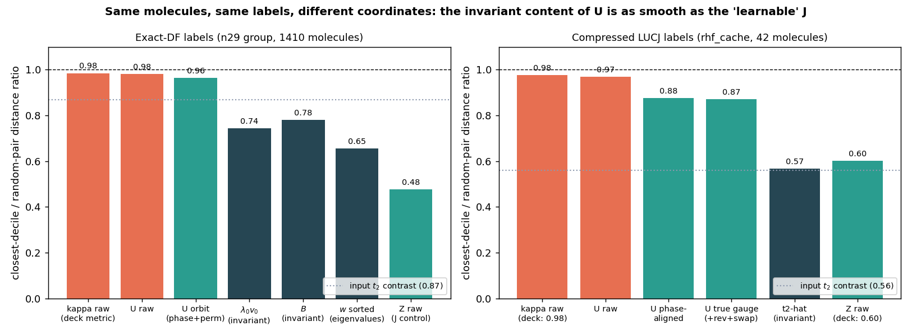
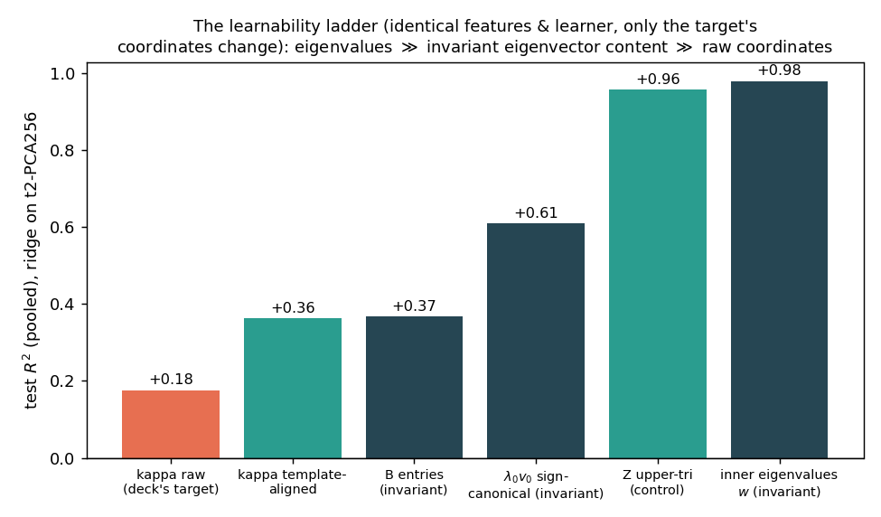

# ML-LUCJ v3: The κ "Gauge Wall" Is a Coordinate Problem
## A learnability study of eigenvector-valued targets, and the fix
#### *Follow-up to deck_v2 — gauge study + retargeted pretraining (Aug 2026)*

---

## Where v2 left off — and the question

**v2 conclusion**: J (diagonal Coulomb) is learnable ($R^2$ 0.63–0.80); U/κ (orbital rotation) is "unlearnable" — local-linear $R^2 = -0.16$, nearest-pair ratio 0.98, κ val MSE flat from epoch 1 (0.1028 for 40 epochs).

**The challenge**: is an eigenvector-valued objective *truly* unlearnable — in any sense?

**Method of this study** (all on our data; code in `gauge_study/`, full report in `docs/eigenvector_learnability_study.md`):

1. Pin down mathematically what the (U, Z) labels *are*
2. Distinguish four meanings of "unlearnable" and test each
3. Re-measure v2's smoothness/learnability tests with **gauge-aware distances and metrics**
4. Survey how other fields learn eigenvector-valued outputs
5. **Fix the objective, retrain, compare**

---

## What the labels actually are (verified to float32 on our targets)

`generate_df_targets.py` (optimize=False) is a *nested eigendecomposition*:

$$T_{(ia),(jb)} = t_2[i,j,a,b] \;\xrightarrow{\text{eigh}}\; T = \textstyle\sum_k \lambda_k v_k v_k^T \quad (\text{sorted by } |\lambda_k|)$$

$$M = \mathrm{mat}(v_0),\qquad Q^{\pm} = \tfrac{1}{2}(1 \mp i)(M \pm i M^T),\qquad \text{eigh}(Q^\pm) = (w^\pm,\, U^\pm)$$

| Identity (50 molecules) | deviation |
|:--|:--|
| $Z_1 = -Z_0$, rep 1 = conj(rep 0) up to gauge | 0 / 1e-18 |
| $Z = \pm\lambda_0\, w w^T$ — **rank-1** | 2e-8 |
| invariant content of (U,Z) = $\lambda_0 v_0 v_0^T$ = best rank-1 approx of $T$ | 7e-8 |
| zero-weight columns of U ($w_p = 0$, pure gauge) | exactly $n_{occ} - n_{virt}$ |

**The whole n_reps=2 label is deterministic linear algebra on one scalar + one $n_{occ}\times n_{virt}$ matrix.**

Hazard found: same molecule, different LAPACK build → Z reproduces to 1e-9 but **κ changes by rel. distance 1.44** (≈ random). Regenerating targets on another machine silently rewrites every κ label.

---

## Four readings of "κ is unlearnable" — only one is true (and it's fixable)

| Reading | Verdict | Evidence |
|:--|:--|:--|
| **V1** No measurable map t2 → valid (U,Z) exists | False — ffsim computes one | trivial |
| **V2** No *globally continuous* selection of U exists | True but benign — obstruction only at spectral degeneracies (topological; canonicalization provably can't fix it — Dym et al. ICML'24); those directions carry ≈ zero Z-weight | theory + gap census |
| **V3** The labels *as generated* are not smooth in t2 | True — this is what v2 measured. LAPACK redraws the gauge per input: a label-pipeline artifact, not a task property | exp1/3/5 |
| **V4** The *task* — predict any representative with the right invariant content — is unlearnable | False — invariant content is as smooth as J and predictable | exp2/4/6 |

**v2's evaluation (raw entrywise MSE / $R^2$) cannot distinguish V3 from V4.** It measured the gauge draw.

---

## Evidence 1 — Same labels, different coordinates

On v2's own 42-molecule cache: raw κ ratio **0.976** (deck: 0.98) → phase-aligned **0.876** → the gauge-invariant content of those same labels: **0.568 — smoother than the "learnable" Z (0.601)**.

---

## Evidence 2 — Interpolate t2, regenerate labels at every step

Raw ‖ΔU‖ sits at the **random-gauge ceiling at every step** (what κ-MSE supervises). The invariant content moves ~1000× less — and spikes exactly where the outer gap $(|\lambda_0|{-}|\lambda_1|)/|\lambda_0|$ pinches (Davis–Kahan). Degeneracy census: **8.4%** of molecules within 5% of a crossing, 0.6% within 1% — hard cases are *rare and flaggable by the predicted gap*.

---

## Evidence 3 — The learnability ladder

Identical features (t2-PCA256), identical learner (ridge), 1410 same-shape molecules — only the target's **coordinates** change:

| Target | test $R^2$ |
|:--|:--|
| κ raw (v2's target) | +0.18 |
| κ template-aligned | +0.36 |
| **λ₀v₀ sign-canonical (invariant)** | **+0.61** |
| Z upper-tri (control) | +0.96 |
| inner eigenvalues $w$ | +0.98 |

Metric check: the *same* 1-NN predictor scores 0.77 (vs random) under raw distance but 0.62 under orbit distance. **The metric, not the signal, produced the "unlearnable" verdict.**

---

## What the literature does with eigenvector-valued outputs

| Field | Solution | Reference |
|:--|:--|:--|
| Quantum ML (H → orbitals) | **Never regress eigenvectors**: predict the operator, diagonalize at inference | PhiSNet '21, DeepH '22, QHNet '23 |
| ...without labels | self-consistency loss (= our reconstruction loss, mainstream-validated) | Zhang et al. ICML'24 |
| Spectral GNNs (eigvecs as inputs) | sign/basis-invariant nets; projectors $VV^T$ | SignNet/BasisNet ICLR'23 |
| Canonicalization theory | **continuous canonicalization provably impossible**; weighted frames | Dym et al. ICML'24 |
| Speech / detection | min-over-permutation (Hungarian) losses — orbit losses at scale | PIT '17, DETR '20 |
| 3D vision | discontinuous charts (Euler/quat) fail regression → continuous representations | Zhou et al. CVPR'19 (κ=log U has branch cuts: same mistake) |
| VQE warm starts | amortized + generative initializers; predict-then-refine | Qracle '25, Flow-VQE '25 |

---

## The fix: predict the invariant generator, not the gauge

<b>Edge Transformer (unchanged)</b> pair tokens (B, norb, norb, d)

▼

<b>NEW: v₀ head</b> — scalar on <b>occ-virt pair tokens</b> → m̂ ∈ ℝ^(n_occ×n_virt) <b>NEW: λ₀ head</b> — masked-mean pool → scalar <em>(J/Z head kept as before; κ heads retired)</em>

▼ inference only

<b>ffsim's own linear algebra</b> (15 lines) M = mat(v̂₀) → Q± → eigh → (U, Z) exactly

**Loss** (sign is the only residual gauge):

$$\mathcal{L} = \min(\|\hat m - v_0\|^2, \|\hat m + v_0\|^2) + w_\lambda(\hat\lambda_0 - \lambda_0)^2 + \mathcal{L}_Z$$

**Why this is exact, not approximate**
- (λ₀, v₀) is a *sufficient statistic*: reconstruction equals ffsim's output up to gauge (verified 1e-8)
- Smooth wherever the outer gap is open; risky 8% flaggable
- eigh at inference only → no degenerate-eigh backprop
- Targets computed from t2 directly (numpy eigh) — **no ffsim, no gauge in the label pipeline**

**Bonus — the Z=0 trap dies**: reconstruction in these coordinates is
$$\|\textstyle\sum_k \pm m_k m_k^T - T\|^2$$
a Burer–Monteiro landscape: m=0 is a *strict saddle* (escape curvature ∝ |λ_k|), not v2's flat plateau.

---

## New evaluation protocol (replaces κ-MSE / raw R²)

| Metric | What it measures | Status |
|:--|:--|:--|
| downstream QSCI / variational energy vs teacher init | the actual deliverable | future work |
| $\|\hat B - B\|/\|B\|$, $B = \lambda_0 v_0 v_0^T$ (= t̂2 error for exact-DF) | invariant content error | **primary** |
| sign-aligned cosine $\lvert\langle \hat v_0, v_0\rangle\rvert$ | eigenvector direction | logged |
| λ₀ MSE / $R^2$ | factor strength | logged |
| accuracy stratified by outer gap | separates model failure from task ill-posedness | eval script |
| raw entrywise κ MSE / $R^2$ | the LAPACK gauge draw | never again |

---

## Retargeted pretraining: results

*(this slide is filled by the v3 run — `checkpoints_invariant/`, `pretrain/eval_invariant.py`)*

| Metric (3,020 val molecules) | v2 baseline (κ heads) | **v3 (invariant heads)** |
|:--|:--|:--|
| val loss curve | κ MSE **flat from epoch 1** (0.1028) | *(training)* |
| invariant-content error $\|\hat B - B\|/\|B\|$ (median) | *(eval of old ckpt)* | *(training)* |
| sign-aligned cosine (median) | — | *(training)* |
| λ₀ $R^2$ | — | *(training)* |
| Z MSE (unchanged head, sanity) | 2.6e-5 | *(training)* |

---

## Limitations and next steps

1. **n_reps > 2**: sufficient statistic becomes the top-K eigenpairs → predict the rank-K truncation $\sum_k \lambda_k v_k v_k^T$ (a "denoised t2"); split into eigenpairs at inference; subspace losses where λ's cross.
2. **Compressed / optimize=True targets**: add per-molecule L-BFGS refinement at inference (predict-then-refine — matches how ffsim itself derives them from the exact init). Optimizer multimodality means these should *never* be regressed directly (aligned ratio saturates at 0.87 vs invariant 0.57).
3. **Energy-aligned fine-tuning** (Stage C RL with QSCI reward) is unchanged and compatible.
4. **Near-degenerate molecules (~8%)**: flag by predicted gap; fall back to rank-2 subspace prediction.
5. Label pipeline: pin a gauge + add a cross-BLAS determinism test if κ labels are ever regenerated.

**Artifacts**: study `docs/eigenvector_learnability_study.md` · experiments `gauge_study/exp1–6` · figures `gauge_study/figs/` · this deck's numbers: exp logs committed alongside.
