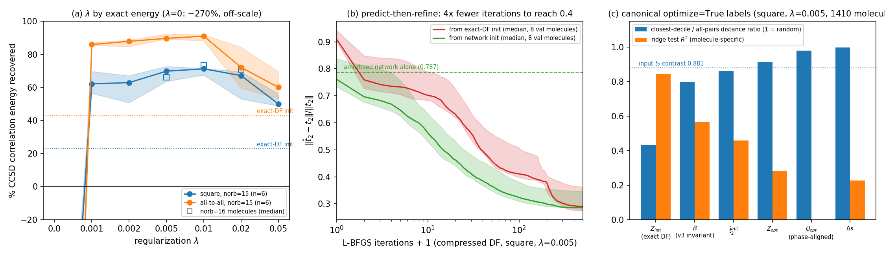

# ML-LUCJ v4: optimize=True labels, regularization, energy RL
## "Is (U, J) learnable once the phases are aligned?" — and what *is* losslessly learnable
#### *Follow-up to deck_v3 (17 Sep 2026)*

---

## The three questions from the v3 discussion

1. **Alignment.** The v3 invariant retarget works because it removes the gauge. If we fix the gauge of the *optimize=True* (compressed-DF) labels at the source, can the Edge Transformer regress $U$ (or $\kappa$) and $J$ directly — and is there a *lossless* learnable formulation?
2. **Regularization.** ffsim's `regularization` $\lambda\,\lvert\sum\|J\|_F^2-\sum\|J_{\rm exact}\|_F^2\rvert$ (Lin et al., arXiv:2511.22476 use 0.005; our O$_3$ test used 0.01): which $\lambda$ for our molecules, chosen by **energy**.
3. **Energy fine-tuning.** GRPO after pretraining with a tensor-network / SQD energy reward (kevinsung/lucj `lucj_sqd_quimb_task_nomad.py` minus NOMAD), group size 8–16.

Code (all in `ccsd_amplitudes/`): `gauge_study/compressed_canonical.py`, `generate_compressed_targets.py`, `gauge_study/exp7–exp13`, `pretrain/train.py --loss-mode compressed_{sup,recon} [--residual-hyps K]`, `pretrain/rl/{hamiltonian,energy,policy,grpo}.py`. Companion doc: `docs/optimize_true_learnability_study.md`.

---

## 1a. Fixing the gauge at the source

ffsim's compressed DF = exact-DF init (nested `eigh`, LAPACK gauge) → L-BFGS on $\kappa=\log U$ and the allowed $Z$ entries. The objective is gauge-invariant, **the optimizer path in $\kappa$-space is not**, so the output inherits — and scrambles — the init's gauge.

`canonical_exact_init` removes every freedom of the init *before* optimizing:

| freedom of the exact-DF init | fix |
|:--|:--|
| sign of $v_0$ | largest-$\lvert\cdot\rvert$ entry positive |
| basis of the $n_{occ}-n_{virt}$ exact zero modes of $Q^\pm$ | pivoted QR of the (gauge-invariant) null projector |
| per-column phases of $U$ | largest-modulus entry of each column real positive |
| column order | ascending $w$ (deterministic once the sign is fixed) |

ffsim's objective + regularizer (its own `df_tensors_*` parameterization) is then minimized from that init. Labels for the n29 group (1410 molecules, $n_{occ}{=}16$, $n_{virt}{=}13$): square $\lambda\in\{0,0.005\}$, all-to-all $\lambda{=}0.005$; 500 L-BFGS iterations, ~80 s/molecule/config/core (60 pinned cores on scai1). Residual 0.915 → 0.328 (square, $\lambda$=0.005); 22 % of molecules put $\log(U_0^\dagger U_{\rm opt})$ on its branch cut.

---

## 1b. The optimizer, not the phase, is the problem (exp8)

Same canonical init, then (ii) restart from a **phase-rotated copy** of it, (iii) restart from the init of **t2 + 1 % noise** (which moves the canonical init by only 0.046). Medians over 8 molecules, square; distances phase-aligned, relative to $\|U\|$, $\|Z\|$, $\|t_2\|$:

| variant | resid | $\|Z\|$ ($\|Z_{\rm full}\|$=0.63) | conv. | (ii) $dU$ | $dZ$ | $d\hat t_2$ | (iii) $dU$ | $dZ$ | $d\hat t_2$ |
|:--|--:|--:|--:|--:|--:|--:|--:|--:|--:|
| init (exact DF, masked) | 0.932 | 0.19 | – | 0 | 0 | 0 | 0.046 | – | – |
| $\lambda=0$, 500 it | 0.344 | 5.73 | no | 1.10 | 1.29 | 0.30 | 0.90 | 0.76 | 0.25 |
| $\lambda=0$, 4000 it | 0.325 | 13.96 | no | 1.17 | 1.25 | 0.28 | 1.08 | 0.95 | 0.26 |
| $\lambda=0.005$, 500 it | 0.366 | 1.16 | no | 1.09 | 0.68 | 0.25 | 1.03 | 0.62 | 0.24 |
| $\lambda=0.005$, converged (942 it) | 0.358 | 1.17 | yes | 1.11 | 0.69 | 0.25 | 1.07 | 0.64 | 0.24 |
| + proximal $10^{-3}\|\kappa-\kappa_0\|^2$ | 0.515 | 1.13 | yes | 0.57 | 0.85 | 0.24 | 0.54 | 0.62 | 0.24 |
| + proximal $10^{-2}$ | 0.786 | 0.68 | yes | 0.13 | 1.11 | 0.11 | 0.07 | 0.55 | 0.09 |

**A restart from a gauge copy of the same init lands on an unrelated $U$** ($dU\approx1$ = two random unitaries), a different $Z$ and a 25 % different invariant content — at the same residual. The label is **not a function of $t_2$**; making it one (proximal term) costs the whole gain. **exp10**: 10 restarts per molecule → 10 distinct minima (pairwise $d\hat t_2$ ≈ 0.20) within 0.03 in residual: the argmin is a near-flat *valley*, not a few basins.

---

## 1c. Learnability of the canonical labels (exp7, 1410 molecules)

Panel (c), square $\lambda$=0.005 (the two other configs give the same picture). **Phase alignment changes nothing**: $U_{\rm opt}$ ratio 0.980 raw → 0.981 aligned (input contrast 0.881, random = 1); $\Delta\kappa$ 0.999. The optimizer made $Z$ *less* smooth than the exact-DF $Z$ it started from (0.915 vs 0.431).

Ridge $R^2$ (molecule-specific, i.e. after removing per-entry means — the pooled numbers are inflated: $Z_{\rm opt}$ 0.82 pooled vs 0.28): $Z_{\rm init}$ **0.85** · $\lambda_0v_0$ 0.57 · $\hat t_2^{\rm opt}$ 0.46 · $Z_{\rm opt}$ 0.28 · $\kappa_{\rm opt}$ / $\Delta\kappa$ **0.22**. 1-NN transfer of $U_{\rm opt}$: 0.68 of random under *both* raw and orbit metrics.
Edge Transformer on these labels (`compressed_sup`, 40 ep): $\Delta\kappa$ loss flat (0.0529→0.0528), residual of predicted $(U,Z)$ **1.05 > 0.92 (init)**.

---

## 1d. What *is* learnable — and what "lossless" can mean here

`--loss-mode compressed_recon`: residual heads on the canonical init, $U=U_0e^{\Delta\kappa}$, $Z=Z_0+\Delta Z$ (zero-init ⇒ start *at* the exact-DF init), trained on ffsim's compressed-DF objective, **no labels**. Gauge problem and the $Z{=}0$ trap vanish by construction.

| n29 val, median t2 residual | |
|:--|--:|
| canonical exact-DF init (square) | 0.919 |
| **amortized network, K=1, 40 ep** | **0.787** |
| per-molecule L-BFGS + proximal 1e-2 (deterministic) | 0.786 |
| K=4 / K=8 winner-takes-all heads, 40 ep | 0.781 / 0.774 |
| **K=4 heads + random κ-kicks 0.08**, 40 ep | **0.769** |
| amortized network, K=1, **full 30k dataset**, 40 ep (init 0.923) | 0.807 |
| network init + **32 L-BFGS it** (exp11) | **0.40** (init needs 132 it) |
| network init + 500 it | 0.286 (init: 0.289) |
| per-molecule L-BFGS labels | 0.328 |
| supervised regression of those labels | 1.05 |

- The single network recovers exactly the **smooth part** of the compressed gain (0.92→0.79 = the proximal optimizer's number) and plateaus. Multiple-hypothesis heads (the standard fix for a set-valued target) help **modestly and monotonically in K and diversity**: K=4 0.781, K=8 0.774, K=4 with random κ-kicks (the kicks that send L-BFGS into different basins, exp10) **0.769** vs 0.787 for K=1. The valley *can* be entered piecewise, but the gap to the labels (0.33) remains large. On the full 30k dataset the K=1 network gets 0.923 → 0.807.
- **Lossless in practice = predict-then-refine** (panel b): from the network's output, L-BFGS reaches residual 0.4 in 32 iterations vs 132 from the exact-DF init and ends at the same 0.286 — 4× less per-molecule optimization for the same quality.
- **exp12**: the valley's minima are *not* energy-equivalent: for two norb=15 molecules, 9 minima within 0.03 residual span **7 and 11 points** of correlation energy (65.6–72.5 %, 59.1–69.8 %), corr(resid, energy) −0.17 / −0.70. Residual is a weak tie-breaker; energy should choose ⇒ RL.

---

## 2. Regularization $\lambda$ chosen by energy (exp9)

Exact statevector energies of the n_reps=2 LUCJ state (with the $t_1$ final rotation), norb=15 molecules (6), % of CCSD correlation energy recovered — panel (a). norb=16 molecules (square, 5–7 per $\lambda$; the rest of that sweep hung in the CPU pool and was killed): init 13.6, $\lambda$=0.005 **66.2**, 0.01 **73.6**, 0.02 71.0 — same ordering:

| square | init | $\lambda$=0 | 0.001 | 0.002 | **0.005** | **0.01** | 0.02 | 0.05 |
|:--|--:|--:|--:|--:|--:|--:|--:|--:|
| median % corr | 22.9 | −271 | 62.2 | 62.9 | **69.9** | **71.3** | 67.2 | 50.0 |
| min % corr | 13.1 | −284 | 37.4 | 46.5 | 56.7 | **66.2** | 48.8 | 39.6 |
| t2 residual | 0.824 | 0.194 | 0.204 | 0.216 | 0.233 | 0.272 | 0.362 | 0.569 |
| $\|Z\|$ | 0.22 | 4.42 | 1.02 | 0.97 | 0.88 | 0.79 | 0.66 | 0.49 |
| **all-to-all** median % | 42.9 | −517 | 86.0 | 87.9 | 89.7 | **91.1** | 72.2 | 60.1 |

- **Unregularized compression is far below Hartree–Fock**: the $Z$-norm blow-up (×20) the paper warns about — the residual is *not* the metric.
- Plateau at $\lambda\in[0.005, 0.01]$ for both topologies; **0.01** marginally better with the best worst case; $\lambda\ge0.02$ over-regularizes.
- Regularized compression triples the correlation energy of the exact n_reps=2 truncation (70 % vs 23 % square; 91 % vs 43 % all-to-all).

---

## 3a. Energy reward: what it costs (measured)

**Exact statevector** (ffsim), one energy, one core: norb 15 (dim 4·10⁷) 5–8 min; norb 16 (1.7·10⁸) ~4×; ≥ 18 infeasible.

**MPS of the LUCJ circuit** (quimb `CircuitMPS`, 30 qubits, norb=15):

| $\chi$ | MPS norm | $\lvert\langle HF\vert\psi\rangle\rvert^2$ (exact 0.968) |
|:--|--:|--:|
| 64 | 0.17 | 0.002 |
| 128 | 0.46 | 0.068 |
| uncapped (reaches 87), cutoff 1e-10 | 1.000 | 0.969 |

Interleaved αβ ordering, `CircuitPermMPS`: worse (norm < 0.01). Faithful MPS build 13 min + 3.5 min sampling on 4 cores at 30 qubits.

- The intermediate states $U^\dagger\vert HF\rangle$ are rotated Slater determinants (Schmidt rank up to $2^{\min(k)}$ at a cut) plus long-range αβ phases: $\chi\gtrsim90$ already at 30 qubits, exponentially more at norb≈29. The paper's $\chi=50$ "works" because **SQD's configuration recovery repairs particle-number-violating samples** — on χ=32–64 samples (35–47 % valid) SQD still reports 91–97 % correlation, and its value swings 38→97 % with (batches, iterations). That reward would measure SQD, not the parameters.
- **Conclusion:** on our CPUs the only trustworthy reward is the exact statevector on norb ≤ 16; a faithful TN reward at norb≈29 needs the CPU allocation *and* reward engineering (fixed-subspace / projected energies, smaller active spaces as a curriculum).

---

## 3b. GRPO implementation and first runs (`pretrain/rl/grpo.py`)

Borrowed from Transition-State-Generation-Flow `compute_rl_loss`: Gaussian policy with fixed $\sigma$, closed-form log-ratio and KL, group-normalized advantages, PPO clip, reference policy refreshed every $K$ steps, anchor option, the same diagnostics (reward mean/std, ratio, clip-active fraction, adv sign fractions, KL, grad-norm, timings) as JSON lines.

- **Policy** = pretrained Edge-Transformer backbone + residual heads on the free parameters $(\Delta\kappa,\Delta Z)$: $U=U_0e^{\Delta\kappa}$, $Z=Z_0+\Delta Z$; zero-init ⇒ exact-DF init; `--init-backbone checkpoints_comp_recon_n29/best.pt` ⇒ amortized compressed DF. **Reward** $(E_{HF}-E)/(E_{HF}-E_{CCSD})$ from a CPU pool with cached Hamiltonians (`pretrain/rl/hamiltonian.py`, `energy.py`: exact | MPS+SQD).
- Two engineering lessons (both fixed): BLAS threads in spawned reward workers (load 190 on 48 cores → limits + `taskset`), and **dropout must be off in the update pass** — with $\sigma=0.02$ a train-mode forward changed $\mu$ enough to send the Gaussian ratio to 0 (KL 246, zero gradient).
- Before any RL step the amortized-DF policy (trained on norb=29 only) already gives **33.0 % / 23.8 %** (train/val) correlation energy on norb=15 molecules vs **23.9 % / 13.1 %** for the exact-DF init. 40-step run (`rl_runs/norb15_exact_v1/log.jsonl`; G=8, B=2, σ=0.02, 20 workers, **5 min per step** = 16 exact energies, 3.3 h total): deterministic val energy **23.8 → 25.4 → 25.9 → 26.0 → 26.7 → 27.5 → 28.3 → 29.0 → 29.8 %** at steps 0, 5, …, 40 — monotone, +6 points on the held-out molecule (exact-DF init: 13.1 %); group-mean train reward 0.30 → 0.31 (noisy: 2 of 5 molecules per step). Mechanically sound and the signal moves the right way; 5 training molecules is far too few to claim more.

---

## Answers and next steps

1. **Q1 — no, and not because of phases.** With the init fully canonical, $U_{\rm opt}/\kappa$ is as unlearnable as before (ratio 0.98 vs random 1.0; $R^2$ 0.22; supervised model worse than the init): ffsim's compressed optimizer is multimodal — a near-flat valley of minima — so the label is not a function of $t_2$. **The only lossless formulation is set-valued**: give the network the *objective*, not the argmin. The amortized optimizer recovers the smooth 15 % of the gain; a 32-iteration refine from its output reaches the label's quality (4× cheaper than from scratch). Multi-hypothesis heads with kicked inits give a modest further gain (0.778 and falling vs 0.787) — the direction to push (more kick diversity, K=8–16, longer training) together with a learned iterative optimizer (conditioning on the current iterate) if one wants to remove the refine step entirely.
2. **Q2 — $\lambda=0.01$** (0.005–0.01 plateau); $\lambda=0$ is below HF. Judge everything by energy; residual is a weak proxy even inside the valley (exp12).
3. **Q3 — GRPO works end to end; the reward is the bottleneck**: 8–30 core-min per exact energy at norb 15–16, 64 energies per G=8×B=8 step → 2 000–6 000 core-hours for 200 steps; TN+SQD at affordable $\chi$ is not a faithful reward. This is the case for the CPU supercomputer allocation, and for reward engineering before scaling to norb≈29.
4. Checkpoints left for the user: `checkpoints_comp_recon_full/` (30k-molecule amortized compressed DF, 0.923 → 0.807), `checkpoints_comp_recon_n29_K{4,8,4kick}/`, `rl_runs/norb15_exact_v1/policy_last.pt`.
